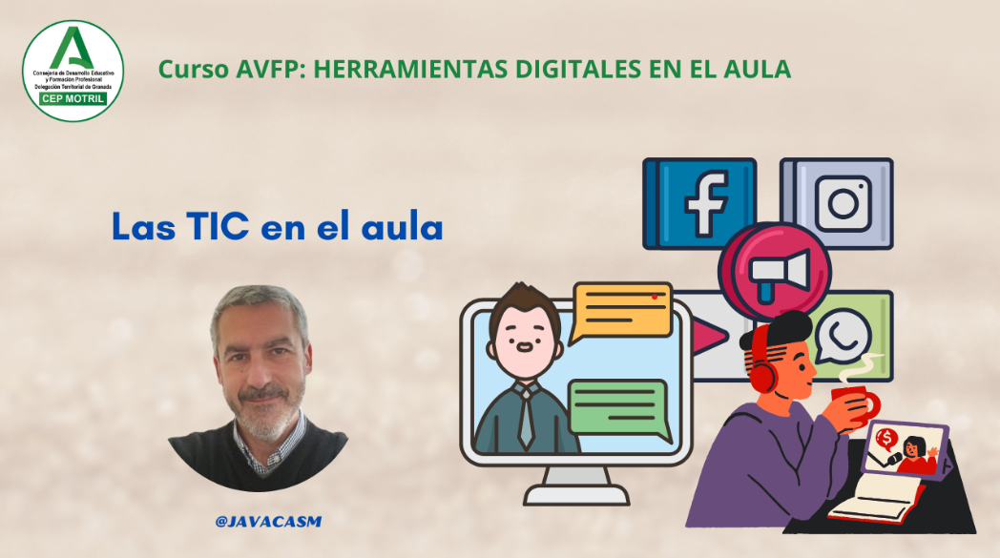

## ¿Por qué usar la tecnología en el aula?

La integración de nuevas tecnologías en el aula puede aportar numerosos beneficios tanto para educadores como para estudiantes. Aquí hay algunas razones clave por las cuales usar nuevas tecnologías en el entorno educativo:

[Vídeo: Las TIC en el aula](https://drive.google.com/file/d/1mvYCjRCKLdXdk7CVUwwTZem-cp6x9h8B/view?usp=sharing)

En este vídeo hemos visto:

1. **Acceso a Recursos Educativos en Línea:**
   - Facilita el acceso a una amplia gama de recursos educativos en línea, incluyendo libros electrónicos, vídeos educativos, simulaciones interactivas y plataformas de aprendizaje en línea.

2. **Personalización del Aprendizaje:**
   - Permite la adaptación del contenido educativo para satisfacer las necesidades individuales de los estudiantes. Las tecnologías pueden proporcionar rutas de aprendizaje personalizadas y ofrecer contenido en diversos estilos y formatos.

3. **Colaboración y Comunicación:**
   - Facilita la colaboración entre estudiantes y profesores. Plataformas en línea, herramientas de colaboración y redes sociales pueden mejorar la comunicación y la interacción en el aula.

4. **Desarrollo de Habilidades Tecnológicas:**
   - Prepara a los estudiantes para el mundo digital, desarrollando habilidades tecnológicas que son esenciales en la sociedad actual y en el futuro mercado laboral.

5. **Aprendizaje Activo y Participación:**
   - Fomenta el aprendizaje activo al proporcionar actividades interactivas y experiencias de aprendizaje inmersivas que capturan la atención de los estudiantes y promueven su participación.

6. **Facilita la Evaluación Formativa:**
   - Permite una evaluación más continua y formativa mediante la incorporación de herramientas en línea para realizar pruebas, cuestionarios y seguimiento del progreso de los estudiantes.

7. **Acceso a la Información en Tiempo Real:**
   - Proporciona acceso instantáneo a información actualizada y recursos relevantes, permitiendo a los estudiantes mantenerse al día con los últimos desarrollos y descubrimientos en sus áreas de estudio.

8. **Desarrollo de Habilidades del Siglo XXI:**
   - Ayuda a desarrollar habilidades del siglo XXI, como el pensamiento crítico, la resolución de problemas, la creatividad y la colaboración, al integrar tecnologías que fomentan el desarrollo de estas habilidades.

9. **Globalización del Aprendizaje:**
   - Rompe barreras geográficas y conecta a estudiantes con personas y culturas de todo el mundo, proporcionando oportunidades para el aprendizaje global y la colaboración internacional.

10. **Motivación y Compromiso:**
    - Aumenta la motivación y el compromiso de los estudiantes al incorporar elementos tecnológicos interactivos y lúdicos que hacen que el aprendizaje sea más atractivo y relevante para ellos.

11. **Preparación para el Futuro Laboral:**
    - Equipa a los estudiantes con habilidades y competencias tecnológicas que son esenciales en la sociedad actual y que serán cada vez más importantes en el futuro entorno laboral.

La integración efectiva de nuevas tecnologías en el aula requiere una planificación cuidadosa y una capacitación adecuada para educadores, pero puede tener un impacto significativo en la calidad y la eficacia del aprendizaje.

