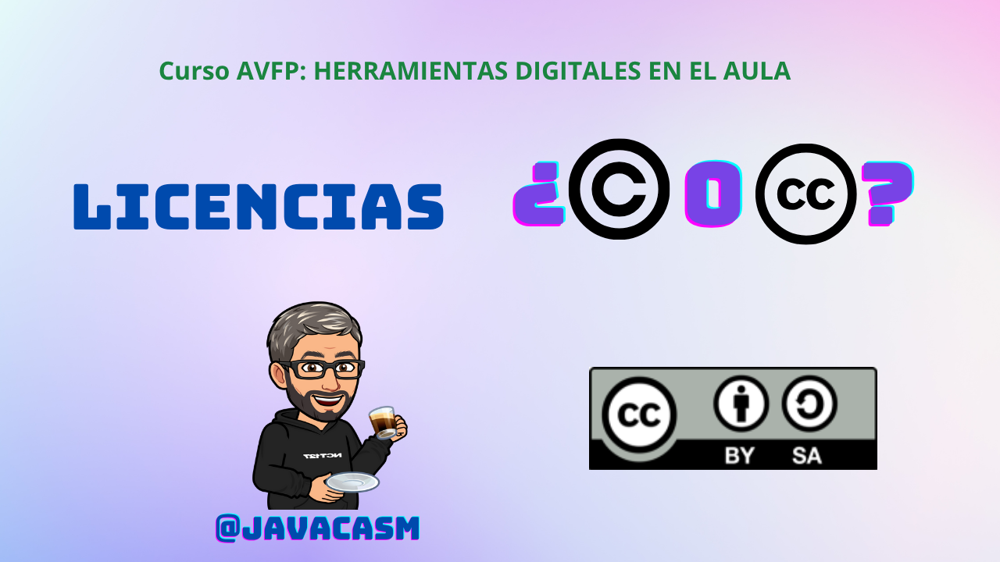

# ¿Qué entendemos por Licencias?

La licencia de un contenido se refiere a los términos y condiciones bajo los cuales el titular de los derechos autoriza el uso de su obra por parte de otras personas. En otras palabras, establece los permisos y restricciones que rigen cómo otros pueden utilizar, compartir, distribuir, modificar o incluso beneficiarse comercialmente de una obra creativa específica.

Cuando un creador otorga una licencia sobre su obra, está especificando de qué manera desea que se utilice y comparta su creación, y qué derechos retiene para sí mismo. Las licencias son fundamentales en el ámbito del derecho de autor y proporcionan un marco legal para equilibrar los intereses de los creadores y del público.

[Vídeo sobre licencias](https://drive.google.com/file/d/1wUvS6euj0DAbVhyv2u7HznA7elL20UmI/view?usp=drive_link)

En este vídeo hemos hablado sobre los elementos Clave de una Licencia de Contenido:

1. **Atribución (BY):**
   - La obligación de dar crédito al autor original de la obra.

2. **No Comercial (NC):**
   - La prohibición del uso comercial de la obra sin permiso explícito.

3. **Compartir Igual (SA):**
   - La obligación de distribuir las obras derivadas bajo la misma licencia que la obra original.

4. **Sin Derivados (ND):**
   - La prohibición de crear obras derivadas basadas en la obra original.

### Tipos Comunes de Licencias:

1. **Licencia de Derechos de Autor Tradicional:**
   - Protege todos los derechos, limitando el uso a lo expresamente autorizado por el titular de los derechos.

2. **Licencias Creative Commons:**
   - Ofrecen un enfoque más flexible, permitiendo a los creadores elegir entre una variedad de combinaciones de atributos como Atribución, No Comercial, Compartir Igual, y Sin Derivados.

3. **Dominio Público:**
   - El creador renuncia a todos sus derechos de autor y coloca la obra directamente en el dominio público, permitiendo su uso sin restricciones.

### Importancia de las Licencias de Contenido:

1. **Protección de Derechos del Creador:**
   - Las licencias permiten a los creadores proteger sus derechos y controlar cómo se utiliza su trabajo.

2. **Promoción de la Creatividad Abierta:**
   - Las licencias flexibles, como las Creative Commons, fomentan la colaboración y el intercambio creativo al permitir a otros utilizar y construir sobre obras existentes.

3. **Acceso y Uso Controlado:**
   - Las licencias definen claramente cómo otros pueden utilizar y compartir una obra, lo que evita malentendidos y conflictos legales.

4. **Facilitan el Uso Educativo:**
   - Las licencias abiertas pueden facilitar el uso de materiales educativos, permitiendo a los educadores utilizar, adaptar y compartir recursos sin violar los derechos de autor.

En resumen, una licencia de contenido es un contrato que define los términos de uso de una obra creativa. Estas licencias son esenciales para equilibrar los intereses de los creadores y la disponibilidad de obras para el público en general.

## ¿Por qué es importante enseñar Licencias a los alumnos?

Enseñar sobre licencias, especialmente aquellas relacionadas con los derechos de autor como las Licencias Creative Commons, es importante por varias razones en el entorno educativo:

### 1. **Fomenta la Conciencia Ética:**
   - Al comprender las licencias, los estudiantes desarrollan una conciencia ética sobre el uso adecuado y respetuoso de las obras creativas de otros. Aprender a dar crédito apropiadamente y respetar los derechos de autor es fundamental en la ética digital.

### 2. **Promueve el Respeto por los Derechos de Autor:**
   - La educación sobre licencias ayuda a los estudiantes a comprender la importancia de respetar los derechos de autor de los creadores. Esto contribuye a una cultura de respeto por la propiedad intelectual.

### 3. **Facilita el Uso Legal y Ético de Recursos:**
   - Los estudiantes aprenden a utilizar recursos de manera legal y ética, evitando la violación de derechos de autor y asegurándose de que están autorizados para usar y compartir determinadas obras.

### 4. **Estimula la Creatividad y la Colaboración:**
   - Comprender las licencias Creative Commons fomenta la colaboración y la creatividad. Los estudiantes pueden utilizar y construir sobre el trabajo de otros de manera legal, siempre que respeten las condiciones de la licencia.

### 5. **Prepara para el Mundo Digital:**
   - En la era digital, donde compartir información es común, enseñar sobre licencias ayuda a los estudiantes a navegar y contribuir responsablemente en línea, donde las obras creativas se comparten y utilizan constantemente.

### 6. **Apoya el Aprendizaje Activo:**
   - Alentar a los estudiantes a crear y compartir su propio contenido utilizando licencias adecuadas promueve el aprendizaje activo y les brinda oportunidades para aplicar sus conocimientos en contextos del mundo real.

### 7. **Facilita el Uso de Recursos Educativos Abiertos (OER):**
   - Los recursos educativos abiertos (OER) son materiales de enseñanza y aprendizaje que se encuentran en el dominio público o tienen licencias abiertas. Comprender estas licencias permite a los estudiantes aprovechar recursos educativos valiosos y compartir los suyos propios.

### 8. **Previene la Violación de Derechos de Autor:**
   - El conocimiento de las licencias ayuda a prevenir la inadvertida violación de derechos de autor. Los estudiantes pueden tomar decisiones informadas sobre cómo utilizar y compartir el contenido digital.

### 9. **Prepara para la Vida Profesional:**
   - En muchos campos profesionales, comprender las licencias y los derechos de autor es esencial. Los estudiantes se benefician al adquirir estas habilidades antes de ingresar al mundo laboral.

### 10. **Promueve el Pensamiento Crítico:**
   - La enseñanza sobre licencias fomenta el pensamiento crítico al hacer que los estudiantes evalúen y comprendan la información relacionada con los derechos de autor antes de utilizar o compartir contenido.

En resumen, enseñar sobre licencias es esencial para preparar a los estudiantes para la participación ética y efectiva en un mundo digital donde el intercambio de información es común. Además, promueve un enfoque respetuoso y responsable hacia el trabajo creativo de los demás.
