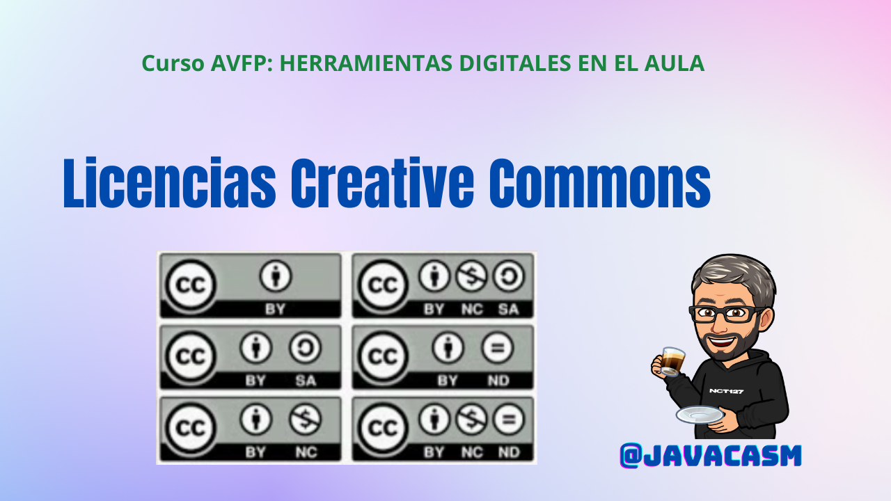

## ¿Qué son las licencias Creative Commons?

Las licencias Creative Commons (CC) son un conjunto de licencias públicas que permiten a los creadores de contenido, otorgar ciertos permisos sobre sus obras mientras retienen otros derechos. Estas licencias fueron diseñadas para facilitar la distribución y el uso de obras creativas, al tiempo que permiten a los creadores mantener ciertos derechos sobre sus trabajos.

[Vídeo sobre licencias CC](https://drive.google.com/file/d/18zk6hhmpeFdxY_ti1F6gzZZzjfa689Lr/view?usp=drive_link)

En este vídeo hemos hecho un resumen de los elementos clave de las licencias Creative Commons y por qué usarlas:

### Principales Componentes:

1. **Atribución (BY):**
   - Todos los tipos de licencias CC requieren atribución, lo que significa que debes dar crédito al autor original de la obra.

2. **No Comercial (NC):**
   - Si se selecciona esta opción, se prohíbe el uso comercial de la obra sin permiso del titular de los derechos.

3. **Compartir Igual (SA):**
   - Las obras derivadas deben distribuirse bajo una licencia idéntica a la original. Si la obra original tiene una licencia que permite usos comerciales, las obras derivadas también deben permitirlos.

4. **Sin Derivados (ND):**
   - Las obras derivadas no están permitidas. Esto significa que otros pueden descargar las obras y compartirlas, pero no pueden cambiarlas de ninguna manera ni usarlas como base para crear obras derivadas.

### Tipos de Licencias Creative Commons:

1. **Atribución (CC BY):**
   - Permite que otros copien, distribuyan, muestren y realicen el trabajo y las obras derivadas, incluso con fines comerciales, siempre y cuando se dé crédito al autor original.

2. **Atribución-No Comercial (CC BY-NC):**
   - Permite la copia, distribución, exhibición y ejecución de la obra y obras derivadas, pero no para un uso comercial. Se debe dar crédito al autor original.

3. **Atribución-No Comercial-Compartir Igual (CC BY-NC-SA):**
   - Permite a otros remezclar, retocar y crear a partir de la obra para fines no comerciales, siempre y cuando den crédito al autor y licencien sus nuevas creaciones bajo los mismos términos.

4. **Atribución-Compartir Igual (CC BY-SA):**
   - Permite a otros remezclar, retocar y crear a partir de la obra, incluso con fines comerciales, siempre y cuando den crédito al autor y licencien sus nuevas creaciones bajo los mismos términos.

5. **Atribución-No Comercial-Sin Derivados (CC BY-NC-ND):**
   - La licencia más restrictiva, solo permite descargar las obras y compartirlas con otras personas siempre que se den créditos, pero no se pueden cambiar de ninguna manera ni se pueden utilizar comercialmente.

### Ventajas de las Licencias Creative Commons:

- **Flexibilidad:** Los creadores pueden elegir la licencia que mejor se adapte a sus objetivos y preferencias.
  
- **Promoción del Compartir:** Facilita el intercambio y la colaboración creativa al permitir a otros utilizar, modificar y compartir obras.

- **Atribución:** Garantiza que los creadores reciban el crédito adecuado por su trabajo, incluso cuando se comparte o se modifica.

- **Facilita el Uso Educativo:** Favorece la utilización de recursos educativos de manera abierta y accesible.

Es importante revisar y comprender los términos específicos de cada licencia Creative Commons antes de utilizar o compartir obras bajo ellas. Esto garantiza un uso adecuado y respetuoso del trabajo de los creadores.
