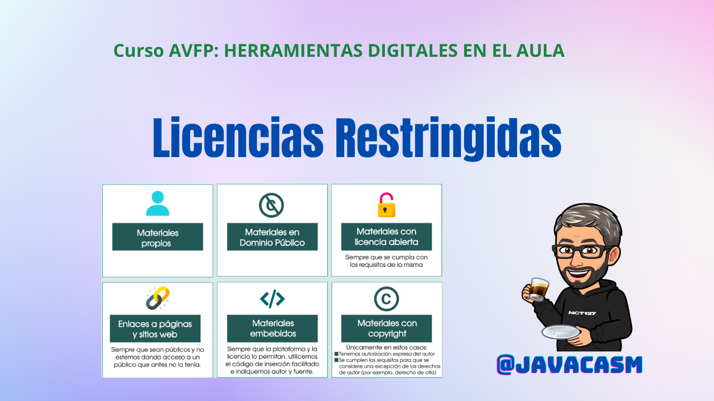

## Resumen uso de materiales

Después de ver los tipos de licencias vamos a hacer un resumen para tener claro qué materiales podemos incluir en nuestro recursos.

[Vídeo sobre qué materiales podemos utilizar y Excepciones a las licencias](https://drive.google.com/file/d/1B34CZXqgwLnmY_qezwhlIBHOoPVDUm23/view?usp=drive_link)

En el vídeo hemos visto:

* Siguiendo la infografía "Materiales que puedo usar"

- Materiales propios
- Materiales en Dominio público, citando su procedencia
- Materiales con licencia abierta que sean compatibles con nuestro proyecto
- Enlaces a páginas y sitios web de acceso libre, siempre que no vayamos a alterar el público que puede acceder a ellas.
- Materiales embebidos, usaremos el formato que nos indique el autor para incluirlos 
- Materiales con copyright tras pedir permiso al autor

* Existen algunas excepciones que nos permiten usar materiales con copyright

- Fragmentos de obras ya divulgadas con fines educativos o de investigación
- Cuando sea para su análisis
- Incluyendo su título, autor y la cita completa
- Siempre que esté justificada su inclusión
- Se puede autorizar la difusión de parte de un material siempre que lo realice profesorado de educación reglada y sea dentro de actividades educativas.

