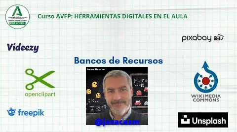

## Bancos de recursos

Para la creación de cualquier documento vamos a necesitar recursos como imágenes, vídeos, sonidos, música para darle un mejor aspecto y complementarlos.

Por ello necesitamos sitios de Internet de lo que podamos buscar estos elementos pero con una licencia adecuada para poder reutilizarlos

Algunos serán libres y otros de pago.

[Vídeo sobre bancos de recursos](https://drive.google.com/file/d/1z3zAUmTYZAiBA8HDOtKkig18a04rpRQo/view?usp=drive_link)

En este vídeo hemos visto:

* Desde [este enlace](https://aonialearning.com/educacion/recursos-digitales-aula-online/) tenemos acceso a bancos de recursos de las comunidades autónomas y al [Procomún del  Intef](https://procomun.intef.es/bm/buscador) desde los que podemos descargar contenidos gratuitos
* Desde [freepik](https://www.freepik.es/) podemos descargar imágenes y vídeos en diferentes formatos, algunos de ellos de pago. También podemos usar generadores de imágenes con IA
* Si tenemos un canal en youtube, podemos acceder a una biblioteca de música y sonidos gratuitos. Lo haremos desde dentro del canal, en el apartado "Biblioteca de sonidos"
* Podemos descargar música desde la [Free Music Archive](https://freemusicarchive.org/) donde puedes buscar por estilos. Hay una opción gratuita y otra Pro
* Vamos a encontrar un  interesante [listado de recursos gratuitos](https://www.educaciontrespuntocero.com/recursos/bancos-de-imagenes-gratis/)

Algunos sitios más

* Descarga de imágenes, fotos, vectores, logos... 

    - [freepik](https://www.freepik.es/)
    - [unsplash](https://unsplash.com/)
    - [pixabay](https://pixabay.com/es/)
    - [vidsplay](https://www.vidsplay.com/)
    - [videezy](https://es.videezy.com/)
    - [Wikimedia Commons](https://commons.wikimedia.org/wiki/Main_Page?uselang=es)
    - [Búsqueda Creative Commons](https://search.creativecommons.org/?lang=es)
    - [Openclipart](https://openclipart.org/)
* Música
    - [Free music archive](https://freemusicarchive.org/)
    - [musopen](https://musopen.org/es/)
    - [ccmixter](http://dig.ccmixter.org/)
    - [moby gratis](https://mobygratis.com/)
 

Hoy en día también podemos generar recursos con herramientas IA, pero eso será en otro curso...
