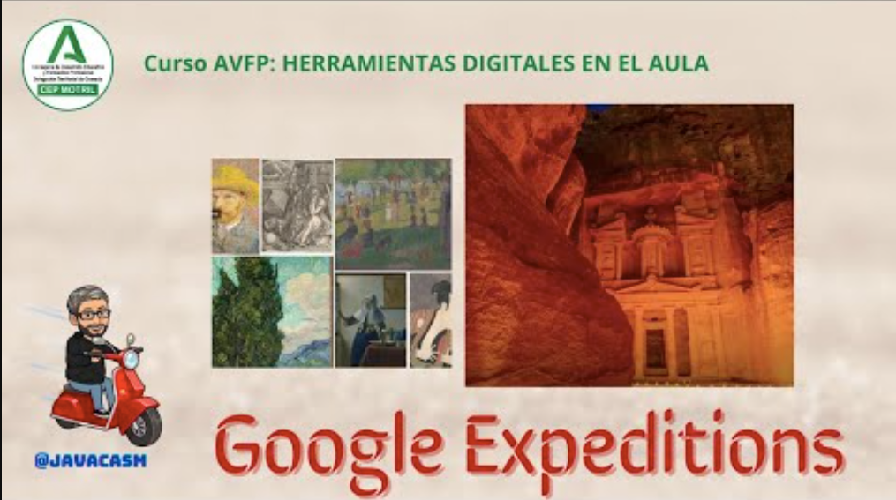

## Google expeditions

Como ejemplo de uso de las tic en el aula vamos a ver no tanto una herramienta como una colección de contenido especialmente interesante para nosotros como docentes de la que podemos extraer mucha información y que será una herramienta excelente para que trabaje nuestro alumnado, se llama [Google Expeditions](https://artsandculture.google.com/project/expeditions)

[Vídeo sobre Google Expeditions](https://drive.google.com/file/d/1EqB3u-fOzS2L4wScCJg_KtjxMVnObmCW/view?usp=sharing)

En este vídeo hemos visto:

[Google Expeditions](https://artsandculture.google.com/project/expeditions) es una iniciativa no-comercial de Google diseñada principalmente para entornos educativos, Expeditions permite a los profesores llevar a sus estudiantes a "viajes virtuales" a lugares de todo el mundo y más allá, en ocasiones usando contenido en 3D, o viajes a determinadas áreas de conocimiento, tanto de la ciencia como de la cultura y el arte. Aquí hay algunas características clave de Google Expeditions:

1. **Viajes Virtuales:**
   - Los profesores pueden guiar a los estudiantes a través de viajes virtuales a lugares históricos, sitios geográficos, museos, e incluso a experiencias relacionadas con temas específicos.

2. **Experiencias Visuales o Inmersivas:**
   - Utilizando dispositivos digitales y en algunos casos de realidad virtual, los estudiantes pueden sumergirse en viajes y a veces en entornos 360 grados, lo que crea una experiencia más inmersiva y educativa.

3. **Guía del Profesor:**
   - El profesor actúa como guía y controla la experiencia para todos los estudiantes. Puede señalar puntos de interés, proporcionar información y fomentar la participación.

4. **Contenido Educativo:**
   - Google Expeditions incluye contenido educativo adaptado a diversos temas, lo que permite a los profesores incorporar estas experiencias en su plan de estudios.

5. **Dispositivos Compatibles:**
   - Inicialmente diseñado para funcionar con dispositivos de realidad virtual como Google Cardboard, Expeditions ahora también es compatible con una variedad de plataformas, incluyendo dispositivos Android e iOS y por supuesto desde ordenadores.

6. **Aplicación para Profesores y Estudiantes:**
   - Los profesores usan la aplicación "Expediciones" para guiar las experiencias, mientras que los estudiantes utilizan la aplicación "Expediciones" o "Expediciones AR" para participar.

Google Expeditions ha sido utilizado en aulas de todo el mundo para enriquecer la educación y proporcionar experiencias de aprendizaje únicas. Sin embargo, ten en cuenta que la disponibilidad y las características específicas pueden haber cambiado desde la última actualización.

Vamos a encontrar todo tipo de temas y lugares:

* Podremos pasear por las [colecciones de grandes museos](https://artsandculture.google.com/partner) como [la galería de los Uffizi](https://artsandculture.google.com/partner/uffizi-gallery) en Florencia o  [la National Gallery de Londres](https://artsandculture.google.com/partner/the-national-gallery-london)
* [Temas científicos](https://artsandculture.google.com/project/expeditions-science) o tecnológicos como [esta historia de los ordenadores](https://artsandculture.google.com/story/0gVxCCj3-VzxLw)
* También podemos movernos por la [ciencias naturales](https://artsandculture.google.com/project/expeditions-natural-history) para ver [dinosaurios](https://artsandculture.google.com/story/uAUBIvk-J5uOEg), [aprender sobre la fotosíntesis](https://artsandculture.google.com/story/6gXx8iNgb7nTUA) o ver [cómo las criaturas marinas colonizan los restos humanos en el mar](https://artsandculture.google.com/story/sgVB7ocG2Q6C9Q) 
* Podemos buscar por lugares interesantes, como este [viaje a Petra](https://artsandculture.google.com/story/3gXROIo6vLctRA) o podemos hacer búsquedas por contenidos cercanos desde un mapa como por [ejemplo el Museo naval de Madrid](https://artsandculture.google.com/partner/fundaci%C3%B3n-museo-naval)

Existen apps para ver estos contenidos, para [Android](https://play.google.com/store/apps/details?id=com.google.android.apps.cultural) o [iOS](https://itunes.apple.com/us/app/google-arts-culture/id1050970557?mt=8)

En definitiva, una fuente de información de calidad a nuestro alcance.
