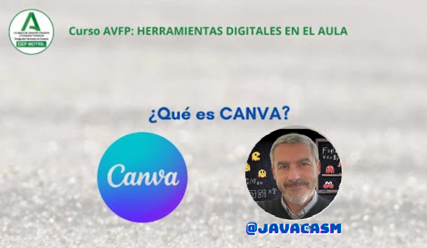

# Canva

## ¿Qué es Canva?

Canva es una plataforma en línea que permite a los usuarios crear una amplia variedad de diseños gráficos de manera sencilla y visual. Fue lanzada en 2012 y se ha vuelto extremadamente popular debido a su facilidad de uso y a la diversidad de herramientas que ofrece. Canva es utilizado para la creación de diseños como presentaciones, pósters, infografías, tarjetas de presentación, publicaciones en redes sociales, banners, y mucho más.

Algunas características clave de Canva incluyen:

1. **Plantillas Prediseñadas:** Ofrece una amplia gama de plantillas prediseñadas para una variedad de proyectos, lo que facilita a los usuarios la creación de diseños profesionales sin tener que comenzar desde cero.

2. **Editor Visual:** La interfaz de Canva es muy visual e intuitiva. Los usuarios pueden arrastrar y soltar elementos, cambiar colores, añadir texto e imágenes, y personalizar cada elemento de su diseño.

3. **Biblioteca de Recursos:** Canva proporciona acceso a una amplia biblioteca de recursos, que incluye imágenes gratuitas, iconos, fuentes y elementos gráficos, así como opciones premium que se pueden comprar.

4. **Colaboración en Tiempo Real:** Permite a los usuarios colaborar en proyectos en tiempo real, lo que es útil para trabajos en equipo y proyectos grupales.

5. **Descargar y Compartir:** Los diseños creados en Canva se pueden descargar en varios formatos (imagen, PDF, presentación) y compartir fácilmente a través de enlaces.

6. **Versatilidad:** Se utiliza en una variedad de contextos, desde proyectos escolares y de trabajo hasta publicaciones en redes sociales y contenido de marketing.

7. **Versión Gratuita, Educativa y Pro:** Canva ofrece una versión gratuita con muchas funcionalidades, y también tiene una suscripción premium llamada Canva Pro, que ofrece características adicionales y acceso a más recursos.

Canva es especialmente popular entre aquellos que no tienen experiencia en diseño gráfico, ya que proporciona herramientas poderosas de diseño de manera accesible para cualquier persona. Es utilizado en entornos educativos, empresariales y personales para crear material visual atractivo y profesional.

[Vídeo:  ¿Qué es Canva?](https://drive.google.com/file/d/1CTxzTp_L91-mdr3mWn1iCqWrTrqvDhtA/view?usp=sharing)

En este vídeo hemos visto:

* Canva es una aplicación Web que nos permite a partir de miles de plantillas crear documentos vistosos con facilidad. También dispone de multitud de elementos visuales y complementos
* Algunas de estas plantillas y elementos sólo están disponibles en la versión Pro, obviamente de pago, aunque existe una versión educativa con gran parte de ellos.
* También existen muchísimos documentos creados por usuarios que están disponibles para reutilizarlos.
* Una vez elegido uno de ellos, podemos modificarlos sin más que ir seleccionando sus componentes pudiendo modificar su formato, aspecto y contenido de manera muy sencilla.
* Existen multitud de tipos de documentos, cada uno de ellos con diferentes formatos visuales:
    - Presentaciones
    - Documentos de texto
    - Vídeos
    - Infografía
    - Imágenes
    - ...
* También permite adaptar todos estos contenidos a los formatos de las distintas redes sociales, permitiendo publicarlos en ellas con facilidad.

Lo mejor es que abras un documento y pruebes a modificarlo

### Características de Canva

Canva es una plataforma de diseño gráfico en línea que ofrece diversas características, como:

1. **Diseño Intuitivo:** Interfaz fácil de usar para usuarios principiantes y avanzados.
  
2. **Plantillas Preestablecidas:** Amplia variedad de plantillas para redes sociales, presentaciones, tarjetas y más.

3. **Elementos Gráficos:** Biblioteca extensa de imágenes, iconos, formas y fondos para personalizar tus diseños.

4. **Herramientas de Texto:** Opciones para cambiar fuentes, tamaños y estilos, además de herramientas de alineación y espaciado.

5. **Colaboración en Tiempo Real:** Posibilidad de trabajar en proyectos de forma colaborativa con otros usuarios.

6. **Exportación Sencilla:** Facilidad para descargar o compartir tus diseños en diferentes formatos.

7. **Edición de Imágenes:** Herramientas de edición de imágenes básicas, como recorte, filtros y ajuste de colores.

8. **Integración con Elementos Multimedia:** Permite agregar vídeos, música y otros elementos multimedia a tus diseños.

9. **Versatilidad de Proyectos:** Adecuado para crear una amplia gama de proyectos, desde redes sociales hasta material impreso.

10. **Versiones Gratuita, Educativa y Premium:** Ofrece una versión gratuita con funciones limitadas y una versión premium con características adicionales.

Estas características hacen que Canva sea una herramienta popular para diseñadores y no diseñadores por igual.

