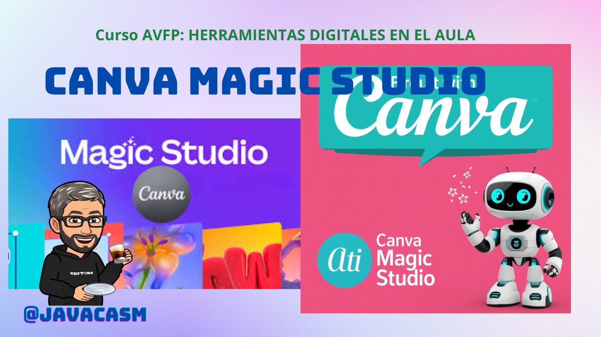

Afortunadamente para los usuarios, Canva actualiza con mucha frecuencia sus aplicaciones, con lo que probablemente verás que la versión de los vídeos es algo diferente. El funcionamiento es básicamente el  mismo salvo las herramientas de IA, que ahora están en todas partes

### Estudio Mágico de Canva

Estudio Mágico (Magic Studio en inglés) es la suite de herramientas de inteligencia artificial integrada en Canva que permite a cualquier persona —sin necesidad de experiencia en diseño o edición— crear contenido profesional de forma rápida, fácil y sorprendente.

Lanzado en octubre de 2023 y constantemente actualizado, Estudio Mágico reúne las funciones de IA más potentes de Canva en un solo lugar, accesible desde la página principal o desde el menú lateral. Su objetivo es eliminar las barreras creativas y reducir drásticamente el tiempo de producción mediante comandos de texto (prompts) o acciones automáticas.

Entre sus herramientas más destacadas están:

- **Magic Design™**: Genera plantillas completas y personalizadas a partir de una simple descripción o al subir una imagen.
- **Magic Media**: Convierte texto en imágenes (Text to Image) o en vídeos (Text to Video) con diferentes estilos (fotografía, arte digital, ilustración, 3D, etc.).
- **Magic Write™**: Asistente de redacción con IA que genera textos, resúmenes, listas, guiones y reformulaciones en más de 100 idiomas.
- **Magic Edit**: Permite añadir, reemplazar o modificar cualquier elemento de una imagen con solo describirlo (por ejemplo: “pon un gato con gafas de sol en esta playa”).
- **Magic Grab**: Nueva función (2025) que separa cualquier objeto o persona de una foto para reposicionarlo libremente como si fuera una pegatina.
- **Magic Expand**: Amplía los bordes de una imagen de forma inteligente manteniendo coherencia y estilo.
- **Magic Eraser**: Borra objetos, personas o elementos no deseados con un pincel.
- **Magic Switch**: Convierte automáticamente cualquier diseño a otro formato (presentación, publicación de Instagram, vídeo, documento, etc.) ajustando el contenido de forma inteligente.
- **Magic Animate**: Añade animaciones y transiciones con un solo clic.
- **Background Remover**: Elimina fondos con precisión de un clic (incluso mechones de pelo).

Todo esto está impulsado por tecnologías propias de Canva y modelos de terceros (como Stable Diffusion, Imagen de Google o DALL·E en sus primeras versiones), pero integrado de forma nativa y segura dentro del ecosistema Canva, respetando las licencias comerciales y la propiedad intelectual.

En resumen, Estudio Mágico transforma Canva en mucho más que un editor gráfico: lo convierte en un estudio de creación completo donde la inteligencia artificial hace el trabajo pesado y tú solo te encargas de guiar la creatividad. Es ideal para creadores de contenido, profesores, marketers, pequeñas empresas y cualquier persona que necesite resultados profesionales en minutos.

)

[Vídeo: Estudio Mágico de Canva](https://drive.google.com/file/d/1jSsq7wBVkR4zcMwoSAsyu-RtR-tYWojY/view?usp=sharing)