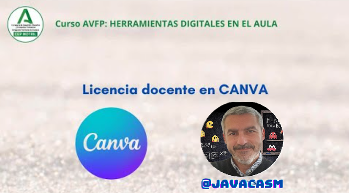
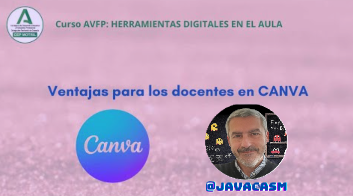
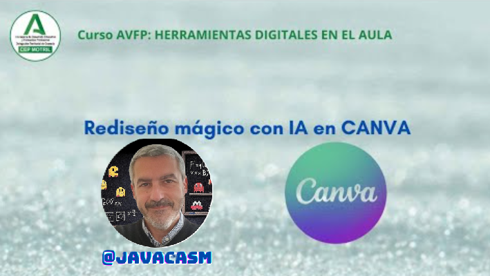

### Licencia educativa de Canva

Canva ofrece una licencia gratuita para educadores, estudiantes y organizaciones educativas que se conoce como "Canva for Education". Esta licencia está diseñada para apoyar a los profesionales de la educación y a los estudiantes, brindándoles acceso a herramientas y recursos adicionales. Algunas características específicas de la licencia educativa de Canva incluyen:

1. **Acceso Gratuito a Canva Pro:**
   - Canva for Education proporciona acceso gratuito a la suscripción Canva Pro para educadores y estudiantes, desbloqueando funciones y recursos adicionales.

2. **Colaboración en Tiempo Real:**
   - Permite a los usuarios colaborar en proyectos en tiempo real, facilitando la interacción y la creación conjunta.

3. **Plantillas Educativas:**
   - Canva for Education incluye plantillas específicas para educación, adaptadas a diversas necesidades educativas, desde presentaciones hasta proyectos y materiales didácticos.

4. **Creación de Equipos:**
   - Facilita la creación y gestión de equipos dentro del entorno educativo, lo que es útil para proyectos colaborativos y la administración de contenido.

5. **Herramientas de Evaluación:**
   - Proporciona herramientas para la creación de evaluaciones interactivas y otros recursos educativos.

Para obtener la licencia educativa gratuita de Canva, los educadores y estudiantes deben registrarse y verificar su estatus educativo. Los detalles exactos pueden cambiar con el tiempo, por lo que se recomienda verificar la información más reciente en el sitio web oficial de Canva o ponerse en contacto directo con su equipo de soporte.

### Cómo obtener la Licencia Educativa

Canva ofrece una licencia gratuita para educadores y estudiantes a través de su programa "Canva for Education". Aquí hay pasos generales que podemos seguir para obtener una licencia educativa gratuita de Canva:

1. **Registro en Canva:**
   - Visita el sitio web oficial de Canva y crea una cuenta si aún no tienes una. Puedes registrarte con tu dirección de correo electrónico o utilizar una cuenta de Google o Facebook.

2. **Verificación del Estatus Educativo:**
   - Después de registrarte, es posible que Canva requiera que verifiques tu estatus educativo. Esto podría implicar proporcionar información sobre tu institución educativa, dirección de correo electrónico educativa, identificación estudiantil u otros documentos que Canva utilice para verificar tu elegibilidad.

3. **Acceso a Canva for Education:**
   - Una vez que tu estatus educativo haya sido verificado, es probable que tengas acceso a Canva for Education de forma gratuita. Este programa proporciona a educadores y estudiantes acceso a funcionalidades y recursos adicionales.

4. **Explorar Funciones Educativas:**
   - Una vez que hayas obtenido la licencia educativa gratuita, explora las funciones y recursos educativos específicos de Canva. Puede incluir plantillas diseñadas para educación, herramientas de colaboración y otras características adaptadas a entornos educativos.

Es importante destacar que los detalles específicos del proceso pueden variar y que Canva puede tener requisitos específicos para la verificación del estatus educativo. Te recomiendo visitar el sitio web oficial de Canva o ponerse en contacto con su equipo de soporte para obtener instrucciones precisas y actualizadas sobre cómo obtener una licencia educativa gratuita.

[Vídeo: licencia educativa](https://drive.google.com/file/d/1Wj6TultLX3Qldvp1TWbVl2glQeT8Bw4k/view?usp=sharing)

En el vídeo hemos visto:

* Como docente tenemos ventajas para usar una licencia educativa, similar a la Pro
* Como docentes tendremos acceso a plantillas, elementos, imágenes y algunas apps
* Para acceder a esta licencia es necesario que nos validemos como docente. A día de hoy se permiten docentes de niveles de infantil, primaria y secundaria. Puede que la validación no se haga automáticamente, sino que tenga que intervenir un trabajador de Canva.

### Ventajas Educación

(Requiere verificación como docente)

* Contenidos pro (plantillas, imágenes y elementos)
* Algunas Apps: 
    - Quitafondos
    - Rediseño mágico (permite convertir entre formatos)
    - Integración con LMS. Permite compartir tareas con tu alumnado
* Tutoriales y formación específica
* Podemos usar "Escritura mágica" que es una herramienta para generación de texto por una IA, como chatGPT pero dentro de Canva.

[Vídeo: ventajas licencia educativa](https://drive.google.com/file/d/19jkA8qwVD8PDrcUM5jrwzsJuKf7mYufP/view?usp=sharing)

En este vídeo hemos visto:

* Una vez validado tendremos acceso a trabajar en equipo, permitiendo colaborar de forma directa con otros participantes. Podremos compartir proyectos y carpetas
* Vamos a encontrar mucho más material disponible, tanto elementos, imágenes como plantillas.
* Si tenemos una licencia de centro educativo podremos invitar a participar a todos los docentes y los estudiantes del centro
* Podemos publicar nuestros proyectos en sistemas de gestión de aprendizaje (LMS) como Moodle, Google Classroom, Microsoft Teams,...
* Se puede crear un formato de "marca" es decir propio del centro, y todas las plantillas lo incluirán, es como una "imagen de empresa"

Una de las ventajas que me parece más interesante, junto con la cantidad de contenidos disponibles, es "Rediseño mágico" que nos permite convertir contenido entre formatos, por ejemplo crear una presentación a partir de un documento o viceversa. También permite traducir directamente los contenidos entre idiomas.

[Vídeo sobre Rediseño Mágico](https://drive.google.com/file/d/1VtA5HSDT6fHzE006J4YlWEPrNE3GS06C/view?usp=sharing)

En este vídeo hemos visto:

La licencia educativa nos da acceso a aplicaciones que utilizan IA, como "Rediseño mágico". Con él podemos hacer:

   * Podemos convertir entre formatos, por ejemplo crear  una presentación automáticamente con el contenido, o pasar una presentación a infografía.
   * Debemos revisarlo y a veces habrá que modificar el formato
   * También permite convertir entre formatos para las distintas redes sociales
   * Permite la traducción automática del contenido, sin más que seleccionar el idioma, creará una copia de nuestro proyecto ya traducido
   * Tendremos que revisar el diseño porque los tamaños de los textos son diferentes según el idioma.

### Ventaja Centro educativo

(Requiere contactar con Canva)

* Todas las ventajas de Educación para sus docentes y alumnado
* Imagen corporativa para el centro
* Acceso único para todo el centro (como Google)
* Formación para los docentes
* Asistencia remota

### Integración en los principales Gestores de Contenido Educativo (LMS)

Podemos enlazar con los sistemas LMS por medio de la pestaña Tareas

Podemos publicar en los principales LMS

* Google Classroom
* Moodle
* Microsoft Teams
* Schoology
* D2L
* BlackBoard
* Canvas

### Licencia Estudiantes

También existe una licencia para estudiantes que pueden conseguir usando un correo oficial de un centro educativo que tenga Canva o bien los invite. Con ellos disfrutan de:

* Contenidos, imágenes y elemento gratuitos por ser licencia educativa
* Pueden crear grupos de trabajo
* Plantillas gratuitas por ser licencia educativa

