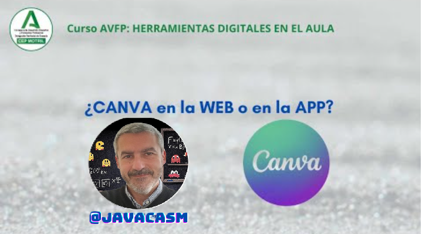
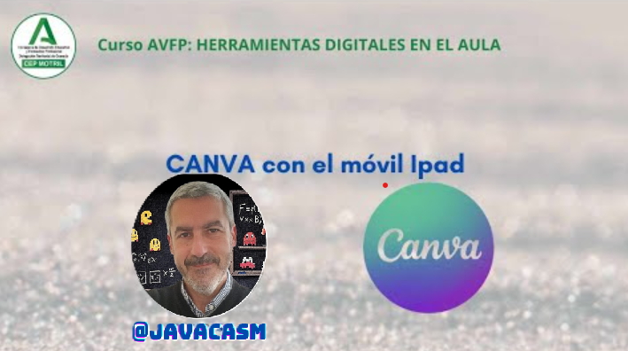
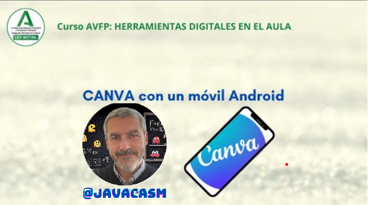

## ¿App o Web?

La principal diferencia entre utilizar Canva a través de una aplicación y su versión web radica en la plataforma o dispositivo desde el cual accedes a la herramienta. Aquí hay algunas distinciones clave:

**1. Acceso:**
   
   - **Aplicación:** Si utilizas la aplicación Canva, generalmente significa que estás accediendo desde un dispositivo móvil, como un teléfono o tablet. Las aplicaciones suelen estar disponibles en las tiendas de aplicaciones de iOS y Android.
   - **Web:** Acceder a Canva a través de la web significa que estás utilizando un navegador en tu computadora, ya sea de escritorio o portátil.

**2. Interfaz de Usuario:**
   
   - **Aplicación:** Las aplicaciones suelen tener interfaces simplificadas y optimizadas para pantallas más pequeñas. Algunas funciones pueden variar en comparación con la versión web.
   - **Web:** La versión web de Canva generalmente ofrece una interfaz más completa con todas las funciones disponibles. Es ideal para usuarios que prefieren trabajar en pantallas más grandes.

**3. Funcionalidades y Herramientas:**

   - **Aplicación:** Puede haber algunas limitaciones en términos de funciones avanzadas y herramientas comparado con la versión web, ya que las aplicaciones a veces simplifican las opciones para adaptarse a dispositivos móviles.
   - **Web:** La versión web de Canva tiende a ofrecer todas las funcionalidades y herramientas disponibles, proporcionando una experiencia más completa para la creación de contenido.

**4. Disponibilidad de Plantillas:**
   
   - **Aplicación:** Las aplicaciones móviles generalmente ofrecen una selección sólida de plantillas, pero la biblioteca puede ser más amplia en la versión web.
   - **Web:** La versión web suele tener una biblioteca más extensa de plantillas y recursos.

**5. Colaboración y Compartir:**

   - **Aplicación:** Puede haber restricciones en términos de colaboración y compartir comparado con la versión web.
   - **Web:** La versión web a menudo proporciona funcionalidades completas para colaborar en proyectos y compartirlos con otros usuarios.

En resumen, la elección entre la aplicación y la versión web de Canva dependerá de tus preferencias personales, del dispositivo que estés utilizando y de las características específicas que necesites para tu trabajo de diseño. Muchos usuarios encuentran útil tener acceso tanto a la aplicación como a la versión web según sus necesidades y contextos de uso.

[Vídeo: App o web para usar Canva](https://drive.google.com/file/d/1SD-43U_1K1hgE86x-fIWdRnzPnpAYLlp/view?usp=sharing)

En este vídeo hemos visto:

* Aunque Canva es una aplicación Web, podemos usar una versión en app para iOS, Android, Mac OS y Windows
* Podemos descargar las aplicaciones como veremos más adelante. 
* También hay un icono para hacerlo directamente desde la app.
* Desde las aplicaciones accedemos a nuestros contenidos en la nube
* La interfaz es esencialmente la misma.
* Mejora la velocidad pero seguimos dependiendo de la conexión a Internet para recuperar plantillas, imágenes, ...
* Si vamos a trabajar con presentaciones que ya tenemos a medio hacer, retocando, añadiendo texto, podemos trabajar sin conexión, aunque no se guardarán los contenidos hasta que vuelve la conexión.

### Usando la App Canva

Podemos descargar una aplicación Canva para algunos sistemas como Windows, Mac OS, iOS y Android, descargables todas desde [su página de descargas](https://www.canva.com/es_es/descargar/mac/). El aspecto de todas las aplicaciones es prácticamente idéntico y accediendo a nuestra cuenta tendremos acceso a nuestros proyectos. 

A pesar de usar una aplicación dependemos mucho de la velocidad de acceso a internet, pues permanentemente se están descargando plantillas, elementos e imágenes.

Podemos descargar una [app para iPad](https://apps.apple.com/es/app/canva-dise%C3%B1o-foto-y-v%C3%ADdeo/id897446215) desde la tienda de Apple.

Veamos cómo usar la aplicación Canva desde un iPad

[Vídeo: Usando Canva en un iPad](https://drive.google.com/file/d/1Ar9pNH6NOh4pUJZbofNAMohpbiNOwOtV/view?usp=sharing)

En este vídeo hemos visto:

* Podemos descargar la aplicación Canva para dispositivos iOS
* La descargamos desde la tienda online del sistema
* La integración con el sistema es estupenda, pudiendo compartir contenidos con facilidad
* El rendimiento es muy bueno y el tamaño de la interface permite trabajar con agilidad.
* El uso de la pantalla táctil facilita mucho el uso.
* Si queremos acceder a imágenes o elementos que tenemos en otro dispositivo podemos usar almacenamiento en la nube como iCloud o Google Drive

También existe [versión para Android](https://play.google.com/store/apps/details?id=com.canva.editor) que podemos usar en móviles y tabletas

Vamos a ver cómo usar la aplicación en un dispositivo Android y funciona muy bien tanto en los móviles como en las tabletas.

[Vídeo: usando Canva en un móvil Android](https://drive.google.com/file/d/1koTS_aMCZPJt-xsYVIi1A5gX_GhYX1dB/view?usp=sharing)

En este vídeo hemos visto:

* Podemos instalar la app Canva en nuestros dispositivos Android.
* Si queremos hacer un post de instagram, (la mejor opción desde un móvil) buscamos una plantilla que ya tendrá el formato adecuado.
* Cambiamos la imagen de la plantilla por una nuestra, que  puede estar en el móvil o tomarla con la cámara, insertándola en el marco
* Hay muchos filtros para modificar la imagen.
* Añadimos o modificamos el texto
* Podemos añadir otros elementos
* Cuando lo tenemos listo podemos publicarlo directamente y si tenemos la versión Pro podemos programarlo para que se publique en determinado momento.
* **Las redes sociales son el medio natural de Canva**
