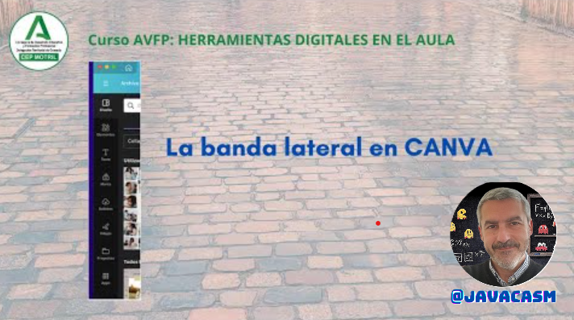
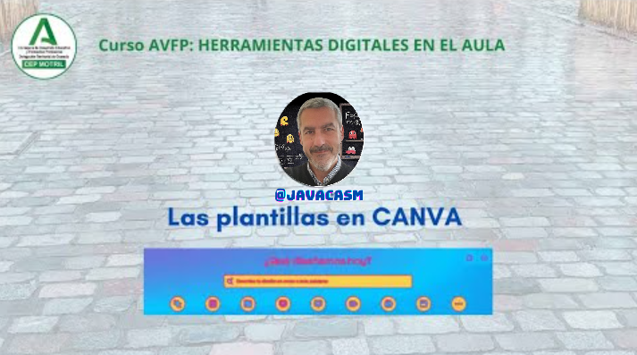
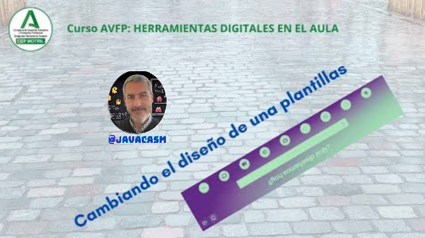
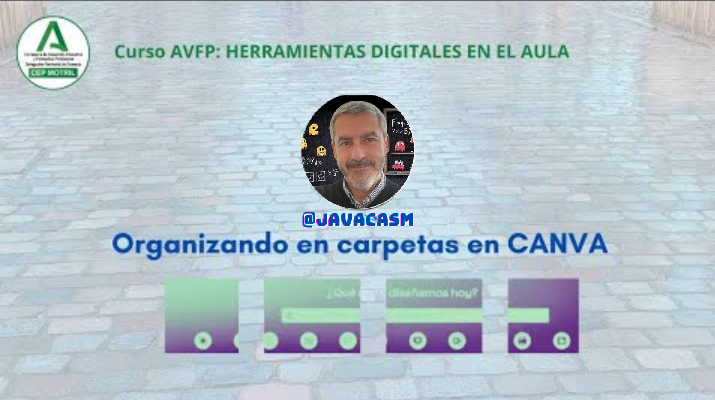
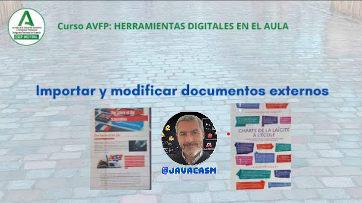
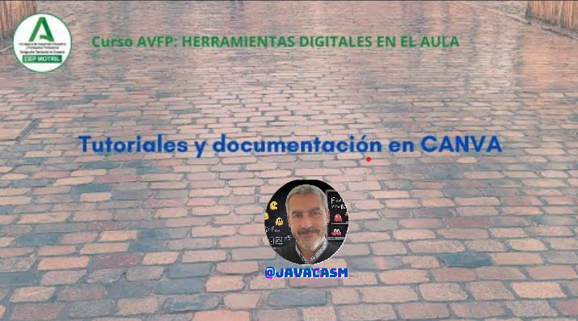
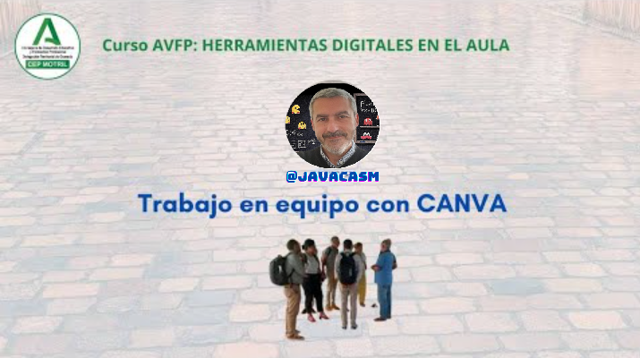
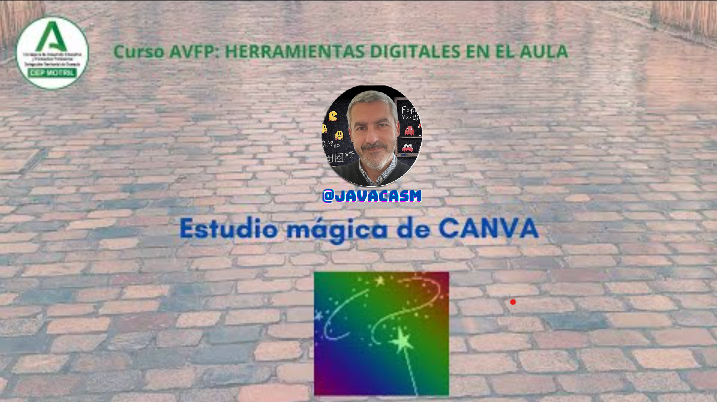

## Tutorial Canva

Vamos a profundizar en algunos de los aspectos clave para aprovechar al máximo Canva en el ámbito educativo:

### Paso 1: Crea tu cuenta

Si has seguido el tutorial para impacientes, ya tienes tu cuenta creada...

### Paso 2: Explorar la interfaz

**2.1 Tablero de diseño:**
   - Este es tu espacio de trabajo principal. Aquí puedes comenzar un nuevo diseño o abrir proyectos existentes.

**2.2 Menú lateral:**
   - Explora las opciones disponibles en el menú lateral para encontrar plantillas y elementos específicos para tu proyecto.

[Vídeo sobre el menú lateral](https://drive.google.com/file/d/1CQKHG7VMGWa0BBwBAX8Y3Do2n6Sm5o2m/view?usp=sharing)

En este vídeo sobre la barra lateral dentro de un proyecto hemos visto:

* Vemos los diferentes componentes de nuestro proyecto:
   - **Diseño**, donde vemos a grandes rasgos las plantillas y el estilo, paleta de colores, tipo de letra, ... de estas. Así podremos mantener un formato coherente en todo el documento
   - **Elementos**, donde están los diferentes componentes que podemos insertar: imágenes, vídeos, elementos gráficos, formas,... generador de imágenes con IA. Podemos filtrar para buscar lo que deseamos
   - **Texto**, cuadros de texto con un estilo determinado. Recordar aquí que se puede pegar el estilo a varios elementos
   - **Marca**, en la versión Pro podemos tener unas imágenes y estilo propios de nuestra marca
   - **Aplicaciones**, nos permiten generar o modificar nuestros contenidos, como pueden ser filtros o generadores de QR o de imágenes con IA

### Paso 3: Crear un diseño

**3.1 Seleccionar un formato:**
   - Podemos elegir el formato que mejor se adapte a las necesidades. Podemos optar por plantillas prediseñadas o empezar desde cero.

**3.2 Personalizar el diseño:**
   - Utilizamos la barra de herramientas superior para añadir elementos. Podemos agregar texto, imágenes, fondos y elementos gráficos.

**3.3 Usar plantillas:**
   - Canva ofrece plantillas para presentaciones, infografías, tarjetas, currículums y más. Ajusta y personaliza estas plantillas según las necesidades.

[Vídeo: paseo por las plantillas de Canva](https://drive.google.com/file/d/1-kM6qfGtkjK3j2DDtX-yGapMVFYnPbFR/view?usp=sharing)

En este vídeo hemos visto:

* Al crear un documento Canva nos propondrá los distintos tipos de documentos y dentro de estos, las diferentes plantillas disponibles
* Además veremos los documentos en los que hemos trabajado
* Existen plantillas para casi cualquier cosa que se nos ocurra diseñar: presentaciones, carteles, camisetas, tazas, ...
* Dentro de cada tipo existen multitud de plantillas con diferentes aspectos según el contenido que queramos insertar (más gráfico o más de texto, ...)
* También podemos ver el trabajo de muchos usuarios que comparten su contenido y que podemos reutilizar
* Aunque algunas de estas plantillas no están disponibles en la versión gratuita, siempre podemos obtener ideas para las nuestras.

Podemos modificar el diseño de cualquiera de estas plantillas

[Vídeo sobre cómo cambiar el diseño de una plantilla](https://drive.google.com/file/d/1bUrAOX2aT7mY5MBRgptkKqsx9aErCW9S/view?usp=sharing)

En este vídeo hemos visto:

* Además de buscar plantillas, podemos trabajar con los estilos, que no es otra cosa que el conjunto de propiedades (paleta de colores, formatos de texto, efectos, elementos...) de nuestra presentación, en definitiva es todo aquello que le da su aspecto visual
* Podemos buscar entre los estilos y diseños según el término que queramos, obteniendo formatos adecuados a nuestra temática.

**3.4 Utilizar carpetas:**
   - Canva permite crear carpetas para organizar nuestros documentos, podemos organizarlos por temas, por proyectos, por cursos,...

[Vídeo sobre la organización en carpetas](https://drive.google.com/file/d/1Pbje5k3VSDWOIAn_WnLc3s8sTj2xM3rx/view?usp=sharing)

En este vídeo hemos visto:

* Los documentos que generamos son los proyectos
* Podemos crear proyectos a partir de las plantillas existentes
* Podemos crear carpetas para incluir nuestros proyectos
* Existe una "carpeta" de proyectos recientes

**3.5 Importar documentos:**
   - Canva permite importar documentos ya creados en diferentes formatos y que podremos modificar

[Vídeo sobre cómo importar y modificar documentos externos](https://drive.google.com/file/d/1Et_UofG4uUNp-flhyqddX7HwhXuwOT43/view?usp=sharing)

En este vídeo hemos visto:

* Podemos subir directamente documentos (word, pdf,...), presentaciones o imágenes (png,jpeg, gif,...) o vídeos que ya tengamos.
* Podemos subir también documentos desde el icono de importar

{height=50%}

* Canva sirve como editor de PDFs, pudiendo modificarlos o añadirles elementos.
* Podemos exportar todos estos elementos como imágenes, pdf y vídeos.
* Tras importar un fichero PDF, podemos:
   - Eliminar párrafos
   - Añadir textos
   - Añadir imágenes, logos, ...
   - Modificar, rotar, modificar sus imágenes.
* Desde la opción de descarga los podemos exportar

**3.6 Documentación y tutoriales:**
   - Canva incluye multitud de documentación y tutoriales, especialmente en la edición para educación

[Vídeo sobre tutoriales y documentación de Canva](https://drive.google.com/file/d/1gYFDzIIxC3CZitiFRiuGUEYNZ-pKl_nw/view?usp=sharing)

En este vídeo hemos visto que:

* Además de los ejemplos que incluye Canva, tenemos acceso a guías y tutoriales en castellano.
* No sólo explican el uso sino qué es importante en cada formato o cómo conseguir destacar en nuestros proyectos

### Paso 4: Colaborar y compartir

**4.1 Colaboración:**
   - Invita a otros usuarios a colaborar en tiempo real en tus proyectos. Ideal para trabajos grupales o presentaciones conjuntas.

**4.2 Compartir:**
   - Canva te permite compartir tu diseño de varias maneras. Puedes obtener un enlace para compartir en línea o descargar el diseño en diferentes formatos como PDF o imagen.

[Vídeo sobre trabajo en equipo](https://drive.google.com/file/d/1kkspXxWhQi4V-NE0Ulc--5HTmczoSMBQ/view?usp=sharing)

En este vídeo hemos visto:

* Canva nos permite trabajar en equipo, compartiendo proyectos y plantillas, está disponible en la versión Pro y en la educativa
* En la versión Pro permite definir una imagen corporativa
* Para los docentes es muy cómodo el poder compartir con sus estudiantes los contenidos, los formatos y los recursos.

### Ideas para usar Canva en educación:

**5.1 Presentaciones:**
   - Diseña presentaciones atractivas para clases, seminarios o proyectos estudiantiles.

**5.2 Infografías:**
   - Convierte datos y conceptos complejos en representaciones visuales fáciles de entender.

**5.3 Pósters:**
   - Crea pósters coloridos para eventos escolares, proyectos de aula o anuncios.

**5.4 Tarjetas de estudio:**
   - Facilita el aprendizaje mediante tarjetas de estudio visuales y organizadas.

**5.5 Portafolios:**
   - Ayuda a los estudiantes a mostrar su trabajo de manera atractiva y profesional.

**5.6 Certificados:**
   - Reconoce logros y premia a los estudiantes con certificados personalizados.

**5.7 Actividades interactivas:**
   - Desarrolla actividades interactivas mediante la combinación de elementos visuales y preguntas.

**5.8 Proyectos de investigación:**
   - Comunica los resultados de proyectos de investigación de manera visual y efectiva.

### Consejos adicionales:

**6.1 Explora las opciones de diseño:**
   - Canva ofrece una amplia gama de herramientas de diseño. Experimenta con fuentes, colores y efectos para personalizar tus creaciones y hacerlas más atractivas.

**6.2 Mantén la simplicidad:**
   - Podemos evitar sobrecargar los diseños. Debemos mantener el contenido claro y conciso para facilitar la comprensión.

¡Espero que estos detalles adicionales te ayuden a utilizar Canva de manera efectiva en el ámbito educativo!

### Herramientas de Inteligencia Artificial (IA)

**7.1 Uso de herramientas de Inteligencia Artificial**
   - Recientemente Canva ha incorporado multitud de herramientas de Inteligencia Artificial, como por ejemplo "Estudio Mágico"

[Vídeo sobre "Estudio Mágico"](https://drive.google.com/file/d/1Q0M__jUwgphIBFSwQ3F7qeKj2ps2Qwh8/view?usp=sharing)

En este vídeo vemos:

* Canva ha incorporado herramientas de Inteligencia Artificial
* La mayoría de estas opciones sólo están disponibles en la licencia Pro, también en la educativa. 
* Podemos generar texto a partir de unas pocas palabras
* Es como tener incluído chatGPT
* También permite convertir entre formatos: de presentación a documento o de texto a imagen
* También puede crear traducciones de tus documentos.

