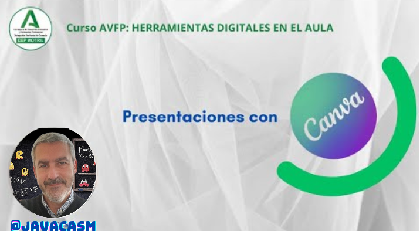

## Presentaciones

Una presentación, en el contexto educativo o empresarial, se refiere a la acción de presentar información de manera estructurada y visualmente atractiva utilizando una combinación de recursos como diapositivas, gráficos, imágenes, texto y, a veces, elementos multimedia. Estas presentaciones suelen acompañar discursos, charlas, lecciones o exposiciones con el objetivo de comunicar un mensaje de manera clara y efectiva.

Las presentaciones pueden variar en su formato y propósito, pero comúnmente involucran el uso de software de presentación, como Microsoft PowerPoint, Google Slides o Apple Keynote, para organizar y mostrar la información en un formato visualmente coherente. Los presentadores pueden utilizar diapositivas para resumir puntos clave, mostrar gráficos o diagramas, resaltar conceptos importantes y facilitar la comprensión del público.

Las presentaciones son herramientas valiosas en entornos educativos y profesionales, ya que permiten transmitir información de manera más dinámica y atractiva que simplemente hablar. Además, el uso de elementos visuales puede mejorar la retención y comprensión de la información por parte de la audiencia.

## Usos educativos de las presentaciones

Las presentaciones son una herramienta versátil en el ámbito educativo y se utilizan para diversos propósitos. Aquí tienes algunos usos educativos comunes de las presentaciones:

1. **Explicación de Contenidos:**
   - **Clases Magistrales:** Los profesores pueden utilizar presentaciones para explicar conceptos, teorías y principios de manera estructurada y visualmente atractiva.
   - **Lecciones Interactivas:** Integrar elementos interactivos, como preguntas o actividades, puede mejorar la participación y comprensión de los estudiantes.

2. **Apoyo Visual:**
   - **Ilustración de Ideas:** Las presentaciones son ideales para proporcionar imágenes, gráficos y diagramas que complementan la información verbal, facilitando la comprensión.
   - **Demostraciones Prácticas:** Se pueden utilizar para mostrar procedimientos, experimentos o demostraciones visuales que complementen el aprendizaje.

3. **Proyectos de Estudiantes:**
   - **Exposición de Trabajos:** Los estudiantes pueden utilizar presentaciones para mostrar sus proyectos, investigaciones y trabajos creativos de manera estructurada.
   - **Colaboración en Grupo:** Facilitan la colaboración entre estudiantes al permitirles crear presentaciones conjuntas para proyectos grupales.

4. **Evaluación y Retroalimentación:**
   - **Presentaciones de Evaluación:** Los estudiantes pueden presentar sus conocimientos y habilidades como parte de su evaluación, demostrando comprensión y aplicación del contenido.
   - **Retroalimentación Visual:** Los profesores pueden utilizar presentaciones para proporcionar retroalimentación visual sobre los trabajos de los estudiantes, destacando áreas de mejora y fortalezas.

5. **Recursos de Aprendizaje:**
   - **Material de Estudio:** Los profesores pueden compartir presentaciones como material de estudio adicional para que los estudiantes revisen en su propio tiempo.
   - **Recursos Multimedia:** Incorporar elementos multimedia en presentaciones, como vídeos y audio, puede enriquecer el material educativo.

6. **Conferencias y Seminarios:**
   - **Charlas Invitadas:** Invitar a expertos para presentar charlas o seminarios a través de presentaciones enriquece la experiencia educativa.
   - **Eventos Especiales:** Utilizar presentaciones en eventos académicos o conferencias para comunicar información de manera efectiva.

7. **Desarrollo de Habilidades:**
   - **Habilidades de Presentación:** Los estudiantes pueden desarrollar habilidades de presentación, comunicación y expresión oral al crear y presentar diapositivas.
   - **Uso de Herramientas Tecnológicas:** Elaborar presentaciones implica el uso de herramientas tecnológicas, lo que puede ayudar a los estudiantes a familiarizarse con software y habilidades digitales.

En general, las presentaciones ofrecen una forma efectiva de transmitir información de manera visual y estructurada, fomentando la participación y facilitando el aprendizaje en diversos contextos educativos.

Canva es una herramienta poderosa y fácil de usar que te permite crear presentaciones visualmente atractivas incluso si no eres un experto en diseño gráfico. ¡Diviértete explorando sus funciones y creando presentaciones impactantes!

[Vídeo: presentaciones con Canva](https://drive.google.com/file/d/1WplgJZnGR1bZhUle6Wegz9irfntAhq3H/view?usp=sharing)

En este vídeo hemos visto:

* Las presentaciones son el formato más habitual
* Podemos hacerla para ...
   - Acompañar nuestra exposición, bastan algunas pinceladas o imágenes 
   - Para que el usuario las lea y aprenda de un tema, donde se necesitará más detalle.
* Existen muchísimas plantillas de todo tipo de presentaciones en Canva

### Presentaciones con Canva

Canva es una herramienta en línea que facilita la creación de presentaciones, entre otros tipos de contenido visual, gracias a su interfaz amigable y sus numerosas plantillas y recursos gráficos. Aquí os proporcionaremos una guía básica para crear presentaciones con Canva:

### Paso 1: Acceder a Canva

1. **Ingresa a la Página de Canva:**
   - Abrimos el navegador web y visita el sitio web de [Canva](https://www.canva.com/).

2. **Inicia Sesión o Crea una Cuenta:**
   - Si ya tenemos una cuenta, iniciamos sesión. De lo contrario, podemos registrarnos gratuitamente.

### Paso 2: Crear una Nueva Presentación

1. **Selecciona "Crear un diseño":**
   - Una vez en la cuenta, hacemos clic en el botón "Crear un diseño" en la esquina superior derecha.

2. **Elige "Presentación":**
   - En la sección "Usos de tu diseño", nos deplazamos hacia abajo y seleccionamos "Presentación".

### Paso 3: Explorar Plantillas y Diseños

1. **Explora Plantillas:**
   - Canva ofrece una variedad de plantillas para presentaciones. Podemos explorarlas desplazándote por las opciones o utilizando la barra de búsqueda.

2. **Selecciona una Plantilla:**
   - Hacemos clic en una plantilla que se adapte a las necesidades. Podemos personalizarla más adelante.

### Paso 4: Editar y Personalizar

1. **Editar Texto:**
   - Hacemos clic en el texto existente en las diapositivas para editarlo. Podemos cambiar la fuente, el tamaño y el color.

2. **Agregar Elementos:**
   - Exploramos la pestaña "Elementos" para agregar imágenes, iconos, líneas y otros elementos gráficos a las diapositivas.

3. **Cambiar Fondos y Colores:**
   - Usamos la pestaña "Fondos" para cambiar el fondo de las diapositivas. También podemos ajustar los colores utilizando la paleta de colores.

4. **Agregar Nuevas Diapositivas:**
   - Utilizamos el botón "+" en la parte inferior de la pantalla para agregar nuevas diapositivas a la presentación.

### Paso 5: Guardar y Compartir

1. **Guardar tu Presentación:**
   - Canva guarda automáticamente tu trabajo, pero es recomendable hacer clic en "Archivo" y luego "Guardar" para asegurarte de que los cambios estén guardados.

2. **Descargar o Compartir:**
   - Cuando la presentación esté lista, podemos descargarla como un archivo PDF, una imagen o incluso presentarla directamente desde Canva.

### Consejos Adicionales:

- **Personaliza Imágenes:**
  - Podemos subir nuestras propias imágenes para personalizar aún más las diapositivas.

- **Colabora con Otros:**
  - Canva permite la colaboración en tiempo real. Podemos invitar a otros a editar o revisar nuestras presentaciones.

- **Explora las Herramientas de Texto y Edición:**
  - Canva ofrece diversas herramientas de texto y edición. Podemos experimentar con ellas para mejorar la apariencia de la presentación.

