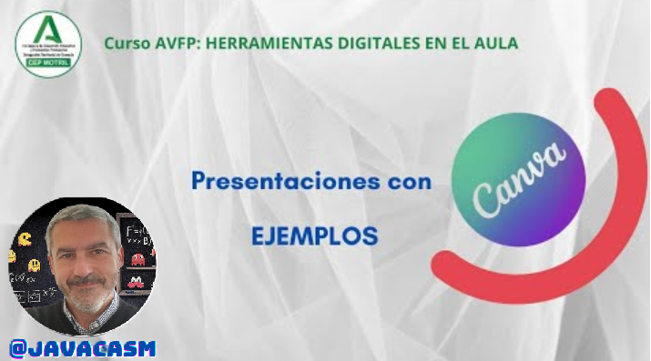

### Ejemplo de presentaciones 

Vamos a ver un ejemplo de presentación con Canva

[Vídeo: Ejemplo de Presentaciones con Canva](https://drive.google.com/file/d/1KHb-jLx4PzUwSJdrreqgK_QHv8DL-1Oa/view?usp=sharing)

En este vídeo hemos visto:

* Antes de empezar a hacer la presentación debemos:
  - Tener planificado, qué queremos contar, mejor si nos hacemos un esquema
  - Planificar diseño y formato
  - Buscar los diferentes tipos de elementos de apoyo o contenidos que vamos a incorporar a la presentación 
  - Enlaces que usaremos como referencia
  - Imágenes con la licencia adecuada que queramos incluir en el documento 
  - Pensar si la presentación es para una exposición o para alguien la lea por su cuenta
* Vamos abuscar una pantilla con un diseño y formato que nos interese.
* Cada una de las diapositivas de las plantillas tienen un formato y aspecto distinto para que podemos integrar fácilmente nuestro contenido, pero manteniendo un mismo aspecto. Por ejemplo, necesitamos que haya diapositivas con índices para enumerar distintas opciones, tablas para hacer gráficos, elementos animados, ...
* Podemos incluir enlaces con las distintas páginas de la presentación, para poder movernos entre ellas con facilidad
* También podemos incluir alguna diapositiva que actúe como menú o índice, donde pondremos ponemos los títulos de nuestros apartados, y enlaces que nos van llevar a cada uno de las secciones de la presentación.  
* Es importante ordenar en capas los distintos elementos, para que la visualización sea la adecuada: 
   - Los fondos en la capa de más atrás
   - Marcos en la intermedia
   - Texto o imágenes en la más cercana
* Conviene agrupar los elementos que forman parte del mismo bloque para así poder moverlos y ajustar su tamaño de manera conjunta. Normalmente podemos usar la tecla Mayúsculas (Shift) para poder seleccionar varios elementos.
* Las plantillas suelen tener diferentes formatos de diapositiva, que podremos duplicar para hacer las nuestras que iremos adaptando
* También tenemos otras diapositivas pensadas para incluir imágenes o vídeos, podemos incluir nuestras propias imágenes usando los marcos y el formato común.
* Podemos hacer una grabación en vídeo de la presentación donde podremos grabar audio, la presentación y si lo deseamos nuestra imagen desde una webcam.
* Podemos incluir también en las páginas finales una relación de enlaces parar ampliar la información

[Persentación en Canva sobre Licencias](https://www.canva.com/design/DAF59B-vx40/TrGFE-38EKULjaxCATmdDw/edit?utm_content=DAF59B-vx40&utm_campaign=designshare&utm_medium=link2&utm_source=sharebutton)

### Otros ejemplos de presentaciones para hacer con Canva

Aquí tienes algunos otros ejemplos de títulos y estructuras que podrían utilizarse en presentaciones educativas para diversos temas. Puedes imaginar cómo organizarías la información en cada diapositiva. Recuerda que la creatividad y la adaptación al contenido son esenciales. Aquí van algunos ejemplos:

### 1. **Ciencias Naturales: "El Ciclo del Agua"**
   - Diapositiva 1: Introducción
     - Título: "El Fascinante Mundo del Agua"
     - Imágenes: Ilustración del ciclo del agua.
   - Diapositiva 2: Evaporación
     - Título: "Evaporación: De líquido a gas"
     - Gráfico: Representación del proceso.
   - Diapositiva 3: Condensación
     - Título: "Condensación: De gas a líquido"
     - Imágenes: Ejemplos de condensación.
   - Diapositiva 4: Precipitación
     - Título: "Precipitación: Lluvia, nieve y más"
     - Fotografías: Diferentes formas de precipitación.
   - Diapositiva 5: Resumen
     - Título: "Resumen: El Ciclo Continúa"
     - Preguntas para reflexionar.

### 2. **Historia: "La Revolución Industrial"**
   - Diapositiva 1: Contexto Histórico
     - Título: "Antecedentes: Cambios en el siglo XVIII"
     - Imágenes: Mapa del mundo en esa época.
   - Diapositiva 2: Inventos Clave
     - Título: "Innovaciones Transformadoras"
     - Lista: Inventos importantes con imágenes.
   - Diapositiva 3: Impacto Social
     - Título: "Impacto en la Sociedad"
     - Gráficos: Cambios demográficos y económicos.
   - Diapositiva 4: Consecuencias a Largo Plazo
     - Título: "Legado de la Revolución Industrial"
     - Citas de historiadores y reflexiones.

### 3. **Matemáticas: "Introducción a la Geometría"**
   - Diapositiva 1: Definición
     - Título: "Explorando Formas y Espacios"
     - Imágenes: Ejemplos de formas geométricas.
   - Diapositiva 2: Tipos de Ángulos
     - Título: "Ángulos: Agudos, rectos y obtusos"
     - Diagrama: Representación visual de ángulos.
   - Diapositiva 3: Propiedades de los Triángulos
     - Título: "Triángulos: Lados y ángulos"
     - Ilustraciones: Diferentes tipos de triángulos.
   - Diapositiva 4: Aplicaciones en la Vida Diaria
     - Título: "Geometría en el Mundo Real"
     - Ejemplos: Uso de geometría en la arquitectura y diseño.

### 4. **Literatura: "Análisis de una Novela"**
   - Diapositiva 1: Introducción
     - Título: "Explorando 'Nombre de la Novela'"
     - Imágenes: Portada del libro y autor.
   - Diapositiva 2: Resumen de la Trama
     - Título: "Resumen: Principales Eventos"
     - Diagrama: Estructura de la narrativa.
   - Diapositiva 3: Desarrollo de Personajes
     - Título: "Personajes Memorables"
     - Collage: Imágenes y descripciones.
   - Diapositiva 4: Temas y Simbolismos
     - Título: "Profundizando en los Temas"
     - Citas clave y símbolos.

Estos son solo ejemplos y la estructura específica dependerá del contenido y del estilo preferido del presentador. Podemos adaptar estas ideas según las necesidades y añadir detalles adicionales para hacer la presentación más completa y atractiva.
