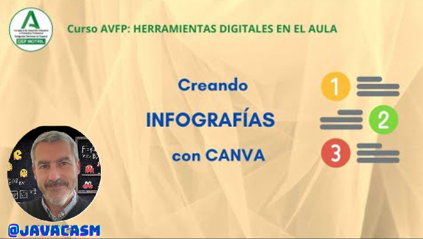

## Infografías con Canva

### ¿Qué es una infografía?

Una infografía es una representación visual de información o datos, diseñada de manera clara y concisa para facilitar la comprensión de conceptos complejos de manera rápida y efectiva. Se caracteriza por el uso de gráficos, imágenes, iconos y texto breve para transmitir información de manera visualmente atractiva. Las infografías son herramientas visuales poderosas que permiten comunicar ideas de manera más accesible y retentiva.

{height=50%}

Más adelante trabajaremos sobre esta infografía

**Características comunes de una infografía:**

1. **Elementos Visuales:**
   - Utiliza gráficos, iconos, imágenes y colores para representar la información de manera visualmente atractiva y fácil de entender.

2. **Texto Breve:**
   - Se caracteriza por la brevedad en el texto, utilizando frases cortas y puntos clave para transmitir la información de manera concisa.

3. **Estructura Lógica:**
   - Organiza la información de manera lógica y estructurada, guiando al lector a través de una secuencia o jerarquía clara.

4. **Enfoque en la Información Importante:**
   - Destaca los datos clave o conceptos más importantes, ayudando a los lectores a identificar y recordar la información esencial.

**Usos y propósitos de las infografías:**

1. **Síntesis de Datos:**
   - Condensan información compleja en un formato visual fácil de entender, lo que facilita la asimilación de datos.

2. **Instrucciones y Tutoriales:**
   - Proporcionan instrucciones paso a paso o tutoriales de manera visual, lo que es especialmente útil para guiar a los usuarios en procesos específicos.

3. **Presentación de Estadísticas:**
   - Resumen datos estadísticos de manera visual, permitiendo que las tendencias y patrones sean fácilmente identificables.

4. **Explicación de Conceptos:**
   - Desglosan conceptos complicados en partes más manejables, facilitando la comprensión de ideas abstractas.

5. **Marketing y Publicidad:**
   - Se utilizan para presentar productos, servicios o ideas de manera atractiva, captando la atención del público objetivo.

6. **Educación:**
   - Son herramientas efectivas en entornos educativos para explicar conceptos, procesos o hechos de manera más visual y memorable.

7. **Resumen de Eventos:**
   - Sintetizan información sobre eventos históricos, noticias o sucesos de actualidad de manera rápida y accesible.

8. **Promoción en Redes Sociales:**
   - Se comparten ampliamente en plataformas de redes sociales debido a su capacidad para captar la atención y transmitir información de manera rápida.

En resumen, las infografías son herramientas visuales versátiles que sirven para simplificar la comunicación de información compleja, facilitar la comprensión de conceptos y hacer que los datos sean más accesibles y atractivos para una audiencia específica.

[Vídeo: creando infografías con Canva](https://drive.google.com/file/d/1BQ976vSqhmG8pr1QMB3cPHPjJcA8OV3h/view?usp=sharing)

En este vídeo hemos visto:

* Una infografía es un documento visual donde queremos mostrar de forma clara unos contenidos.
* Suelen dar detalles sobre un concepto
* Normalmente tiene una página, pero podemos añadir más. 
* Podemos crearla desde una plantilla, buscamos el formato que queramos entre las que nos aparezcan, según queramos hacer más visual o menos, si enumera puntos o da detalles sobre un tema.
* Cuanto más similar sea a nuestra, idea menos trabajo tendremos que hacer.
* Vamos modificando las partes añadiendo el texto que hemos preparado previamente, manteniendo el formato. 
* Posteriormente podemos copiar el estilo entre los distintos elementos para mantener una imagen similar.
* Modificamos los elementos moviéndolos, rotando, quitando o poniendo otros nuevos. Y los ajustamos para que quede a nuestro gusto
* Jugaremos con el Zoom para ver en detalle y todo el resultado en conjunto
* Si nos es cómodo usar teclas, al seleccionar una opción vermos cuál tiene asociada.
* Si no encontramos elementos adecuados podemos construirlos con las formas básicas y/o cajas de texto
* También podemos buscar imágenes en internet e importarlos en la opción "Subidos"
* Recordad que los textos largos nos impiden ver las infografías de un vistazo
* Si nos equivocamos podemos deshacer el error con la opción de la flecha "hacia atrás" del menú o con la familiar tecla Ctrl-Z (Cmd-Z en mac OS)
* Normalmente daremos varias iteraciones hasta conseguir el resultado que nos guste.
* Podemos añadir marcos a nuestros elementos, pero recuerda ponerlos en una capa más atrás para que no tape al elemento.
* Podemos agrupar varios elementos cuando los tengamos seleccionados, así los moveremos y modificaremos al mismo tiempo.
* También podemos desagrupar los elementos para modificarlos por separado.
* Una vez tengamos lista la infografía podemos imprimirla en papel
* También podemos compartirla con un enlace o  descargarlas en diferentes formatos, como png o pdf
* También podríamos publicar en una web o compartirla en redes o en servicios de almacenamiento en la nube

###  Crear infografías con Canva

Crear infografías con Canva es un proceso sencillo y accesible, ya que Canva es una plataforma en línea que proporciona herramientas intuitivas y una amplia variedad de plantillas y elementos gráficos. Aquí tienes una guía paso a paso sobre cómo hacer infografías con Canva:

1. **Acceder a Canva:**
   - Inicia sesión en tu cuenta de Canva o crea una cuenta nueva si aún no tienes una. Puedes acceder a Canva en www.canva.com.

2. **Seleccionar un Tipo de Diseño:**
   - En la página de inicio, haz clic en "Crear un diseño" y elige "Infografía" entre las opciones prediseñadas o utiliza las dimensiones personalizadas.

3. **Explorar Plantillas:**
   - Canva ofrece una variedad de plantillas de infografías. Explora las opciones disponibles y selecciona la que mejor se adapte a tu tema o propósito.

4. **Personalizar la Plantilla:**
   - Haz clic en los elementos de la plantilla para editarlos. Puedes cambiar el texto, colores, fuentes, imágenes y cualquier otro elemento según tus necesidades.

5. **Agregar Elementos:**
   - Utiliza la barra lateral izquierda para acceder a elementos adicionales. Puedes añadir iconos, ilustraciones, líneas, formas y más para personalizar tu infografía.

6. **Incorporar Texto:**
   - Haz clic en el botón "Texto" en la barra lateral para agregar cuadros de texto. Puedes escribir títulos, subtítulos, descripciones y cualquier otro texto relevante.

7. **Cargar Imágenes:**
   - Si deseas incorporar imágenes, haz clic en "Elementos" y selecciona "Subir tus propias imágenes". También puedes explorar la biblioteca de imágenes de Canva.

8. **Ajustar Diseño y Diseño Responsivo:**
   - Utiliza las opciones de diseño para ajustar la distribución de elementos y asegurarte de que tu infografía se vea equilibrada. Canva también ofrece una función de diseño responsivo para adaptar tu diseño a diferentes formatos.

9. **Guardar y Compartir:**
   - Una vez que estés satisfecho con tu infografía, haz clic en "Descargar" para guardarla en tu dispositivo en formato PNG, JPEG, PDF u otro formato compatible. También puedes compartir tu infografía directamente desde Canva.

10. **Colaborar (opcional):**
    - Canva permite la colaboración en tiempo real. Si estás trabajando en equipo, puedes invitar a otros a editar la infografía contigo.

¡Listo! Has creado tu infografía con Canva. Recuerda que puedes guardar tu trabajo en cualquier momento y regresar para editarlo o actualizarlo según sea necesario. Canva es una herramienta flexible que facilita la creación de diseños visuales impactantes incluso si no tienes experiencia en diseño gráfico.

### Ejemplos sencillos

Vamos a ver algunos ejemplos que podemos hacer de infografías con Canva, en algún caso los haremos desde cero y en otros reutilizaremos los que ya existen...

#### Infografía sobre el cambio climático

Como modelo de lenguaje basado en texto, no puedo crear imágenes o gráficos directamente. Sin embargo, puedo proporcionarte una descripción general de cómo podrías estructurar una infografía educativa sobre un tema específico utilizando Canva. Imagina que estás creando una infografía sobre "Los Efectos del Cambio Climático". Aquí tienes una descripción de cómo podría ser:

**Título:**
- Inicia tu infografía con un título llamativo y descriptivo: "Impacto del Cambio Climático en Nuestro Planeta".

**Sección 1: Introducción al Cambio Climático**
- Breve introducción al cambio climático, con una definición clara y sencilla.
- Gráfico representativo del aumento de la temperatura global a lo largo de los años.

**Sección 2: Causas del Cambio Climático**
- Lista de las principales causas, como emisiones de gases de efecto invernadero, deforestación, etc.
- Iconos o ilustraciones que representen cada causa.

**Sección 3: Efectos del Cambio Climático**
- Enumeración de los impactos, como el deshielo de los glaciares, eventos climáticos extremos, cambios en los patrones de lluvia, etc.
- Gráficos o imágenes que ilustren cada efecto.

**Sección 4: Impacto en la Fauna y Flora**
- Descripción de cómo el cambio climático afecta a la biodiversidad.
- Imágenes de animales y plantas en peligro debido a estos cambios.

**Sección 5: Soluciones y Acciones Positivas**
- Lista de acciones que las personas pueden tomar para reducir su huella de carbono.
- Gráfico circular que muestre el porcentaje de reducción de emisiones al adoptar prácticas sostenibles.

**Sección 6: Datos Importantes**
- Estadísticas clave sobre el cambio climático.
- Gráficos de barras o líneas para resaltar datos relevantes.

**Conclusiones:**
- Breve resumen de los puntos clave.
- Llamada a la acción para inspirar a las personas a tomar medidas.

Recuerda que Canva te permite agregar iconos, gráficos, imágenes y otros elementos visuales para hacer tu infografía más atractiva. Explora las opciones de diseño y personalización que ofrece la plataforma para adaptar la infografía a tus necesidades y al estilo visual que desees.

[Vídeo: Infografía sobre el cambio climático](https://drive.google.com/file/d/1zm68ZSF8mWLPl0PJDfdBziG3jY7WGurn/view?usp=drive_link)

Este es el enlace a los [datos numéricos sobre el cambio climático](https://www.epdata.es/datos/cambio-climatico-datos-graficos/447?accion=2#) que hemos usado 

En este vídeo hemos aprendido:

* El ordenar las capas dentro de cada zona nos facilita la selección. Es más cómodo si el marco está en la capa de más atrás y el texto en la más cercana.

* Es útil copiar el formato entre bloques para que tengan igual apariencia, usando el icono del rodillo 
* Cuando trabajamos con varios elementos que comparten posición, por ejemplo: un marco, el texto y quizás una imagen, podemos agruparlos de manera que se muevan como un todo. Los seleccionamos haciendo clic sobre ellos pulsando la tecla Mayúsculas, apareciendo la la opción **Agrupar** que marcaremos.
* Podemos crear gráficos (de líneas, de barras, de sectores,...) con nuestros datos que podemos importar desde un fichero CSV o Google Sheets
* Cuando veamos una infografía que nos gusta o interesa, podemos marcarla como favorita, luego la encontraremos con facilidad en "Plantillas" -> "Favoritos"
