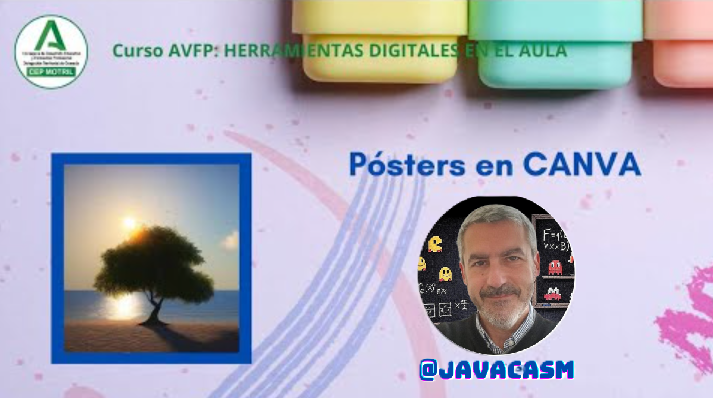
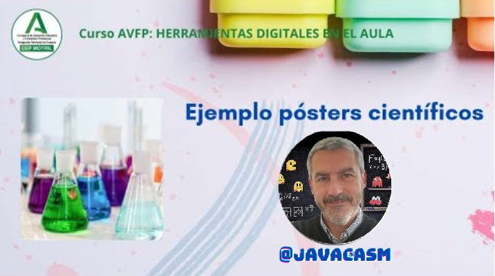

## Posters y carteles con Canva

Un póster es una representación gráfica y visual que comunica información de manera concisa y atractiva. Se utiliza comúnmente en conferencias, presentaciones académicas, ferias, exposiciones y otros eventos para transmitir mensajes de manera efectiva. Los pósters suelen ser grandes hojas de papel o cartulina diseñadas para ser exhibidas en paneles o paredes.

La utilidad de un póster radica en su capacidad para presentar información de manera clara y rápida, capturando la atención del espectador y comunicando conceptos clave. Algunos elementos comunes que puedes incluir en un póster son:

La clave para un póster efectivo es lograr una combinación equilibrada de texto e imágenes, de manera que la audiencia pueda entender fácilmente el contenido sin tener que leer grandes cantidades de texto. Los pósters son una herramienta valiosa para compartir investigaciones, proyectos o ideas de manera visual y accesible.

[Vídeo sobre pósters con Canva](https://drive.google.com/file/d/1wIjaoJqMNoe1YO-twdBxgjYihIyiJP_K/view?usp=sharing)

En este vídeo hemos visto:

* Suelen ser de gran tamaño, y se ven a distancia, por lo que tendremos que usar tipografía de tamaño adecuado.
* Competimos con la atención de los demás
* Canva tiene una enorme variedad de plantillas para pósters, ya sean de anuncios o de exposición de trabajo
* Debemos intentar que quien lo vea y le interese se pueda llevar la información, quizás con una URL o un código QR
* También existen plantillas para incluir frases, o lista de cosas que recordar cómo normas de uso, o información relevante
* Muchos de estos posters, están pensados para ser impresos
* Para educación existen carteles para recordar todo tipo de conocimientos, como fórmulas, frases, fechas, ....

{height=50%}

En este póster trabajaremos a continuación

### Cómo crear un póster llamativo

Normalmente cuando haces un póster/cartel compites con otros muchos carteles para captar la atención de tu público. Crear un cartel llamativo implica combinar elementos visuales y de diseño de manera efectiva para captar la atención de la audiencia. Aquí hay algunos consejos para crear un cartel atractivo:

1. **Título impactante:**
   - Utiliza un título claro, conciso y atractivo que resuma el mensaje principal de tu cartel. Puedes usar fuentes llamativas y colores contrastantes para destacarlo.

2. **Imágenes atractivas:**
   - Incorpora imágenes de alta calidad que sean relevantes para el tema del cartel. Las imágenes deben ser claras, nítidas y visualmente atractivas.

3. **Colores vibrantes:**
   - Elige una paleta de colores llamativos y vibrantes que capturen la atención. Asegúrate de que los colores se complementen y no resulten difíciles de leer.

4. **Diseño limpio y organizado:**
   - Mantén el diseño del cartel limpio y organizado. Evita la sobrecarga de información y deja suficiente espacio en blanco para que la información sea fácil de procesar.

5. **Tipografía legible:**
   - Selecciona fuentes legibles y evita el uso de demasiados estilos de letra en un solo cartel. Ajusta el tamaño y el espaciado para garantizar la legibilidad desde una distancia razonable.

6. **Mensaje claro:**
   - Asegúrate de que el mensaje principal sea claro y fácil de entender. La gente debería poder captar la idea central del cartel en unos pocos segundos.

7. **Uso de iconos y gráficos:**
   - Incorpora iconos y gráficos simples para visualizar información clave. Estos elementos pueden hacer que el cartel sea más atractivo y fácil de entender.

8. **Contraste:**
   - Utiliza contrastes visuales para resaltar elementos importantes. Esto puede incluir contrastes de color, tamaño o forma para dirigir la atención a áreas específicas del cartel.

9. **Originalidad:**
   - Sé creativo y original en tu enfoque. Trata de destacarte de la competencia utilizando ideas únicas y creativas.

10. **Llamada a la acción:**
    - Incluye una llamada a la acción clara si es relevante para tu mensaje. Puedes utilizar frases persuasivas que motiven a la audiencia a tomar medidas.

11. **Pruebas de visualización:**
    - Antes de imprimir o compartir digitalmente el cartel, realiza pruebas de visualización para asegurarte de que todos los elementos se vean como esperas y sean efectivos.

Recuerda que el objetivo principal es comunicar tu mensaje de manera efectiva y atraer la atención de la audiencia. Experimenta con diferentes combinaciones de colores, diseños y elementos visuales hasta encontrar la combinación que funcione mejor para tu mensaje específico.

### Ejemplo de póster ciéntifico

Un póster es una representación gráfica y visual que comunica información de manera concisa y atractiva. Se utiliza comúnmente en conferencias, presentaciones académicas, ferias, exposiciones y otros eventos para transmitir mensajes de manera efectiva. Los pósters suelen ser grandes hojas de papel o cartulina diseñadas para ser exhibidas en paneles o paredes.

1. **Título:**
   - Un título claro y atractivo que resuma el tema principal del póster.

2. **Autores y afiliaciones:**
   - Nombres de los autores y las instituciones a las que están afiliados.

3. **Introducción:**
   - Una sección breve que establezca el contexto y la importancia del tema.

4. **Objetivos:**
   - Declaraciones claras sobre lo que se espera lograr con la investigación o el proyecto.

5. **Metodología:**
   - Descripción concisa de los métodos utilizados en la investigación o el proyecto.

6. **Resultados:**
   - Presentación visual de los hallazgos, como gráficos, tablas o imágenes.

7. **Discusión:**
   - Interpretación de los resultados y sus implicaciones.

8. **Conclusiones:**
   - Resumen de los puntos clave y posibles direcciones futuras.

9. **Referencias:**
   - Citas bibliográficas o fuentes utilizadas en la investigación.

10. **Gráficos y visualizaciones:**
    - Elementos visuales como gráficos, imágenes, diagramas o fotografías que respalden y aclaren la información presentada.

11. **Diseño atractivo:**
    - Un diseño limpio y atractivo que facilite la lectura y la comprensión rápida.

[Vídeo: Ejemplo de póster científico](https://drive.google.com/file/d/163bIR5Gu8gqXCBgbtI0zuK2So87E5Acl/view?usp=sharing)

En este vídeo hemos visto:

* Existen multitud de plantillas de posters científicos. Podemos encontrar breves infografías o trabajos más serios, que suelen tener los siguientes puntos:
   - Título
   - Autores
   - Introducción
   - Objetivos
   - Metodología
   - Resultados
   - Discusión
   - Conclusiones
* Si se trata de un trabajo serio debemos usar un aspecto que acompañe al contenido.
* Depende de dónde se exponga habrá que decidir el tamaño de la letra y su contenido
* Elegir bien el título, pues habrá quien sea lo único que lea.
* Suelen incluir gráficas con datos reales, que podemos importar desde un excel o similar.
* Si nuestro póster sólo quiere presentar someramente nuestro trabajo debe ser claro, dar los cuatro elementos esenciales y de un vistazo.

### Ejemplo cartel para un anuncio

También podemos hacer carteles de forma sencilla con Canva, existen ejemplos de todo tipo.

Recuerda que tu cartel compite con muchos otros por la atención:

* Hazlo vistoso, elige una plantilla que lo sea
* Usa un tamaño de letra que se vea desde lejos
* Información relevante y clara
* Añade forma de guardar la información y de recordarla, por ejemplo con un QR 
* Canva tiene su propia App para generar QRs

Dentro de Canva, existen aplicaciones, como determinados complementos, que realizan desarrolladores, no sólo los propios trabajadores de Canva, y disponibles para hacer todo tipo de cambios a las imágenes, como pixelar, simulación de corte, etc. La aplicación “Licuar” por ejemplo,  les añade efecto de color psicodélico.

[Vídeo sobre creación de carteles de anuncio con Canva](https://drive.google.com/file/d/1pLIWUYnZE63bQl9ERylAeA3pYm4HE9GI/view?usp=sharing)

En este vídeo hemos visto:

* Un uso interesante de los pósters y los carteles son los anuncios, una herramienta poderosa utilizada para transmitir información, divulgación científica, dar a conocer servicios o productos, marcas, eventos académicos, culturales, sociales, de forma rápida,  práctica y creativa.
* Las características principales de un anuncio:
   - Tamaño, preferiblemente grande
   - El motivo del anuncio, puede ser un evento, festival, cumpleaños,... 
   - Título alguna palabra, frase o invitación directa
   - Información de contacto, muy importante para que el interesado sepa cómo comunicarse contigo.
   - Nombre de los asistentes, participantes o público al que va dirigido
   - Lugar , fecha, hora, duración,  del evento
* Aspecto atractivo, como los colores, formas, siluetas, logo
* Vamos a usar la opción “Personaliza plantilla”, cambiando:
   - El título 
   - La fecha y hora duración 
   - Los diferentes textos del evento
* Resaltaremos los elementos gráficos integrados, para hacerlos atractivos cambiando tamaños. 
* Recordad que deben estar ordenados en las capas correspondientes. Seleccionamos “Capa”, y  la opción “Traer al frente“ o al fondo para ordenarlos 
* Podemos importar nuestras propias imágenes que incluiremos en el marco seleccionado. Recordad,  siempre que tengamos una imagen dentro de un marco, donde podemos hacerle algunos ajustes como cambiar la iluminación, la calidez, el brillo, el contraste para que destaque un poco, típicos ajustes de imagen.
* Para completar el anuncio,  podemos integrar un QR, que nos llevará a la propia página para acceder directamente al contenido online. 
* Primero, crearemos un “enlace público” de este anuncio, con el que generamos un código QR, para que podamos acceder a esta documentación.
* Desde la opción de “Elementos “ y  “Buscar elementos”  seleccionamos QR. Hacemos clic en “Usar app”, código QR. Es una aplicación creada por Canva, que nos informa que va a acceder a nuestra información, y solicita permiso para añadir contenido al diseño o subir archivos a Canva en nuestro nombre. Aceptamos y “abrimos” la aplicación,  introducimos el enlace que queremos generar, podemos ponerle distintos fondos, márgenes, una vez finalizada la personalización, seleccionamos “Genera Código”, y tenemos nuestra imagen QR que añadiremos a la parte inferior de nuestro documento.
* Cuando tengamos nuestro cartel listo podemos “Imprimir el cartel” indicando cómo es lo que queremos imprimir y cuál el resultado,  una página,  formato A3, acabado satinado, cantidad, y también aparece el importe si lo imprimimos a través del servicio de impresión de Canva.
* Si lo quisiéramos imprimir en otro sitio, descargaríamos nuestro archivo en el formato deseado, PDF, PNG y lo  imprimimos.

### Ejemplos de posters educativos con Canva

Veamos algunos ejemplos de posibles contenidos para un póster educativo que podrías crear con Canva. Puedes seguir estos ejemplos y personalizarlos según tus necesidades específicas:

1. **Póster sobre el Ciclo del Agua:**
   - Utiliza gráficos e imágenes para representar las diferentes etapas del ciclo del agua. Incluye descripciones breves y etiquetas para cada fase.

2. **Póster de Vocabulario en Otro Idioma:**
   - Diseña un póster educativo que presente vocabulario básico en otro idioma. Incluye imágenes para asociarlas con cada palabra y fomentar el aprendizaje visual.

3. **Póster de Historia Local:**
   - Crea un póster que destaque eventos históricos importantes en tu localidad. Incluye fechas, imágenes y breves descripciones para cada evento.

4. **Póster de Ciencias Naturales:**
   - Diseña un póster que explique un concepto específico de ciencias naturales, como la fotosíntesis o la cadena alimentaria. Utiliza gráficos y diagramas para hacerlo visualmente atractivo.

5. **Póster de Hábitos Saludables:**
   - Crea un póster que promueva hábitos saludables, como una dieta balanceada y ejercicio regular. Incluye imágenes de alimentos saludables y consejos para mantener un estilo de vida activo.

6. **Póster de Literatura:**
   - Diseña un póster que destaque obras literarias clave, autores o conceptos literarios importantes. Incluye imágenes de libros y citas destacadas.

7. **Póster de Matemáticas:**
   - Crea un póster que explique un concepto matemático específico, como geometría, álgebra o estadísticas. Utiliza gráficos y ejemplos para ilustrar el concepto.

8. **Póster de Evento Escolar:**
   - Diseña un póster para promocionar un evento escolar, como una feria de ciencias, un concierto o una obra de teatro. Incluye detalles del evento, fechas y horarios.

9. **Póster de Seguridad en Internet:**
   - Crea un póster educativo sobre seguridad en Internet, destacando consejos y buenas prácticas para el uso seguro de la tecnología.

10. **Póster de Ecología y Medio Ambiente:**
    - Diseña un póster que destaque la importancia de cuidar el medio ambiente. Incluye consejos para la conservación y gráficos que ilustren problemas ambientales.

Recuerda que Canva proporciona una amplia variedad de plantillas y elementos gráficos que puedes utilizar como punto de partida para crear pósteres educativos atractivos y efectivos.

