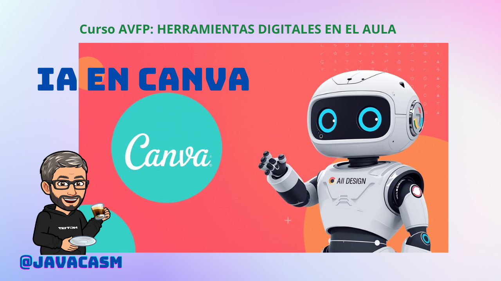

### Herramientas de IA en Canva (Actualizado a noviembre de 2025)

En este apartado vamos a hacer un repaso completo sobre las herramientas de IA de Canva.

Canva ha evolucionado enormemente con su suite **Magic Studio**, que integra inteligencia artificial para simplificar el diseño gráfico, edición de imágenes, creación de videos y más. En octubre de 2025, Canva lanzó su **Sistema Operativo Creativo** y actualizaciones en **Canva Create 2025**, incorporando nuevas funciones como edición de fotos impulsada por IA, generadores de fondos y voces sintéticas. Estas herramientas están diseñadas para ser accesibles, pero su disponibilidad y límites de uso varían según el plan (Free, Pro, Business o Enterprise).

En este tutorial, vermos:
1. **Categorías de herramientas de IA** con descripciones y pasos básicos para usarlas.
2. **Disponibilidad por plan**, con una tabla comparativa.
3. **Consejos prácticos** para maximizar su uso.

Todas las herramientas se acceden desde el editor de Canva (web, app móvil o desktop). Asegúrate de tener una cuenta en [canva.com](https://www.canva.com). Las actualizaciones de 2025 incluyen integración con Affinity (editor profesional gratuito) y herramientas on-device para privacidad.

)
[Vídeo: Herramientas IA de Canva](https://drive.google.com/file/d/1No1G09bDPR9-jJKQ4UfmS0cWQXv8Tufr/view?usp=sharing)

#### 1. Categorías de Herramientas de IA en Magic Studio

Las herramientas se agrupan en áreas clave. Muchas son "premium" y consumen créditos de IA mensuales (pooled, es decir, compartidos entre herramientas). En planes gratuitos, el límite es bajo (ej. 5 usos/mes para clips de video). Aquí va un resumen con ejemplos de uso:

##### a. **Generación de Imágenes y Gráficos (Magic Media)**
Estas crean contenido visual desde texto o referencias.
- **Text to Image (Dream Lab)**: Genera imágenes a partir de prompts de texto. *Ej.: "Un gato astronauta en Marte"*.  
  **Paso a paso**: 1. Abre un diseño nuevo. 2. Ve a "Apps" > "Magic Studio" > "Text to Image". 3. Escribe el prompt y selecciona estilo (realista, cartoon). 4. Genera y arrastra a tu canvas. *Nuevo en 2025: Soporte para estilos 3D y transiciones (cartoon a realista).*
- **Text to Graphic**: Crea iconos, stickers o ilustraciones. *Ej.: "Gráfico de pastel colorido para ventas"*.  
  **Paso a paso**: Similar a arriba, pero selecciona "Graphics" en Magic Media.
- **Style Match**: Aplica el estilo de una imagen de referencia a otra. *Ej.: Convierte una foto en estilo acuarela*.  
  **Paso a paso**: Sube la referencia > Selecciona imagen objetivo > "Aplicar estilo".
- **Background Generator (Magic Background)**: Crea fondos personalizados. *Nuevo en 2025*.  
  **Paso a paso**: En editor de foto > "Editar imagen" > "Fondo" > Describe el fondo (ej. "Gradiente azul oceánico").

##### b. **Edición de Imágenes y Fotos**
Herramientas para refinar sin habilidades avanzadas.
- **Magic Edit**: Edita partes específicas con prompts. *Ej.: Cambia un sombrero por una corona*.  
  **Paso a paso**: 1. Sube foto. 2. Selecciona área con pincel. 3. Escribe cambio (ej. "Añade flores"). 4. Aplica.
- **Magic Eraser / Background Remover**: Elimina fondos o elementos no deseados.  
  **Paso a paso**: Selecciona objeto > "Borrar" o "Remover fondo" (un clic para videos también).
- **Magic Expand / Magic Grab**: Extiende imágenes o mueve elementos. *Nuevo: Magic Grab para seleccionar objetos precisos*.  
  **Paso a paso**: Para Expand: Arrastra borde > "Expandir". Para Grab: Clic en objeto > Mueve/redimensiona.
- **AI-powered Photo Editor**: Edición por clic (recolorear, duplicar). *Lanzado en 2025*.  
  **Paso a paso**: En foto > "Editar con IA" > Clic en sujeto > Elige acción.

##### c. **Herramientas de Texto y Escritura**
- **Magic Write**: Genera texto en tu tono (sube muestra para personalizar). *Ej.: Emails o captions*.  
  **Paso a paso**: 1. En texto > "Magic Write". 2. Prompt: "Escribe un post de Instagram motivacional". 3. Edita y ajusta tono.
- **Canva AI (Texto)**: Asistente conversacional para ideas y diseños. *Nuevo: Integra con Sheets para fórmulas mágicas*.  
  **Paso a paso**: @CanvaAI en chat o editor > Pregunta: "Sugiere layout para flyer".
- **Magic Morph**: Transforma texto en patrones/texturas.  
  **Paso a paso**: Selecciona texto > "Morph" > Prompt: "Hazlo como ondas marinas".
- **Translate**: Traduce diseños automáticamente.

##### d. **Creación y Edición de Video**
- **Text to Video**: Genera videos cortos desde texto (con Runway). *Beta en 2025*.  
  **Paso a paso**: "Apps" > "Text to Video" > Prompt: "Video de 10s de un café abriéndose".
- **Highlights**: Extrae clips cortos de videos largos.  
  **Paso a paso**: Sube video > "Highlights" > IA selecciona momentos clave.
- **AI Voice / Enhance Voice**: Sintetiza voz o limpia audio. *Nuevo: Voces naturales sin equipo*.  
  **Paso a paso**: En video > "Audio" > "Generar voz" > Elige voz y prompt.
- **Magic Animate / Beat Sync**: Anima diseños o sincroniza con música.  
  **Paso a paso**: Selecciona elemento > "Animar" > Elige efecto (automático en Pro+).

##### e. **Otras Herramientas Avanzadas**
- **Magic Resize**: Adapta diseños a formatos (redes sociales, impresiones).  
  **Paso a paso**: "Resize" > Elige plataforma > IA ajusta.
- **Canva Code**: Crea elementos interactivos sin código (ej. quizzes). *Nuevo en 2025*.  
  **Paso a paso**: "Apps" > "Canva Code" > Describe: "Botón interactivo para encuesta".
- **Magic Charts / Magic Formulas**: Genera gráficos y fórmulas en Sheets. *Integrado en 2025*.
- **Custom Mockups**: Convierte imágenes en plantillas realistas. *Nuevo*.

**Nota**: En 2025, se añadieron integraciones con [Affinity](https://www.affinity.studio/es_es) (edición pro gratuita) y herramientas on-device para privacidad (no usan datos para entrenar IA).

#### 2. Disponibilidad de Herramientas por Plan

Canva ofrece **acceso ilimitado a herramientas básicas de IA** (no consumen créditos), pero las premium usan un pool mensual de créditos (resetea cada mes). Free: Bajo (limitado, ej. 5 usos para videos). Pro: Alto. Business/Enterprise: Alto+ (más créditos, controles admin).

| Herramienta/Categoría                  | Free (0 USD/año) | Pro (120 USD/año) | Business (200 USD/año/usuario) | Enterprise (Personalizado) |
|----------------------------------------|------------------|-------------------|--------------------------------|----------------------------|
| **Generación de Imágenes (Text to Image, Style Match, Background Generator)** | Limitado (bajo pool) | Alto pool; ilimitado básico | Alto+ pool; escalable para equipos | Alto+; controles SSO y auditoría |
| **Edición de Imágenes (Magic Edit, Eraser, Expand, Grab, Photo Editor)** | Limitado; remover fondo básico | Alto; todas premium incluidas | Alto+; locking de elementos | Alto+; indemnity IP |
| **Texto y Escritura (Magic Write, Canva AI, Morph, Translate)** | Limitado; prompts básicos | Alto; tono personalizado | Alto+; bulk creation | Alto+; multi-idioma escalable |
| **Video (Text to Video, Highlights, AI Voice, Animate)** | Muy limitado (5 clips/mes) | Alto; beta ilimitada | Alto+; Beat Sync auto | Alto+; integraciones API |
| **Otras (Resize, Code, Charts, Mockups)** | Limitado | Alto; custom dimensions | Alto+; apps marketplace | Alto+; custom integrations |
| **Almacenamiento y Colaboración** | 5GB; básico | 100GB; scheduling | 500GB; approvals y reports | 1TB; SSO y logs |
| **Nuevas de 2025 (Affinity AI, 3D Styles)** | Básico on-device | Premium en Affinity | Premium+; admin AI controls | Premium+; dedicated manager |

*Fuentes: Planes oficiales de Canva.*  Planes pagos incluyen Affinity gratis con IA premium. Free es ideal para probar; Pro para freelancers; Business para equipos pequeños; Enterprise para grandes orgs.

#### 3. Consejos Prácticos y Mejores Prácticas
- **Acceso rápido**: En el editor, busca "Magic Studio" en la barra lateral o usa @CanvaAI para prompts conversacionales.
- **Gestión de créditos**: Monitorea uso en "Configuración > Uso de IA". Si agotas, actualiza o espera reset mensual.
- **Privacidad**: Canva no usa tus creaciones para entrenar IA (2025 update).
- **Tutoriales en Canva**: Ve a "Aprende" para videos guiados. Prueba con un diseño simple: Crea un post de IG con Text to Image + Magic Write.
- **Limitaciones comunes**: Prompts en inglés dan mejores resultados; edita manualmente para precisión. En móvil, algunas (ej. Code) son web-only.

¡Con estas herramientas, Canva democratiza el diseño pro! Si tienes un plan Free, empieza con Background Remover. ¿Quieres un ejemplo específico? Prueba en tu cuenta. Para más detalles, visita [Magic Studio](https://www.canva.com/magic/).

### Tutorial Detallado: Magic Write en Canva (Actualizado a noviembre de 2025)

¡Bienvenido a este tutorial exhaustivo sobre **Magic Write**, la herramienta de IA de Canva que actúa como un asistente de escritura impulsado por OpenAI! Magic Write te permite generar texto de manera rápida y creativa, desde borradores iniciales hasta ediciones personalizadas, todo integrado en el editor de Canva. Lanzada en 2022, ha generado más de mil millones de palabras para millones de usuarios. En 2025, se han incorporado mejoras como la integración más profunda con Canva Docs y Whiteboards, soporte para voces personalizadas (basadas en muestras de texto) y límites ampliados en planes pagos, con énfasis en safeguards éticos para contenido seguro.

Este tutorial cubre **qué es**, **cómo acceder**, **pasos detallados para usarlo**, **funciones avanzadas**, **disponibilidad por planes**, **ejemplos prácticos**, **consejos y limitaciones**. Todo se basa en la documentación oficial de Canva y actualizaciones recientes. Para probarlo, inicia sesión en [canva.com](https://www.canva.com) y crea un diseño o documento nuevo.

#### 1. ¿Qué es Magic Write?
Magic Write es un generador de texto basado en IA que transforma ideas en contenido escrito en segundos. Usa modelos de machine learning entrenados con datos públicos de la web para predecir y crear texto basado en tus prompts. Es ideal para:
- **Contenido inicial**: Captions de redes sociales, bios, poemas o cartas.
- **Edición**: Reescribir, acortar, expandir o ajustar tono (ej. formal, juguetón).
- **Brainstorming**: Ideas para presentaciones, agendas o descripciones de productos.
- **Integraciones**: Funciona en diseños, Docs, Whiteboards, Presentaciones y más.

**Novedades en 2025**: Soporte para "voces personalizadas" (sube muestras de tu estilo para que la IA lo imite), generación en multi-idioma con mejor precisión (incluyendo español nativo) y herramientas educativas para planes Education.

**Safeguards**: Canva incluye filtros multicapa para evitar contenido dañino o inapropiado. Siempre úsalo de forma ética y responsable.

#### 2. Cómo Acceder a Magic Write
Magic Write está disponible en todos los tipos de diseños de Canva (web, app móvil o desktop). Hay dos formas principales:

- **En un diseño existente**:
  1. Abre tu diseño (ej. flyer, post de Instagram o Doc).
  2. Haz clic en un cuadro de texto vacío o selecciona texto existente.
  3. En la barra superior o lateral, busca el ícono de **Magic Write** (parece una varita mágica con "AI") o escribe `/` para abrir el menú rápido.
  4. Selecciona **Magic Write** de la lista.

- **Desde cero (en Docs o Whiteboards)**:
  1. Ve a "Crear un diseño" > Elige "Canva Doc", "Whiteboard" o "Presentación".
  2. En la página en blanco, haz clic en **+ Añadir** (o escribe `/`).
  3. Selecciona **Magic Write** > Escribe tu prompt.

**Acceso rápido**: En cualquier lugar, presiona `/magic` o usa el botón **+ Añadir Magic** en la barra izquierda para opciones como encabezados, listas o tablas.

#### 3. Tutorial Paso a Paso: Cómo Usar Magic Write
Magic Write ofrece modos como **generar nuevo texto**, **reescribir** o **expandir**. Cada uso consume un "query" (consulta), con límites por plan. Mantén prompts en menos de 200 palabras para mejores resultados.

##### a. **Generar Texto Nuevo desde un Prompt**
   1. Accede a Magic Write como se describió arriba.
   2. En el cuadro de prompt, escribe una descripción clara (ej. "Escribe un caption motivacional para Instagram sobre fitness, en tono entusiasta, 50 palabras").
   3. Opcional: Selecciona longitud (corta, media, larga) o tono (formal, casual).
   4. Haz clic en **Generar**.
   5. Revisa las opciones (hasta 3 variantes). Arrastra la que te guste al canvas o edítala directamente.
   6. Si no te convence, haz clic en **Regenerar** o **Otra versión**.

   **Ejemplo práctico**: Prompt: "Agenda de reunión de equipo para lanzamiento de producto". Resultado: Una lista con puntos como "Bienvenida (10 min)", "Revisión de metas", etc.

##### b. **Reescribir Texto Existente**
   1. Selecciona el texto en tu diseño que quieres cambiar.
   2. Haz clic en el ícono de Magic Write (aparece automáticamente).
   3. Elige una acción predefinida:
      - **Reescribir**: Cambia palabras/frases (ej. hazlo más conciso).
      - **Acortar**: Reduce longitud sin perder esencia.
      - **Expandir**: Añade detalles.
      - **Cambiar tono**: De formal a juguetón, o viceversa.
   4. Escribe un comando específico si usas "Custom" (ej. "Hazlo más persuasivo para ventas").
   5. Genera y aplica.

   **Ejemplo**: Texto original: "Este producto es bueno". Reescribe como: "Descubre por qué este innovador gadget revolucionará tu rutina diaria con su diseño elegante y funciones de vanguardia."

##### c. **Crear Voz Personalizada (Novedad 2025)**
   1. Ve a Configuración > "Guardar voz" (en el menú de Magic Write).
   2. Sube 2-3 muestras de texto tuyo (ej. un párrafo en tu estilo).
   3. Nombra la voz (ej. "Mi tono corporativo").
   4. En prompts futuros, selecciona "Usar mi voz" para que la IA la imite.
   5. Genera texto adaptado.

##### d. **Integrar en Estructuras (Listas, Tablas, etc.)**
   1. En un Doc o Whiteboard, usa `/` > "Añadir Magic".
   2. Elige "Lista", "Tabla" o "Encabezado".
   3. Prompt: "Crea una tabla de pros y contras de marketing digital".
   4. La IA genera la estructura editable.

**Tiempo estimado**: Cada generación toma 5-10 segundos. En móvil, es igual de fluido.

#### 4. Disponibilidad por Planes
Magic Write es accesible en todos los planes, pero con límites de queries mensuales (resetean cada mes). Planes pagos incluyen más usos y funciones premium.

| Plan                  | Queries Gratuitas/Mes | Funciones Incluidas | Notas |
|-----------------------|-----------------------|---------------------|-------|
| **Free**             | 25                   | Generación básica, reescritura simple, idiomas estándar | Ideal para pruebas; sin voces personalizadas. |
| **Pro** (120 USD/año)| Ilimitado            | Todo + voces personalizadas, tono avanzado, multi-idioma | Acceso a 100+ idiomas; integra con Brand Kit. |
| **Business** (200 USD/año/usuario) | Ilimitado + equipo | Todo + controles admin, bulk generation | Para equipos; reports de uso. |
| **Enterprise**       | Personalizado        | Todo + API, SSO     | Soporte dedicado; indemnity IP. |

*Fuente: Planes oficiales de Canva.* En Free, si agotas queries, espera al reset o actualiza. En 2025, Education plans tienen bonos para docentes.

#### 5. Ejemplos Prácticos
- **Redes Sociales**: Prompt: "Caption para TikTok sobre receta vegana, con emojis y llamada a acción". Resultado: "¡Prueba esta ensalada explosiva de quinoa! 🥗 Fácil, saludable y deliciosa. ¿Cuál es tu twist? Comenta abajo 👇 #VeganoFacil".
- **Negocios**: "Descripción de producto para e-commerce: auriculares inalámbricos". Resultado: Párrafo persuasivo con beneficios.
- **Educación**: "Plan de lección para clase de historia sobre Revolución Industrial, para 10mo grado". Genera outline con objetivos y actividades.
- **Creativo**: "Poema corto sobre el océano en estilo romántico". Produce versos poéticos listos para un diseño.

#### 6. Consejos y Mejores Prácticas
- **Prompts efectivos**: Sé específico (incluye longitud, tono, audiencia). Ej.: "Escribe un email de bienvenida para nuevos clientes, formal, 150 palabras, en español".
- **Itera**: Usa "Regenerar" o combina con otras herramientas (ej. Magic Design para layouts).
- **Idiomas**: Soporta 100+ (mejor en inglés/español). Para español, especifica "en español neutro".
- **Ética**: Revisa siempre el output; no copies directamente sin editar.
- **En educación**: Úsalo para brainstorm inclusivo o planes de lecciones creativas.
- **Integraciones 2025**: Combínalo con Magic Switch para traducir y adaptar diseños.

#### 7. Limitaciones y Soluciones
- **Límites de queries**: En Free, 25/mes; soluciona actualizando.
- **Precisión**: Puede alucinar; edita manualmente. Prompts vagos dan resultados genéricos.
- **Privacidad**: Canva no usa tus prompts para entrenar IA (política 2025).
- **Disponibilidad**: No en todos los templates antiguos; actualiza tu diseño.
- **Problemas comunes**: Si no carga, refresca la página o verifica conexión.

¡Magic Write acelera tu flujo creativo sin salir de Canva! Prueba con un Doc simple: Escribe "/magic write" y genera una bio. Para más, visita [Magic Write](https://www.canva.com/magic-write/) o el Help Center. 

### Tutorial Detallado: Magic Design en Canva (Actualizado a noviembre de 2025)

¡Bienvenido a este tutorial exhaustivo sobre **Magic Design**, una de las herramientas estrella de la suite **Magic Studio** en Canva! Magic Design es un generador de diseños impulsado por IA que transforma ideas simples en plantillas profesionales, personalizadas y listas para usar, todo en segundos. Lanzado como parte de Magic Studio en 2023, en 2025 ha recibido actualizaciones clave en **Canva Create 2025**, como integración con **Voice-to-Design** (generación por voz, rollout inicial en móvil), **Magic Collaboration** (sugerencias de equipo en resultados de IA) y mejoras en escalabilidad para contenido multilingüe y de datos (vía Canva Sheets). Está diseñado para no diseñadores, ahorrando horas en la creación de gráficos, presentaciones y videos, con safeguards éticos para contenido seguro.

Este tutorial cubre **qué es**, **cómo acceder**, **pasos detallados**, **funciones avanzadas**, **disponibilidad por planes**, **ejemplos**, **consejos y limitaciones**. Basado en la documentación oficial de Canva y actualizaciones recientes. Para probarlo, inicia sesión en [canva.com](https://www.canva.com) (disponible en web, apps iOS/Android y desktop). Nota: Actualmente solo en inglés para prompts, pero genera diseños en cualquier idioma de Canva.

#### 1. ¿Qué es Magic Design?
Magic Design usa IA generativa (entrenada por diseñadores de Canva) para crear diseños personalizados a partir de un prompt de texto, una imagen subida o incluso voz (nuevo en 2025). No requiere código ni habilidades avanzadas: describe tu idea (ej. "flyer para evento de yoga"), y genera una colección de plantillas relevantes, con elementos como imágenes, texto y layouts optimizados. Es ideal para:
- **Gráficos rápidos**: Posts de redes, flyers, tarjetas.
- **Presentaciones y videos**: Estructuras automáticas con contenido sugerido.
- **Personalización**: Aplica tu marca (colores, fuentes) con un clic.
- **Escalabilidad**: En 2025, integra con Canva Sheets para visuales de datos y Magic Switch para adaptaciones multiformato.

**Novedades en 2025**: Voice-to-Design (habla tu idea en la app móvil), Magic Collaboration (comentarios IA de equipo) y generación de videos con Beat Sync automático (sincroniza música con escenas). Todo con énfasis en privacidad: Canva no usa tus creaciones para entrenar IA.

#### 2. Cómo Acceder a Magic Design
Magic Design está integrado en Canva, accesible desde la homepage o el editor. Requiere una cuenta (crea una gratuita si no tienes).

- **Desde la homepage**:
  1. Ve a [canva.com](https://www.canva.com).
  2. En la barra de búsqueda y AI (arriba), selecciona **"Canva AI" > "Design for me"**.
  3. Escribe tu prompt o sube media.

- **Desde el editor**:
  1. Crea o abre un diseño (ej. "Post de Instagram").
  2. En la barra lateral izquierda, ve a **"Design"** (o "Diseño").
  3. En la barra de búsqueda, haz clic en **Magic Design** (ícono de varita mágica).

- **En móvil (nuevo en 2025)**: Usa Voice-to-Design presionando el micrófono en la barra de búsqueda para dictar prompts.

Cada generación cuenta como un "uso" de IA (límite por plan). En 2025, se integra con el **Sistema Operativo Creativo** para flujos de trabajo más fluidos.

#### 3. Tutorial Paso a Paso: Cómo Usar Magic Design
Magic Design genera hasta 8-12 opciones por prompt. Sé específico en descripciones para mejores resultados (ej. incluye estilo, colores, audiencia). Cada uso toma 5-15 segundos.

##### a. **Generar Diseños desde Texto (Básico)**
   1. Accede como arriba.
   2. Escribe un prompt claro (ej. "Flyer promocional para café orgánico, estilo minimalista, colores verdes y marrones").
   3. Opcional: Selecciona tipo de diseño (post de IG, flyer, etc.) o sube una imagen de referencia (clic en "Media" > "Uploads").
   4. Haz clic en **Generate** (o "Ver resultados").
   5. Revisa las plantillas sugeridas: Previsualiza con hover, filtra por estilo.
   6. Selecciona una > **Apply** (se abre en el editor). Edita texto/imágenes y descarga/comparte.

##### b. **Magic Design para Presentaciones**
   1. Crea un diseño nuevo > Selecciona "Presentación".
   2. En el editor, ve a **Design** > Escribe prompt (ej. "Presentación sobre marketing digital, 5 slides, con outline y ejemplos").
   3. Genera: IA crea slides con tema, estructura y contenido sugerido (usa Magic Write internamente).
   4. Clic en **See more** para variantes > **Apply all pages** para agregar todo.
   5. Personaliza: Añade tu Brand Kit (Pro) o traduce slides (Pro).

##### c. **Magic Design para Video (Novedad 2025)**
   1. Desde homepage, selecciona "Videos" > Elige formato (Reel IG, TikTok, etc.).
   2. Clic en **Magic Design** > Sube 3-10 clips/imágenes de "Uploads" (o sube nuevos).
   3. Describe el video (ej. "Tutorial rápido de receta vegana, con texto overlay y música upbeat").
   4. **Generate**: IA combina media, añade transiciones, captions y soundtrack (con Beat Sync auto).
   5. Previsualiza > Edita en timeline > Exporta (MP4, sin watermark en Pro).

##### d. **Personalización Avanzada (con Media o Marca)**
   1. En el prompt, clic **Media** > Sube imagen (ej. foto de producto).
   2. Para branding: En Pro, activa **Brand Kit** > IA aplica colores/fuentes automáticamente.
   3. Integra con otras tools: Usa Magic Write para texto, Magic Edit para fotos.

**Ejemplo práctico**: Prompt: "Tarjeta de cumpleaños colorida para niño de 5 años". Resultado: Plantillas con globos, texto editable y espacio para foto.

#### 4. Disponibilidad por Planes
Magic Design es premium (cuenta en pool de usos de IA mensuales). Free: Limitado (ej. 10-20 usos/mes, con watermark en Pro assets). Pro+: Ilimitado, sin límites.

| Plan                  | Usos de Magic Design/Mes | Funciones Incluidas | Notas |
|-----------------------|---------------------------|---------------------|-------|
| **Free**             | Limitado (10-50, varía) | Generación básica (texto/imagen), presentaciones/videos limitados; watermark en Pro content | Ideal para pruebas; no Brand Kit ni Voice-to-Design. Almacenamiento: 5GB. |
| **Pro** (120 USD/año o ~15 USD/mes) | Ilimitado | Todo + Brand Kit auto, Voice-to-Design, Magic Collaboration, export sin watermark, 1TB storage | Acceso a templates Pro; integra con Content Planner. |
| **Business** (200 USD/año/usuario) | Ilimitado + equipo | Todo + controles admin (restringir IA), bulk generation, reports | Para equipos; approvals y multilingual escalable. |
| **Enterprise**       | Personalizado (ilimitado) | Todo + SSO, API, indemnity IP | Soporte dedicado; custom integrations con Sheets. |

*Fuente: Planes oficiales de Canva (2025).* En Education/NFP: Similar a Free, pero Video restringido para estudiantes. Admins controlan acceso. Si agotas usos en Free, actualiza o espera reset mensual.

#### 5. Ejemplos Prácticos
- **Redes Sociales**: Prompt: "Post de LinkedIn sobre tips de productividad, con infografía". Resultado: Layout con íconos, texto editable y llamada a acción.
- **Marketing**: "Banner para email newsletter de moda sostenible". Genera con imagen subida y colores de marca.
- **Educación**: "Presentación de 6 slides sobre historia romana para secundaria". Incluye outline, imágenes y preguntas interactivas.
- **Video 2025**: "Reel de 15s para gym, con clips de ejercicios". Añade música sync y texto motivacional.

#### 6. Consejos y Mejores Prácticas
- **Prompts efectivos**: Sé descriptivo (estilo, audiencia, elementos clave). Ej.: "Poster de concierto rock, fondo negro, tipografía bold, para millennials".
- **Itera**: Usa "See more" para variantes; combina con Magic Resize para adaptar formatos.
- **Integraciones 2025**: Une con Canva Sheets para gráficos de datos (Magic Formulas genera visuals) o Magic Switch para traducciones automáticas.
- **Ética y optimización**: Revisa outputs; usa en Chrome/Safari para mejor rendimiento. En móvil, prueba Voice-to-Design para ideas rápidas.
- **Troubleshooting**: Si no carga, borra caché o usa modo incógnito. Free limits? Prueba en cuenta nueva.

#### 7. Limitaciones y Soluciones
- **Idioma**: Prompts solo en inglés (2025: Mejora en multi-idioma, pero describe en inglés). Solución: Usa traductor para prompts.
- **Límites Free**: Usos bajos y watermarks. Solución: Actualiza a Pro para ilimitado.
- **Precisión**: Puede necesitar ediciones (IA no es perfecta). Solución: Refina prompts o edita manualmente.
- **Privacidad**: Contenido seguro con filtros; no se usa para entrenar IA. Reporta issues en Help Center.
- **Disponibilidad**: No en templates muy antiguos; actualiza diseños. En Education, Video solo para teachers.

¡Magic Design hace que el diseño sea mágico y accesible! Prueba con un post simple: Ve a homepage, escribe "Infografía de hábitos saludables" y genera. Para más, visita [Magic Design](https://www.canva.com/magic-design/) o el Help Center. 