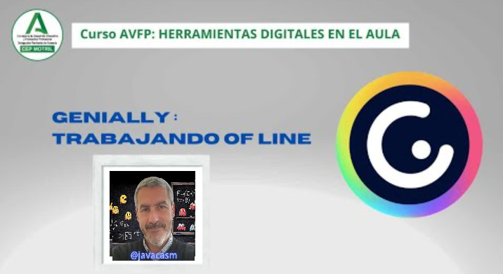

## ¿Qué es Genially?

{width=50%}

Genially es una plataforma en línea que permite a los usuarios crear contenido interactivo y visualmente atractivo. Genially se utiliza para diseñar presentaciones, infografías, pósters, informes interactivos y otros tipos de materiales visuales.

Algunas características clave de Genially incluyen:

1. **Interactividad:** Genially se destaca por su capacidad para crear contenido interactivo. Los usuarios pueden incorporar elementos interactivos como enlaces, ventanas emergentes, botones y animaciones para mejorar la experiencia del usuario.

2. **Variedad de Plantillas y Recursos Gráficos:** La plataforma ofrece una amplia variedad de plantillas y recursos gráficos para ayudar a los usuarios a comenzar con sus diseños. Esto facilita la creación de contenido visualmente atractivo incluso para aquellos sin habilidades avanzadas en diseño gráfico.

3. **Facilidad de Uso:** Genially tiene una interfaz intuitiva que permite a los usuarios crear contenido de manera fácil y rápida mediante el uso de arrastrar y soltar elementos.

4. **Colaboración en Tiempo Real:** Los usuarios pueden colaborar en tiempo real, permitiendo a múltiples personas trabajar juntas en un proyecto.

5. **Adaptabilidad para Diferentes Propósitos:** Genially se puede utilizar para una variedad de propósitos, desde presentaciones educativas y empresariales hasta contenido interactivo para sitios web y redes sociales.

6. **Integración Multimedia:** Permite la incorporación de imágenes, vídeos, mapas interactivos, cuestionarios y otros elementos multimedia para mejorar la presentación del contenido.

7. **Compatibilidad con Dispositivos Móviles:** Los geniallys (contenidos creados en Genially) se pueden visualizar y disfrutar fácilmente en dispositivos móviles, lo que aumenta la accesibilidad.

8. **Compartir y Embeber:** Los geniallys se pueden compartir a través de enlaces y también se pueden embeber en sitios web, blogs y plataformas educativas.

Es importante tener en cuenta que la información puede cambiar y evolucionar con el tiempo, por lo que recomendamos verificar el sitio web oficial de Genially para obtener la información más reciente y conocer las características y actualizaciones de la plataforma.

## ¿App de Genially?

Genially no tiene una aplicación nativa para usar dispositivos, donde podemos utilizarla en el navegador también. Pero aunque es una página web permite cierto uso offline.

[Vídeo: uso offline de Genially](https://drive.google.com/file/d/1uEXxpQzPEi2Z4lLO1omHoi9uJJtM9lr7/view?usp=drivesdk)

En este vídeo hemos visto:

* Aunque Genially es una aplicación online en la que estamos conectados permanentemente al servidor, cuando accedemos, se descarga una parte importante y podemos trabajar offline. 
* Podemos trabajar de forma bastante eficiente con el programa sin estar conectados a la red. 
* Podemos tocar los elementos, modificarlos directamente o simplemente ver qué cambios podemos realizar a través del menú, “Centro de interactividades”, por ejemplo:

    - audio
    - etiqueta
    - ventana
    - enlace
    - ampliar
    - mostrar

* Llegará el momento en que cuando no consiga conectarse, nos avisará de que se encuentra offline, que no podemos guardar los cambios realizados en nuestro proyecto hasta el momento que vuelva la conexión
* Pero básicamente, podemos seguir trabajando con ciertas limitaciones. 
* Cuando se conecte de nuevo, nos aparecerá un aviso de que la conexión está recuperada. Así  vamos a tener automáticamente, todos los cambios realizados en nuestra presentación guardados y actualizados en el servidor.
