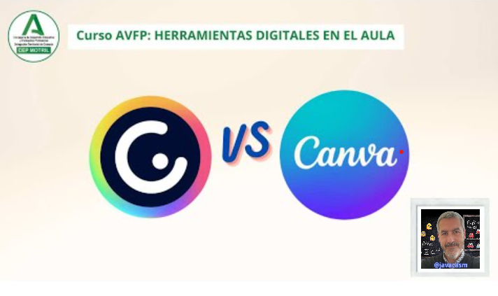

## Diferencia entre Genially y Canva

Canva y Genially son dos plataformas en línea que permiten a los usuarios crear contenido visualmente atractivo, pero difieren en varios aspectos, incluyendo sus enfoques, características y capacidades específicas. Aquí hay algunas diferencias clave entre Canva y Genially:

### Enfoque y Uso:

1. **Canva:**
   - **Enfoque Principal:** Canva se centra en la creación de una variedad de diseños gráficos, desde presentaciones y pósters hasta publicaciones en redes sociales y material promocional.
   - **Versatilidad:** Aunque Canva ofrece plantillas para presentaciones, su enfoque es más amplio y se utiliza para una variedad de propósitos de diseño gráfico.

2. **Genially:**
   - **Enfoque Principal:** Genially se destaca por su capacidad para crear contenido interactivo. Se utiliza para diseñar presentaciones, infografías, pósters y otro contenido visual que puede incluir elementos interactivos.

### Interactividad:

1. **Canva:**
   - **Interactividad Básica:** Canva ofrece algunas funciones interactivas, pero no está especializado en la creación de contenido altamente interactivo.

2. **Genially:**
   - **Enfoque en Interactividad:** La fortaleza de Genially radica en su capacidad para agregar elementos interactivos, como botones, enlaces, animaciones y ventanas emergentes, proporcionando una experiencia de usuario más dinámica.

### Diseño y Plantillas:

1. **Canva:**
   - **Amplia Variedad de Plantillas:** Canva ofrece una amplia variedad de plantillas prediseñadas para varios tipos de proyectos y categorías.

2. **Genially:**
   - **Plantillas Interactivas:** Genially proporciona plantillas que se centran en la interactividad, permitiendo a los usuarios crear presentaciones y contenido visual más dinámico.

### Colaboración y Edición:

1. **Canva:**
   - **Colaboración en Tiempo Real:** Canva permite la colaboración en tiempo real, lo que facilita el trabajo conjunto en proyectos.

2. **Genially:**
   - **Colaboración en Tiempo Real:** Al igual que Canva, Genially permite que múltiples usuarios colaboren en un proyecto en tiempo real.

### Uso Específico:

1. **Canva:**
   - **Uso Generalizado:** Canva se utiliza para una variedad de propósitos de diseño, desde presentaciones educativas hasta gráficos para redes sociales y material promocional.

2. **Genially:**
   - **Enfoque en Contenido Interactivo:** Genially se utiliza especialmente cuando se desea crear contenido más interactivo, como presentaciones con elementos interactivos o infografías dinámicas.

### Conclusiones:

- **Canva es más generalista:** Ofrece una variedad de herramientas de diseño gráfico y es versátil para una amplia gama de proyectos.
  
- **Genially es más especializado en interactividad:** Se destaca por su capacidad para crear contenido visualmente atractivo e interactivo, lo que lo hace particularmente útil para presentaciones y proyectos que requieren elementos interactivos.

La elección entre Canva y Genially dependerá de las necesidades específicas del proyecto y del nivel de interactividad que se desee incorporar en el contenido visual. Ambas plataformas tienen sus propias fortalezas y pueden complementarse en función de los objetivos del usuario.

[Vídeo sobre las ventajas de Genially](https://drive.google.com/file/d/1VamjnwPZVpO8oMkShE_GiRK5GGBzPZfv/view?usp=drive_link)

En este vídeo hemos visto:

* La principal ventaja y potencia que nos aporta Genially frente a otras aplicaciones como Canva, es que podemos tener una gran interacción de forma más sencilla entre distintos elementos de nuestras presentaciones.
* Podemos hacer transiciones sencillas entre distintas partes de nuestra presentación.
* Podemos hacer los contenidos más interactivos que reproduzcan sonido, vídeo, añadir animaciones, etc
* Podemos modificar, acceder a otras fuentes, enseñar textos, movernos entre la presentación.
* Vamos a  hacer que tanto nosotros como el alumnado seamos más productivos en las tareas que realizamos
* Otra ventaja es el enorme contenido publicado online, que podemos reutilizar en nuestras presentaciones y así conseguir una mayor productividad.

