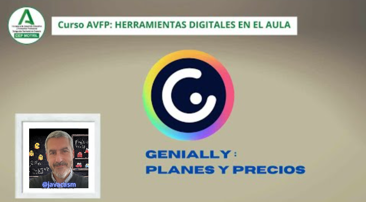

### Precio y licencias de Genially

A día de hoy, Genially ofrecía diferentes opciones de precios y licencias para adaptarse a las necesidades de los usuarios. Ten en cuenta que esta información puede haber cambiado, por lo que es importante verificar los detalles más recientes en el sitio [web oficial de Genially](https://genial.ly/es/planes/educacion/).

[Vídeo sobre Precios y licencias de Genially](https://drive.google.com/file/d/1PlTIEwX8cLZF3pXNRGNCaxKL2HX_YFCE/view?usp=drivesdk)

En este vídeo hemos visto:

* Genially dispone de una versión normal básica gratuita y versiones de pago con distintos niveles.
* Cuando seleccionamos un elemento, en principio nos aparece como disponible y que podemos acceder a una opción concreta pero al intentar entrar, nos puede decir que nuestro plan no incluye dicho contenido. 
* Entre los distintos planes que podemos elegir y  que tenemos disponibles actualmente,nos encontramos 

1. “Edu Pro” es la  versión más básica, facturado anualmente, con la posibilidad de 

   - Descargar en PDF, JPG, HTML y MP4.
   - Importar archivos PPTX Google Slides
   - Control de privacidad 
   - Insertar audio desde nuestro equipo
   - Organizar en carpetas

2. “Expert” facturado anualmente,  incluye 

   - Todas las ventajas “Edu Pro”
   - Preguntas interactivas premium
   - Seguimiento individual
   - Recopilación de respuestas

3. “Genius” facturados anualmente o por miembro/mes

   - Incluye todas las opciones Expert disponibles
   - Podemos colaborar con otros docente
   - Kit de marca Educación
   - Gestión de recursos corporativos
   - Control de permisos para equipos
   - Estadísticas de audiencia

### Licencia educativa Genially

Genially ofrece una licencia gratuita para educadores y estudiantes, así como opciones de suscripción premium con características adicionales. Aquí hay detalles generales sobre la licencia educativa de Genially:

1. **Genially Gratuito para Educación:**
   - Genially proporciona una licencia gratuita para educadores y estudiantes. Con esta licencia, puedes acceder a funciones básicas y crear contenidos interactivos de manera gratuita.

2. **Genially Edu Pro:**
   - Genially también ofrece una suscripción premium llamada "Genially Edu Pro" diseñada específicamente para el ámbito educativo. Esta suscripción ofrece beneficios adicionales, como acceso a plantillas premium, funciones de colaboración avanzadas y estadísticas detalladas de interacción. La suscripción Edu Pro se factura mensual o anualmente.

3. **Genially Business y Enterprise:**
   - Para instituciones educativas a mayor escala o aquellas que requieren funciones empresariales avanzadas, Genially ofrece soluciones personalizadas a nivel empresarial bajo las categorías "Genially Business" y "Genially Enterprise". Estas soluciones pueden incluir características como administración de usuarios, personalización de marca y soporte dedicado.

Para obtener información detallada sobre los precios y las características más recientes, te recomiendo visitar el sitio web oficial de Genially o contactar directamente con su equipo de soporte. Las opciones y características pueden haber cambiado desde la última actualización.

Para obtener una licencia educativa gratuita de Genially, generalmente se requiere seguir un proceso de registro y verificación de tu estatus como educador o estudiante. Aquí hay pasos generales que podrías seguir:

1. **Registro en Genially:**
   - Visita el sitio web oficial de Genially y crea una cuenta si aún no tienes una. Debes proporcionar una dirección de correo electrónico y establecer una contraseña.

2. **Verificación del Estatus Educativo:**
   - Después de registrarte, es posible que debas completar un proceso de verificación para confirmar que eres un educador o estudiante. Esto podría incluir proporcionar información sobre tu institución educativa, dirección de correo electrónico educativa, identificación estudiantil, o cualquier otro documento que Genially requiera para verificar tu elegibilidad.

3. **Selección de la Licencia Educativa Gratuita:**
   - Una vez verificado tu estatus, podrás acceder a la licencia educativa gratuita de Genially. Esto te dará acceso a funciones específicas para educadores y estudiantes sin costo.

4. **Explorar Funciones y Recursos Educativos:**
   - Una vez que hayas obtenido la licencia educativa gratuita, explora las funciones y recursos educativos que Genially ofrece. Esto puede incluir plantillas específicas para educación, herramientas de colaboración y estadísticas de interacción.

Recuerda que los detalles específicos del proceso pueden variar y es posible que Genially tenga requisitos específicos para la verificación del estatus educativo. Te recomiendo visitar el sitio web oficial de Genially o ponerse en contacto con su equipo de soporte para obtener instrucciones precisas y actualizadas sobre cómo obtener una licencia educativa gratuita.
