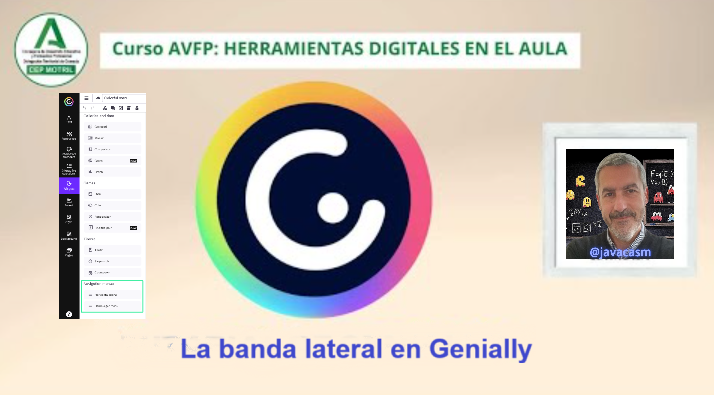
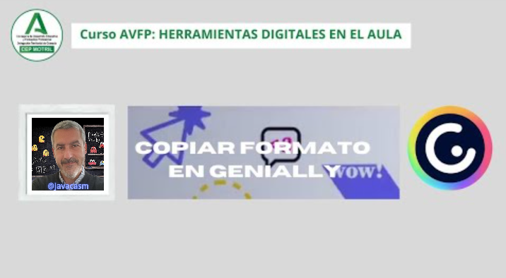
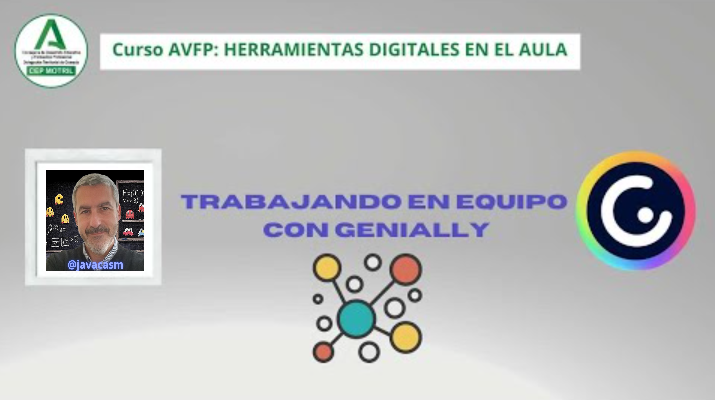
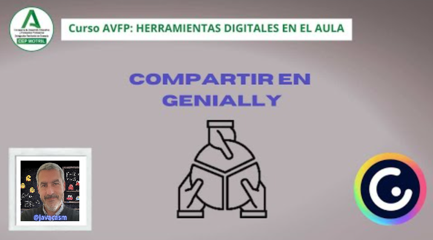
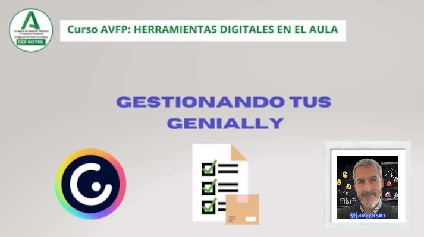

## Tutorial Genially

Vamos a hacer un breve tutorial sobre Genially

[Vídeo: tutorial básico de Genially](https://drive.google.com/file/d/1hGF8ENgIfMPwK5-TtFrcQD8upmQEZ6eB/view?usp=drive_link)

En este vídeo hemos visto:

* Hay distintas formas de crear un Genially.  
* Seleccionamos dónde lo guardamos  según sea de uno de  nuestros equipos o en nuestra cuenta personal.
* Podemos crear presentaciones, infografías, imágenes interactivas, gamificaciones, vídeos, guías o material formativo como documentación 
* Desde una plantilla existente  o desde una "Creación en blanco", en la que nos va a crear el elemento y vamos a ir añadiéndolo todo.
* La versión Premium nos permite usar plantillas de equipo.
* Podemos importar presentaciones desde una Imagen en la versión gratuita. Importar desde PowerPoint y  Google Slides, son opciones de pago.
* Empezaremos nuestro contenido pulsando la opción “Crear genially” y nos aparecerá un asistente que nos va a ayudar en la búsqueda de lo que queremos hacer. Primero seleccionamos según el tipo de creación,  por ejemplo, una infografía, y utilizando la opción de Filtro, nos permitirá elegir entre distintos elementos, si son Gratis, sobre Educación … 
* Una vez elegida la plantilla si es una infografía gratuita, seleccionamos “Usar esta plantilla” y Genially nos permitirá trabajar. 
* En la página tenemos distintos elementos cada uno con opciones distintas. Por ejemplo:

   - **Texto**, le podemos editar tipos de letra, color, tamaño, alineación ...
   - **Imágenes** les  podemos modificar lo que queramos, girar, cambiar tamaño, ...
   - **Recursos** elementos gráficos e ilustraciones
* Podemos bloquear elementos para evitar cambiarlos por error.
* Lo habitual es “Agrupar” elementos según vamos avanzando, para que se muevan juntos, perdiendo eso sí, los valores de interactividad y animación individual.
* Si quiero añadir una imagen o recurso,  me voy a la pestaña “Imagen”y busco la que se adapte a lo que necesite. En inglés, aumenta las posibilidades de búsqueda de recursos. Podemos especificar ciertos parámetros como “solo fondo transparente”
* Una vez localizada,  ajustamos tamaño y posición.
* Podemos mejorar nuestra infografía Genially añadiendo elementos que enriquecen  nuestras presentaciones con opciones como:

   - **Elementos interactivos**, algo que permite la conexión entre el usuario, y el contenido. Elementos habituales como gráficas de datos, botones, enlaces, formularios, sonidos, animaciones. Destacan los widgets, que nos ofrecen información visual, como un carrusel de imágenes, un temporizador, un cronómetro...
   - **Preguntas interactivas** que podemos poner en nuestra presentación para ver resultados, unas gratuitas y otras en versión de Premium de pago.
   - **Smartblocks** o bloques interactivos, como 
      * Diagramas
      * Datos 
      * Tablas 
      * Gráficas
      * Procesos
      * Timeline 
      * Galerías
      * Mapas 
      * Perfiles Animados

* Una vez finalizado nuestro trabajo, seleccionamos “Presentar”, para reproducir su funcionamiento o “Publicar”  que puede ser:

   - **Privado** en versión Premium, el proyecto será visible solo para aquellos con quien lo compartas.
   - **Público** en la web, versión gratuita, en el proyecto podrá utilizarlo cualquiera 
* Otras opciones, nos permite duplicar geniallys, hacer una copia con la que trabajaremos más adelante y obtendremos un nuevo proyecto. Ya finalizado, lo tendremos siempre disponible en nuestra página.

* Una de las mayores limitaciones de la versión Gratuita es que **No podemos descargar nuestro proyecto**

## Tutorial Extensivo sobre Genially

Aquí tienes un tutorial extenso sobre cómo utilizar Genially, una plataforma de diseño interactivo y visualmente atractivo:

### Paso 1: Crear una Cuenta

1. **Accede a Genially:**
   - Abre tu navegador web y ve a [Genially](https://www.genial.ly/).

2. **Crear una Cuenta:**
   - Haz clic en "Registro" o "Iniciar Sesión" y sigue los pasos para crear una cuenta. Puedes registrarte con tu correo electrónico, cuenta de Google o Facebook.

### Paso 2: Explorar la Interfaz

1. **Panel de Control:**

   - Después de iniciar sesión, familiarízate con el panel de control de Genially. Aquí es donde encontrarás tus proyectos existentes y las opciones para crear uno nuevo.

   - En Genially nos encontramos con una banda lateral donde tenemos distintas opciones que podemos utilizar. Vamos a enumerar algunas de las opciones disponibles para usar con la cuenta Genially Educación.

[Vídeo sobre la banda lateral](https://drive.google.com/file/d/1r4XDGA5wSyCVRF65Me4p12mJ0SYacAlR/view?usp=drivesdk)

En este vídeo hemos visto:

* Desde el apartado “Configuración” podemos “Invitar al equipo” a alguien, pero nos encontramos que con la licencia gratuita tenemos solamente una plaza disponible. 
* Si queremos añadir a algún miembro más, nos informa de que el acceso a esta opción sólo es posible de manera ilimitada para incluir a estudiantes, para el resto de usuarios, tenemos que consultar nuestro plan.
* En la mayoría de las opciones incluidas en esta banda lateral, que aparentemente tenemos disponibles, se nos redirige a “Ver planes” para informarnos de qué versión incluye dichos apartados:

   - “Plantillas de equipo”
   - “Kit de marca“
   - “Inspiración" 

* Dentro de “Mi espacio”, nos encontramos en la parte central los distintos proyectos con los que hemos trabajado en algún momento y disponibles en nuestra cuenta. 
* Podemos consultarlos también, desde  la pestaña “Actividad”, donde nos aparecen los trabajos recientes que hemos realizado. Esta opción sí es accesible con el plan gratuito. 
* Disponemos también de un buscador para localizar alguna de nuestras creaciones.

2. **Explorar Plantillas:**
   - Haz clic en "Crear Genially" para explorar las plantillas disponibles. Genially ofrece una variedad de plantillas para diferentes propósitos.

### Paso 3: Crear un Genially

1. **Seleccionar Plantilla:**
   - Elige una plantilla que se ajuste a tu proyecto. Puedes encontrar plantillas para presentaciones, infografías, pósters, etc.

2. **Editar y Personalizar:**
   - Utiliza el editor de Genially para editar y personalizar el contenido de tu proyecto. Agrega texto, imágenes, vídeos y otros elementos según tus necesidades.

3. **Elementos Interactivos:**
   - Explora la barra lateral para agregar elementos interactivos como botones, enlaces, animaciones y ventanas emergentes. Haz que tu Genially sea interactivo y dinámico.

4. **Copia formato entre elementos:**

[Vídeo copiar formato](https://drive.google.com/file/d/1zDv722BtydKYPJ1Eh0OhuxX3evzKOxCh/view?usp=drivesdk)

En este vídeo hemos visto:

* Algo que realizamos en multitud de ocasiones es hacer varios elementos muy similares, iguales o al menos, con el mismo formato dentro de nuestra presentación. 
* ¿Cómo lo hacemos? Lo más sencillo es simplemente,  coger un elemento lo copiamos, (Ctrl+C), “Copiar” o lo pegamos (Ctrl+V) “Pegar”. 
* A veces, solo necesitamos modificar el formato, para realizar por ejemplo un cambio de letra, elegimos el tipo que nos gusta, seleccionamos con el botón derecho  “copiar formato" y lo vamos pasando a los distintos elementos que queremos modificar con “pegar formato".
* Podemos hacer más rápido el proceso de cambio si seleccionamos varios elementos y con el botón derecho, “pegar formato”, inmediatamente, todos adoptan el nuevo formato elegido.
* Otra opción de cambio en el formato de nuestro documento es reemplazar la forma o el color de entre una gran cantidad de recursos que nos proporciona las diferentes opciones. Unas veces será más cómodo Copiar-Pegar formato, otras directamente, Copiar el elemento íntegro. 
* Recordad, cuando trabajamos con diferentes formas y texto por ejemplo, es interesante que agrupemos elementos, así vamos a ir copiando y pegando todo en conjunto. Vamos a conseguir una mayor efectividad en nuestras tareas.

### Paso 4: Agregar Contenido Multimedia

1. **Imágenes y Vídeos:**
   - Importa imágenes y vídeos a tu Genially. Puedes subir archivos desde tu computadora o utilizar recursos de la biblioteca de Genially.

2. **Iconos e Ilustraciones:**
   - Explora la biblioteca de Genially para encontrar iconos e ilustraciones que complementen tu diseño.

### Paso 5: Configuración y Animaciones

1. **Configuración de Página:**
   - Ajusta la configuración de la página, como el fondo y el diseño. Experimenta con diferentes opciones para mejorar la apariencia visual.

2. **Animaciones y Transiciones:**
   - Agrega animaciones a los elementos de tu Genially. Utiliza transiciones para crear efectos visuales atractivos.

### Paso 6: Colaboración y Compartir

1. **Colaboración en Tiempo Real:**
   - Invita a otros usuarios a colaborar en tu proyecto en tiempo real. Esto es útil para proyectos grupales.

[Vídeo sobre trabajo en equipo](https://drive.google.com/file/d/1k1uWze_Rbja0uqgiwnexH_Z4wx9mKIuG/view?usp=drivesdk)

En este vídeo hemos visto:

* Podemos crear equipos para compartir los distintos proyectos y elementos con otros usuarios con los que colaboramos.
* Desde “Crear Genially”, podemos “Crear equipo” o “Unirse a un equipo”
* Seleccionamos “Creamos equipo” y dentro de las dos opciones de uso del nuevo  espacio de trabajo

   - Corporativo, para cualquier proyecto de diseño, marketing…
   - Educación, enfocado a proyectos educativos y formación

* Elegimos  la opción “Educación”, completamos el nombre del equipo y Seleccionamos “Crear equipo”, que nos servirá para trabajar directamente entre distintas opciones.
* También podemos invitar a un equipo a nuevos miembros, las invitaciones son ilimitadas en el caso de los estudiantes para que trabajen en él. 
* Podemos usar esta funcionalidad del equipo como si fuera una asignatura. 
* Vamos añadiendo a los distintos estudiantes. Escribimos la dirección de email y se les asigna el rol correspondiente, lo invitamos y directamente va a poder participar en el equipo.

2. **Compartir en Redes Sociales:**
   - Utiliza las opciones de compartir para publicar tu Genially en redes sociales o generar un enlace para compartir.

### Paso 7: Publicar y Embeber

1. **Publicar en la Web:**
   - Publica tu Genially en la web para que sea accesible a través de un enlace único.

2. **Embeber en Sitios Web:**
   - Si tienes un sitio web o blog, utiliza la opción de embeber para incrustar tu Genially directamente en una página.

[Vídeo sobre compartir](https://drive.google.com/file/d/1_mjiFT9qZPq0s4R6Dj__K5axfw3VQ_0f/view?usp=drivesdk)

En este vídeo hemos visto:

* Una vez que hemos finalizado nuestra presentación, una imagen interactiva o cualquier proyecto  y queremos compartirlo, lo vamos a pasar de modo “Borrador” a modo “Publicación”.
* Nos vamos al menú “Opciones Genially” y en Preferencias, en “Visualización“, tenemos que marcar lo que vamos a ver cuando publiquemos nuestro proyecto. Podemos elegir entre varias opciones,

   - Compartir Genially
   - Pantalla completa, 
   - Indicador de interactividad, qué elementos interactivos vamos a tener disponibles
   - Ampliar
   - Indicador de elementos arrastrables 
   - Pintar sobre Genially
   - Títulos
   - Resumen de resultados
   - Seleccionar un estilo para etiquetas
   - Personalización de marca, como por ejemplo mostrar un logotipo corporativo, opción sólo disponible en la versión Premium.

* En la opción “Privacidad” podemos seleccionar cómo otros usuarios van a poder ver nuestro trabajo. 

   - Público en la web siempre, para publicar con la versión gratuita. Cualquiera puede acceder a ella y aparecerá en los motores de búsqueda. 
   - Privado, sólo será visible para nosotros o aquellos con quién compartas el enlace privado.
   - Reutilizable, si queremos que quién encuentre nuestra publicación pueda hacer otra mejorando o modificando contenidos. 
   - Título
   - Descripción 

* Seleccionamos ¡LISTO! De este modo, nuestro proyecto ya está  online y cuando el trabajo esté publicado, directamente lo tendremos disponible para que cualquiera pueda utilizarlo.
* También podemos elegir la forma de mostrarlo,
* Con la opción “Presentar” podemos abrir nuestra presentación en cualquier sitio a pantalla completa.
* La opción “Descargar” en el formato que queremos,  HTML, JPG, PDF, MP4, Vídeo (sólo en el plan Premium)
* Compartir nuestra creación a través de:

   - Un Link para incrustarlo públicamente en (opción Premium)
   
      * “Visualización en página social” 
      * link público
      * “Visualización en página exclusiva” 
   - Insertar,  Iframe (el contenido se mantiene en Genially) 
   - Script (las etiquetas se ven fuera de Genially)
   - Redes Sociales,  
   - Mail
   - Código
   - Otros, compartir  contenido con grupos a través de Google Classroom, Moodle,  Microsoft Teams

* Estamos trabajando temas educativos para que el alumnado aprenda a compartir y a reutilizar contenidos, recomendamos que ya que los proyectos los vamos a compartir en público, dejemos que otros los puedan reutilizar para hacerlos aún  más interesantes

### Paso 8: Explorar Genially Analytics

1. **Analítica de Genially:**
   - Accede a Genially Analytics para obtener información sobre la interacción de los usuarios con tu proyecto. Esto puede ser útil para evaluar el rendimiento.

### Paso 9: Probar con Proyectos Avanzados

1. **Proyectos más Complejos:**
   - A medida que te familiarices con Genially, experimenta con proyectos más complejos que incluyan múltiples páginas, interactividad avanzada y elementos multimedia.

### Paso 10: Recursos y Comunidad

1. **Explorar Recursos:**
   - Visita la sección de recursos en el sitio web de Genially para tutoriales adicionales, consejos y plantillas.

2. **Comunidad Genially:**
   - Únete a la comunidad de Genially para conectarte con otros usuarios, compartir ideas y obtener inspiración.

### Paso 11: Gestiona tus creaciones

A medida que vamos creando más geniallys, debemos de organizarlos

[Vídeo sobre gestión de tus geniallys](https://drive.google.com/file/d/1qP6e-LKypfgEJGOL5ImsvP1H2WJtvMoI/view?usp=drivesdk)

* Desde la pantalla principal podemos trabajar con nuestras presentaciones. 
* Algunas aparecen marcadas como borrador porque todavía no han sido publicadas. 
* Podemos trabajar con ellas, presentarlas, editarlas o si la versión que tenemos nos lo permite, podemos descargarlas o compartirlas con otros usuarios. 
* Podríamos trabajar con varias presentaciones a la vez si marcamos con  un tic, en la casilla que nos aparece en la esquina superior izquierda de cada elemento.
* Si tenemos una versión de pago podemos crear carpetas. En ese caso podemos organizar nuestras presentaciones en ellas.

---

¡Con estos pasos, deberías estar listo para crear proyectos impactantes y visualmente atractivos con Genially! Recuerda experimentar y explorar las diversas características que ofrece la plataforma para personalizar tus creaciones según tus necesidades. ¡Diviértete diseñando con Genially!

