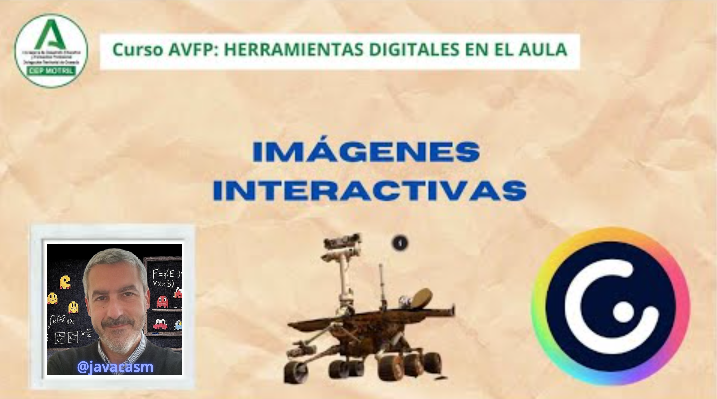
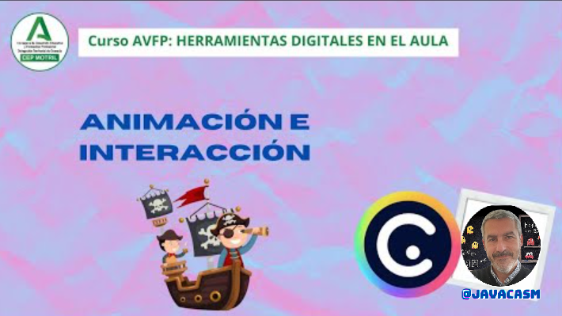
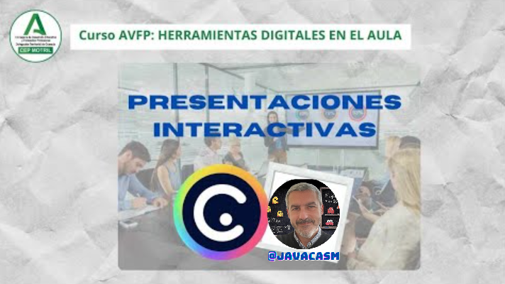

## Interacción en Genially

Una de las características más apreciadas de Genially es su capacidad para generar interacción con los usuarios.

Vamos a ver ejemplos de interacción

[Vídeo imagen interactiva Marte](https://drive.google.com/file/d/1juuXzPuDWPF7i1_Ujq0HwLmt0ZXFuf5h/view?usp=drivesdk)

En este vídeo hemos visto:

Este [ejemplo](https://view.genial.ly/5c897761e1906b76bf4ac9cc/interactive-content-marte)  muestra diversas interacciones.

* Con tocar cada uno de los Puntos de Interés (PDI)
* Aparecen resaltados en la imagen, y podemos hacer que se vean más claros pulsando el icono de PDI

* Podemos hacer una **Etiqueta** que no es más que una caja pequeña que puede ser de sólo texto. Si incluímos demasiado texto nos avisará de que mejor usar Ventana
* Si queremos poner texto e imágenes usaremos la **Ventana** que es de mayor tamaño y tiene más posibilidades.
* También podemos incluir un vídeo, de youtube o similar en una Ventana
* Para editar la interacción, sólo tenemos que pulsar sobre cada PDI y veremos la propiedades de la animación y de la interacción
* La animación puede ser al entrar, todo el tiempo, al poner el ratón encima o al salir
* Podemos añadir varias interacciones a un PDI, por ejemplo una etiqueta al pasar sobre encima y un vídeo si hacemos clic en él.

Ya que hemos visto una presentación sobre Marte, no me resisto a compartir con vosotros [este estupendo genially titulado "Trip to Mars"](https://view.genial.ly/6404a01b412c70001a0b1149/interactive-content-quiztriptomars) de [Pedro J. Ramón Torregrosa](https://twitter.com/MasQCiencia) 

Crear una presentación interactiva con Genially es un proceso fácil y versátil. Aquí tienes una guía básica:

[Vídeo sobre animación e interacción en Genially](https://drive.google.com/file/d/15MaVa6spP4OcaZFEx3Cs89TgSUIh22Iq/view?usp=drivesdk)

En este vídeo hemos visto:

* La mayor potencia que tiene Genially es que nos permite trabajar con elementos interactivos. 
* Si seleccionamos cualquier elemento de la presentación para modificarlo (puede ser que en primer lugar debamos desbloquearlo) podemos añadirle una animación o efecto como bote, rotación,etc. 

* Podemos definir  que ocurre en una animación automática 

    - al principio o “Entrada"
    - durante toda la duración o “Continuo” 
    - al finalizar la acción o “Salida” del elemento. 
* Tambíen podemos definir como se comporta una animación interactiva 

    - con el “ratón encima” 
    - al “Hacer clic”
* Estas acciones no tienen actividad, si no que hay que añadirles efectos, por ejemplo ampliar, contraer, deslizar, etc.
* Tenemos la posibilidad de “Añadir interactividad” que nos informa de qué hace nuestro elemento cuando lo tocamos con las siguientes opciones

    - etiqueta, texto breve en el que podemos añadir imágenes, vídeos, etc. 
    - ventana, elemento de mayor tamaño que la etiqueta y que permite mayor contenido, 
    - ir a página, podemos movernos entre diferentes páginas de nuestra la presentación
    - enlace, poner un enlace al exterior
    - ampliar, en la que se agrande un elemento, una imagen o una zona para mostrar algo
    - audio, se reproduce un audio
    - mostrar un elemento que estaba oculto
* Con estos elementos, vamos a conseguir una presentación más atractiva y eficiente.

### Componentes interativos

Genially ofrece una amplia gama de elementos interactivos que puedes incorporar en tus creaciones para hacerlas más atractivas. Aquí algunos de los elementos que puedes utilizar:

1. **Botones de Acción:** Crea botones que los usuarios pueden hacer clic para activar diferentes acciones, como pasar a la siguiente diapositiva o abrir un enlace.

2. **Enlaces Interactivos:** Inserta enlaces a sitios web, documentos o cualquier recurso en línea directamente en tu presentación.

3. **Ventanas Emergentes:** Añade ventanas emergentes que contienen contenido adicional, como imágenes, textos o vídeos, y que se abren al hacer clic en un elemento específico.

4. **Mapas Interactivos:** Incorpora mapas interactivos donde los usuarios pueden hacer clic en regiones para obtener información específica.

5. **Galerías de Imágenes:** Crea galerías de imágenes que los usuarios pueden explorar al hacer clic en miniaturas o deslizar.

6. **Elementos Multimedia:** Inserta vídeos y audios directamente en tus diapositivas para hacer la presentación más dinámica.

7. **Cuestionarios y Encuestas:** Integra cuestionarios y encuestas directamente en tu presentación para evaluar el conocimiento o recopilar retroalimentación.

8. **Animaciones y Efectos:** Añade animaciones y efectos a elementos individuales para dar movimiento y vida a tu presentación.

9. **Botones de Navegación:** Crea botones de navegación para permitir que los espectadores se muevan fácilmente entre las diapositivas.

10. **Formularios Interactivos:** Incorpora formularios para la recopilación de datos directamente en tu presentación.

Para agregar estos elementos, simplemente selecciona la diapositiva deseada, busca la opción correspondiente en el menú de Genially y personaliza según tus necesidades. La versatilidad de estos elementos hace que Genially sea una herramienta poderosa para la creación de contenido interactivo.

### Ejemplo de presentación interactiva con múltiples páginas

Cuando hablamos de interacción ¿a qué nos referimos? 

Vamos a verlo con [una presentación llamada ¿Cuánto sabes sobre cine?](https://view.genial.ly/65acf08599dd1b0014273274/interactive-content-cuanto-sabes-sobre-cine)

[Vídeo sobre presentación interactiva con varias páginas](https://drive.google.com/file/d/1V-3rERrZ4-29J1pZvZ7LWxeWKoeZPlnl/view?usp=drivesdk)

* Vamos a seleccionar el botón “Presentar” para ver su funcionamiento y podemos saber nuestro nivel de conocimientos sobre el tema. 
* Nos va hacer preguntas y tenemos que seleccionar la respuesta correcta, y en función de las mismas, nos va a ir contestando si son o no correctas. 
* Nos da opciones de interacción, por ejemplo, con enlaces, nos permite ver breves vídeos de las películas
* Si la pregunta es fallida repite la pregunta y avanza en la presentación cuando acertamos las respuesta. 
* Así nos van apareciendo distintos elementos y mensajes cada vez que contestamos. Tenemos como un flujo que va pasando de una página a otra.
* Vamos a ver cómo se ha realizado la presentación

    - Una diapositiva de portada
    - Una pregunta
    - Una respuesta de "¡Correcto!" después de cada pregunta, que permite ir avanzando.
    - Tenemos una diapositiva que nos aparece cada vez que nuestra respuesta es correcta, y en la que van apareciendo y aumentando, el número de aciertos y premios que nos aparecen en la pantalla.
    - La última diapositiva da el mensaje de ¡Error! con la opción de volver a la pantalla que sea. 
* ¿Qué ocurre con cada una de ellas? Según pulsemos un botón u otro, vamos a ver los elementos que la componen, y cada uno de ellos provocan una interacción asociada, nos llevan a una página. 

    - Si las respuestas dadas son equivocadas, nos manda a la última página “Has fallado” Vuelve a intentarlo”, y desde ahí volvemos a la misma página de la pregunta. 
    - Sin embargo, el botón de las respuestas acertadas, nos llevaría a la página siguiente con el mensaje “And the winner is…Tú” .
* Por resumir el orden de las diapositivas sería

1. Portada
2. Pregunta 1
3. Ok pregunta 1
4. Pregunta 2
5. Ok pregunta 2

....

9. (la última) Error, vuelve a la anterior

