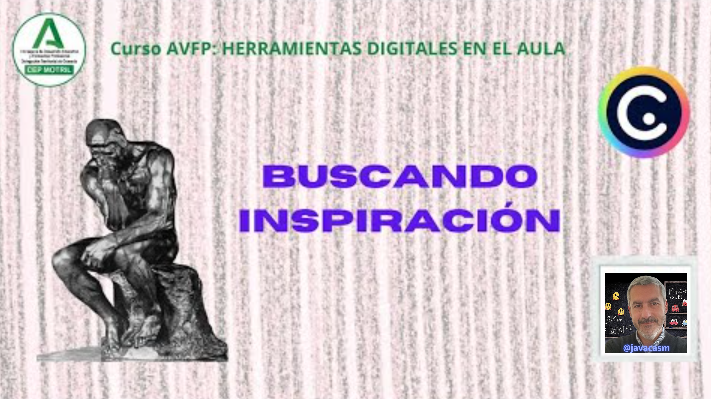
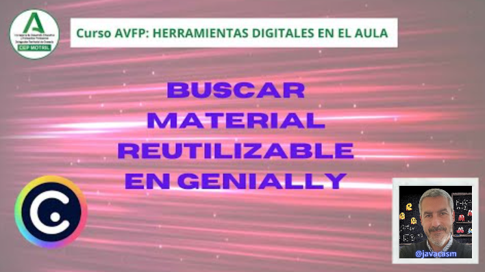

## Buscando inspiración: Reutilizar

Veamos un ejemplo de cómo buscar inspiración y reutilizar geniallys

[Vídeo: buscando inspiración](https://drive.google.com/file/d/1LGgFC4AxUvmIfr7vyXd9gbMQHfRcLoA2/view?usp=drivesdk)

En este vídeo hemos visto:

* Para buscar ejemplos de los que inspirarnos podemos usar el buscador sobre presentaciones ya realizadas y a consultarlas en la opción del menú “Inspiración”, donde vamos a encontrar proyectos compartidos por toda la comunidad.
* Primero filtramos la búsqueda y seleccionamos en primer lugar sólo la opción gratuita...
* Si no los hay, buscaremos en la versión Premium.
* A veces una búsqueda muy concreta no nos va a dar resultados.
* Si buscamos por el tema “ciencia”, encontramos muchísimo contenido y ...
* Podremos filtrar sobre Marte .
* Seleccionamos una plantilla de aspecto muy interesante y con distintos contenidos, de texto, imágenes interactivas o vídeos. 
* Si queremos guardarla o reutilizarla, pulsamos en la opción “usar como plantilla” y la tenemos disponible para trabajarla.

También podemos filtrar por contenido "Reutilizable" como hacemos en este vídeo:

[Vídeo sobre filtrado de material reutilizable](https://drive.google.com/file/d/1Y7pV9n3LQky-57c1KE1Zq_JZZSaI2gz8/view?usp=drivesdk)

En el vídeo hemos visto que:

* Cuando buscamos entre las distintas plantillas Premium o Gratis, por ejemplo  “Marte”, en la opción del menú “Inspiración” en toda la comunidad de Genially, aparecen varias presentaciones interesantes. 
* Algunas están compartidas públicamente y son perfectas para coger ideas, podemos verlas, aprender, pero no podemos utilizarlas como plantilla. 
* Sin embargo hay otras que tienen una marca o símbolo de “Reutilizable” porque el usuario las ha compartido y nos permite reutilizarlas. 
* En las búsquedas al filtrar, podemos especificar la opción de “Solo reutilizables” si lo que deseamos es modificar y adaptar  las presentaciones.
