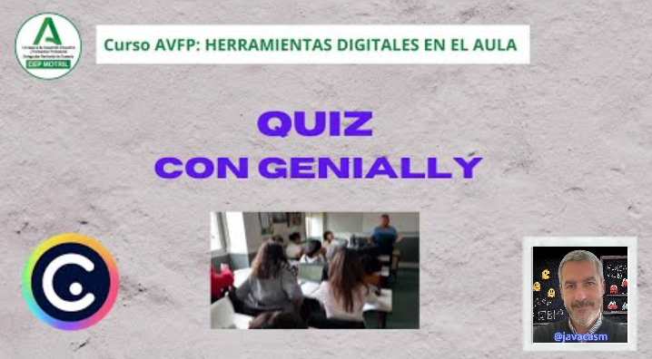
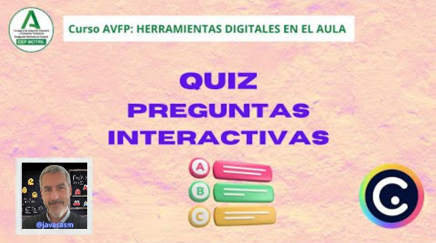

## Gamificación con Genially

Una de las mayores cualidades de Genially es que nos permite generar contenido con gran interacción y facilitarnos la gamificación de las tareas. De hecho podemos crear presentaciones que son auténticos juegos.

Seleccionamos el tipo de plantilla gamificación y encontraremos tres variedades: 

* **Quiz** que son básicamente preguntas y respuestas donde ya tenemos plantillas para los diferentes tipos de preguntas. La presentación lleva la cuenta de los aciertos y muestra finalmente el resultado. Podemos hacer que las preguntas y las respuestas se muestren aleatoriamente, que se repita la pregunta hasta que se acierte o no.
* **Juegos** donde podemos hacer juegos en el que el participante mueve los elementos entre distintas partes de la presentación, como por ejemplo podría ser un juego de la oca o bien un "ordena las palabras para formar frases". A día de hoy estas plantillas no tienen validación automática.
* **Escape Rooms** donde los participantes van moviéndose entre distintas partes del genially, como si se movieran en distintas habitaciones resolviendo enigma, encontrando objetos y obteniendo las **llaves** para conseguir desbloquear otros lugares y objetos y finalmente alcanzar la salida. Normalmente incluyen un mapa para ver por donde nos movemos.

[Vídeo: Ejemplos Gamificación](https://drive.google.com/file/d/141DnFGvOZuFIOACmIt8SYcYsIFYTR8EK/view?usp=drivesdk)

En este vídeo hemos visto:

* Genially es muy potente en interacción y por tanto la hace indicada para trabajar la **gamificación**
* Al seleccionar los diferentes tipos de plantillas encontramos que aparece "Gamificación"
* Si lo seleccionamos encontramos 3 variedades: Quiz, Juegos y Escape room
* Quiz se refiere a la típica actividad de preguntas con varias respuestas.
* Vemos que hay ejemplos muy sencillos y otros más elaborados
* Podemos filtrar sólo educación y gratuitas.
* Las preguntas en el tipo Quiz están implementadas con el elemento "Pregunta", pudiendo hacer que se repita hasta que se acierte o no
* [Ejemplo de Quizz básico](https://view.genial.ly/65b259dfe3f2e2001473604d/interactive-content-quiz-interactivo-basico)

* Siempre podemos "decorar" nuestra plantilla para que tenga un mejor aspecto
* En la gamificación de tipo "Juego", tenemos elementos que podemos mover entre las partes de la diapositiva.
* Un [ejemplo típico es "ordena las palabras de la frase"](https://view.genial.ly/65b2c1b44dad0100147284e2/interactive-content-ordena-las-palabras-edu) 

* Este tipo no hace validación automática de nuestras respuestas
* Para hacerlo marcamos como "Móviles" los elementos que queramos
* Podemos hacer el típico juego de mesa tipo "oca" o similar, pero serán los jugadores los que se encarguen de mover los elementos.
* [Ejemplo de Juego similar a la Oca](https://view.genial.ly/65b2c27d5f9c280013c8660c/interactive-content-carrera-de-animales)

* Podemos incluir zonas interactivas o elemento como el "Dado" para obtener números aleatorios
* En los Escape Room o Breakout lo que tenemos es que ir encontrando elementos o resolviendo enigmas con pistas.
* Suelen tener un "mapa" que nos indica por donde nos movemos

* [Ejemplo de Escape Room en el museo](https://view.genial.ly/65b38ae8fa276d00152abd59/interactive-content-escape-room-museo)
* A medida que vamos resolviendo las preguntas o encontrando las pistas se va completando el mapa.

### Ejemplos de Quiz

Vamos a ver que podemos hacer los geniallys de tipo Quiz de dos maneras distintas:

* Construyendo "a mano" la interacción y el paso entre diapositivas/preguntas. Añadimos botones para las distintas respuestas y creamos el flujo entre las distintas partes de la presentación
* Usando el elemento "Pregunta Interactiva" que nos crea directamente los botones de las respuestas y el mecanismo de acierto/error, ahorrando trabajo.

La primera opción está pensada si queremos hacer una presentación más vistosa y detallada, tendremos que hacerlo todo a mano, incluyendo botones y saltos entre preguntas, pero podemos personalizarlo más.

La segunda opción es más productiva y con un poco de trabajo puede quedar también visualmente atractiva, pero nos ahorra mucho trabajo.

Vamos a ver un ejemplo de cada uno de los tipos

### Quiz "hecho a mano"

Vamos a analizar y ver cómo está hecho un Genially tipo Quiz donde las preguntas están hechas artesanalmente

[Vídeo sobre Quiz artesanal](https://drive.google.com/file/d/1zcV2H8pNLf5FJmDmDCRXQe6i22lE7Ljx/view?usp=drivesdk)

* Usaremos este [Ejemplo de Quiz artesanal](https://view.genial.ly/65b2b95a5f9c280013c2d9b1/interactive-content-quiz-prehistoria) sobre la prehistoria

* En la imagen vemos que los botones tiene el aspecto visual excelente al que nos tiene acostumbrados Genially, totalmente personalizado

* Los botones tiene animación cuando los pulsamos o nos acercamos
* Al tocar cada botón nos lleva a una diapositiva u otra en función de si la pregunta es correcta o no. 
* Si nos equivocamos nos aparece una pantalla de Error totalmente personalizada
* En estas presentaciones tenemos que construir el flujo entre las diapositivas
* Para construir cada diapositiva añadimos sus botones y cada uno tiene implementada la interactividad para enviar a  una u otra parte de presentación
* Los botones de respuestas correctas nos envían a la diapositiva siguiente
* Se usa "pasar a siguiente" en lugar de pasar a una concreta porque si reordenamos las diapositivas o insertamos una nueva seguirá funcionando
* Tenemos una diapositiva para el error a la que envían todos los botones con respuestas incorrectas.
* La diapositiva de Error está al final de la presentación y saltamos a ella desde los botones de error. También tiene un botón de "Volver" que nos lleva a "Volver atrás"
* En las presentación se puede ver que hay diferentes tipos de preguntas, algunas con texto, otras con imágenes y con botones de reproducción de sonido
* Podemos usar distintas imágenes ordenadas adecuadamente en capas para dar el efecto que se consigue con los personajes de esta presentación. Puedes ver los recursos que se usan en el última diapositiva
* La ventaja de hacer los Quiz de esta manera es que tenemos total libertad para movernos, eso sí, a cambio de más trabajo.

### Quiz hecho con "Preguntas interactivas"

Vamos a ver ahora cómo se hace un Quiz usando el elemento "Preguntas interactivas"

[Vídeo sobre Quiz con Preguntas interactivas](https://drive.google.com/file/d/174nv8oIVPslh1mTfVGy5vllVeFFY4MFG/view?usp=drivesdk)

* Para activar las estadísticas globales de uso de las Preguntas interactivas necesitamos tener un plan de pago de Genially
* Vamos a usar [la plantilla de Quiz Interactivo Básico](https://view.genial.ly/65b259dfe3f2e2001473604d/interactive-content-quiz-interactivo-basico)
* El aspecto no esl que esperamos de un Genially...

* Podemos usar una presentación más vistosa sobre la que añadiremos el elemento de "Preguntas Interactivas" que se encargará de hacer todo el flujo de preguntas y conteo de aciertos errores por nosotros.
* El elemento "Preguntas Interactivas" está en la paleta de Recursos y vemos que hay disponibles distintos formatos, con preguntas "Tipo texto", "Verdadero/Falso", "Elección de imágenes" o de "Ordenar" elementos. Si tenemos una licencia de pago podremos usar también "Preguntas Abierta" y "Encuesta"

* En cada elemento "Pregunta interactiva" tenemos que incluir su Contenido, que será 

   * la pregunta, 
   * las posibles respuestas que pueden ser texto o imágenes, según el tipo usado
   * cuál es la correcta y 
   * Si queremos las respuestas ordenadas aleatoriamente
* Podemos reordenar las respuestas

* Podemos definir las Acciones para cada pregunta, si se muestra la respuestas, los mensajes de error y acierto y el flujo de las páginas

* En cuanto al diseño podemos decidir si las respuestas se muestran en vertical u horizontal y estilo que queramos

* Estas propiedades afectan a todas los elementos "Preguntas Interactivas" de la presentación. Podemos permitir que se va un resultado de cuántos aciertos llevamos y si en caso de error se repite o no

* A la hora de añadir una nueva diapositiva podemos duplicar cualquiera de las que ya tenemos para acelerar el proceso

### Gamificación tipo juego

Vamos a ver ejemplos de gamificación tipo Juego

[Vídeo sobre gamificación tipo Juego](https://drive.google.com/file/d/15c95_Zeb6MKubFHb6k07BSnMsir_tF4G/view?usp=drivesdk)

En este vídeo hemos visto:

* Las gamificaciones tipo Juego utilizan elementos movibles que tiene que mover el propio usuario manualmente y no existe una validación de lo que este ha hecho. Se suele mostrar una ventana con el resultado para que el usuario lo compruebe

* Un [ejemplo típico es "ordena las palabras de la frase"](https://view.genial.ly/65b2c1b44dad0100147284e2/interactive-content-ordena-las-palabras-edu) donde tenemos que ordenar las palabras para crear una frase 

* Cuando tenemos elementos movibles, aparece un simbolito para que sepamos cuáles son los elementos movibles

* En cualquier momento podemos ver la solución, que nos mostrará lo que podíamos hacer hecho, pero sin validar de ninguna forma lo que hemos hecho, con lo que no podemos "calificar" la solución"
* Otro ejemplo podría ser un "Sudoku" donde tenemos que colocar los números en su sitio. En ese caso la solución muestra una imagen de la respuesta correcta.
* Otro ejemplo típico sería [el de colocar cosas en su sitio](https://view.genial.ly/612f1ec630febe0ddde82a74/interactive-content-juego-partes-de-la-casa)

* Siempre podemos incluir "Ventanas" o "Etiquetas para ir dando información
* También tenemos [juegos similares a la Oca](https://view.genial.ly/65b2c27d5f9c280013c8660c/interactive-content-carrera-de-animales)

* Los distintos jugadores mueven manualmente sus fichas, también disponemos de un dado que nos dice el movimiento a hacer.
* Siempre se pueden incluir interacciones en casillas.
* Se trata de juegos que los participantes mueven manualmente, es una versión en el ordenador de los juegos de siempre.
* Para hacer un juego de este tipo sólo tenemos que marcar como movibles los elementos que queremos que se muevan, marcando como arrastable el icono en el menú o la opción de Arrastable al pulsar sobre él el botón derecho
* En los juegos de aspecto "Tablero" solemos usar una imagen que es ese tablero y que actúa como fondo.
* El dado es un Elemento Interactivo "Randomizer"
* También podíamos incluir un Elemento Interactivo tipo "Cronómetro" para indicar el tiempo de juego.
* Si usamos una plantilla de tipo "Operaciones matemáticas" como [esta](https://view.genial.ly/5ba885ba91109a2787a1652b/interactive-content-operaciones-matematicas), podemos hacer que determinado elementos (operadores o números) sean movibles y que el usuario debe colocar en su lugar correcto

* Al ver la solución se mostrará una etiqueta con el resultado correcto

* Si hacemos un ejemplo donde un elemento se puede arrastrar varias veces, como un Sudoku o un "3 en raya" tendremos que incluir tantos elementos iguales como necesitemos, 9 de cada en el Sudoku o tantas fichas de un color como quepan en nuestro "3 en raya". Los pondremos unos encima de otros.

### ScapeRoom con Genially

Crear un escape room con Genially puede ser una experiencia divertida y educativa. Aquí hay una guía básica para empezar:

1. **Planificación y Tema:**
   - Define el tema y la historia del escape room. Puede ser educativo, de resolución de problemas o simplemente divertido.

2. **Estructura del Escape Room:**
   - Divide la experiencia en varias "habitaciones" o secciones. Cada sección podría ser una diapositiva en Genially.

3. **Elementos Interactivos:**
   - Utiliza botones de acción para crear "puertas" entre las habitaciones. Los participantes deben resolver un acertijo o responder una pregunta para avanzar.

4. **Pistas y Enigmas:**
   - Coloca pistas y enigmas en cada habitación. Puedes usar imágenes, texto oculto, ventanas emergentes o incluso vídeos para proporcionar pistas.

5. **Bloquea el Avance:**
   - Asegúrate de que los participantes no puedan avanzar hasta que hayan resuelto correctamente cada acertijo. Esto se puede lograr mediante botones de acción o mediante enlaces condicionales.

6. **Cronómetro y Puntuación:**
   - Agrega un cronómetro para simular el tiempo límite de un escape room real. También puedes incorporar un sistema de puntuación para motivar a los participantes.

7. **Historia Coherente:**
   - Asegúrate de que la historia y los enigmas estén conectados de manera coherente para crear una experiencia envolvente.

8. **Pruebas Finales:**
   - Diseña pruebas finales más desafiantes para las últimas habitaciones. Estas podrían ser acertijos más complicados o tareas que requieran más tiempo para resolver.

9. **Instrucciones Claras:**
   - Proporciona instrucciones claras al principio y a lo largo del escape room para guiar a los participantes.

10. **Prueba y Mejora:**
    - Antes de compartir el escape room, pruébalo tú mismo o con un grupo para asegurarte de que todo funcione como esperas. Realiza ajustes según sea necesario.

Recuerda, la creatividad es clave al crear un escape room con Genially. Experimenta con diferentes elementos interactivos y enigmas para hacer que la experiencia sea emocionante y desafiante.

[Vídeo sobre EscapeRoom y Breakout](https://drive.google.com/file/d/10rKSRQopeIkINikH281EJn9yTtIKO791/view?usp=drivesdk)

En este vídeo hemos visto:

* Un Escape Room consiste en ir resolviendo pruebas y encontrando pistas para poder salir de una situación
* Breakout es similar pero tenemos que resolver un enigma para abrir una caja cerrada
* En Genially se tratará de una presentación donde tenemos que pulsar sobre determinados objetos que desbloquean o muestran otros que nos darán pistas y detalles para poder movernos entre las diapositivas de nuestra presentación.
* Se suele implementar a la antigua usanza, con botones que nos mueven entre diapositivas
* Veamos el ejemplo de [este Escape Room en la granja](https://view.genial.ly/6376171b2cf1e00011b0f063/interactive-content-escape-room-granja)

* Existen unas diapositivas que actúan como mapa y que aparecen a medida que avanzamos. 
* En cada diapositiva tenemos que acertar la respuesta de la pregunta, lo que nos desbloquea para poder recolectar objetos, mostrando un objeto que estaba oculto. 
* Cuando hemos recolectado todos los disponibles, se desbloquea otra zona de la granja, lo que se muestra en la diapositiva que actúa como mapa

* Como vemos la dinámica es sencilla y para implementarlo sólo tenemos que ir rellenando las preguntas y las respuestas de la plantilla en cada una de las diapositivas.
* Tendremos una diapositiva por cada etapa de las distintas fases del juego, lo que hace su implementación sencilla, pero larga.
* Debemos ir probando el funcionamiento cada cierto tiempo para detectar pronto los errores y evitar errores más complejos
* Para darle más interactividad se reproducen sonidos y hay pantallas para los errores
* En muchos típicos Escape Rooms se muestra un mapa de un lugar, como [este de un museo](https://view.genial.ly/65b38ae8fa276d00152abd59/interactive-content-escape-room-museo)

* Suelen tener un "mapa" que nos indica por donde nos movemos

* En realidad hay varias diapositivas con la imagen del mapa y las distintas habitaciones a las que hemos desbloqueado el acceso
* En cada una de las salas tenemos que ir pulsando sobre elementos y a medida que contestamos se van mostrando elementos, cuando ya se han mostrado todos podremos pasar a la siguiente zona, se activará un botón que nos permite saltar a la siguiente "Zona"
* En este Escape Room, existen varias diapositivas de Error, desde las que volvemos a la página anterior que estábamos respondiendo
* En este ejemplo, el mapa no es interactivo, pero podíamos hacerlo, incluyendo botones que nos lleven a las distintas "Salas"
* Podemos hacer diapositivas con las típicas preguntas o también con una imagen que se va completando, obviamente nosotros nos encargamos de generar esa imagen en distintos puntos de visualización
* En [este ejemplo de Breakout](https://view.genial.ly/65b38a5f055677001351a268/interactive-content-breakout-historia) tenemos que ir resolviendo enigmas para poder avanzar.

* Tenemos diferentes misiones que completar y con cada una de ellas obtenemos una parte de un código. Para completar cada misión tenemos que ir contestando preguntas.
* Este código lo necesitamos para desbloquear la "Recompensa" que está protegida por contraseña.
* Para activar la contraseña pulsamos sobre los 3 puntitos junto a la diapositiva la opción "Añadir contraseña a la página"
* En la configuración de la contraseña introducimos el código, configuramos el aspecto y los textos que se mostrarán.

