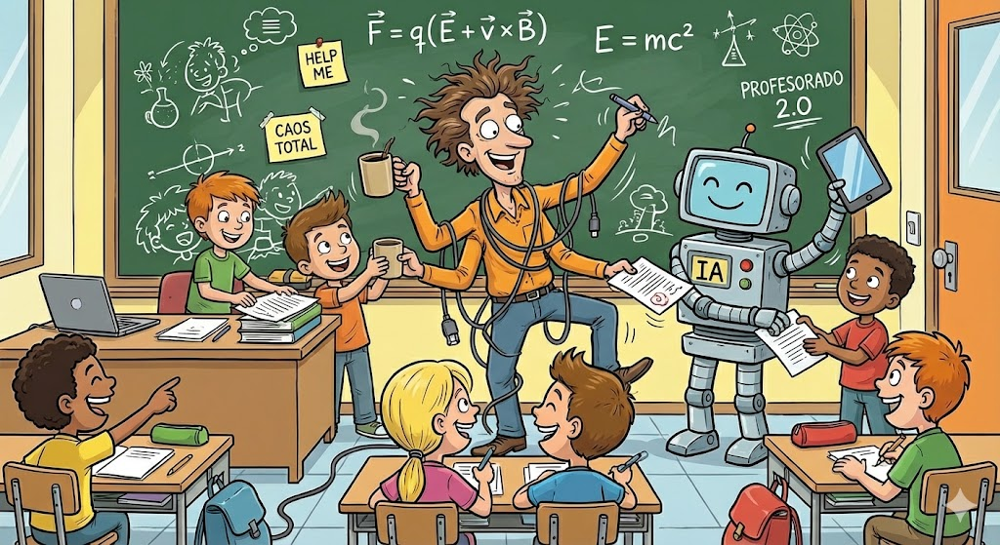
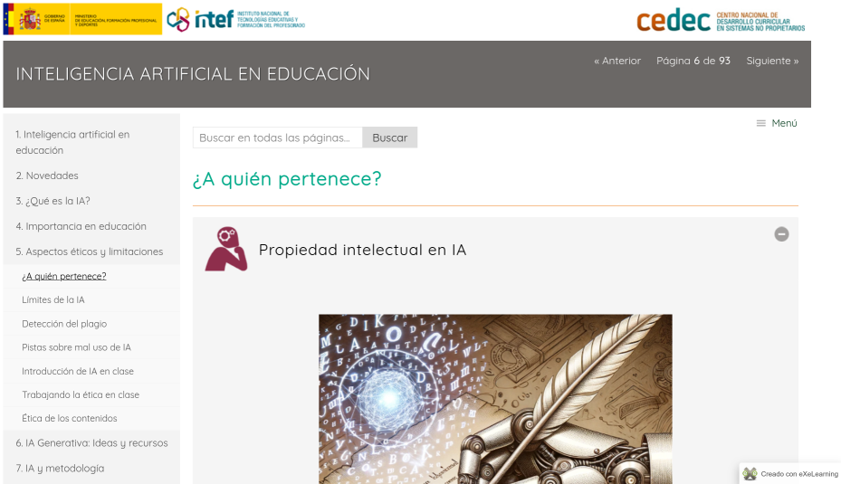

## Herramientas Generativas de IA en el Ámbito Educativo

En este apartado vamos hablar sobre el uso de herramientas generativas de inteligencia artificial (IA) en la educación. 

En un mundo donde la IA evoluciona rápidamente, estas herramientas —como modelos de lenguaje grandes (LLM) que generan texto, imágenes, código o resúmenes— están transformando cómo enseñamos y aprendemos. A fecha de noviembre de 2025, herramientas como ChatGPT, Google Gemini, Anthropic Claude, xAI Grok y Microsoft Copilot destacan por su accesibilidad y potencial educativo.

Este apartado cubre:
- **Usos posibles** para profesores y alumnos.
- **Consideraciones éticas**, ya que la IA no es neutral.

A continuación hablaremos sobre temas más prácticos:
- **Tutoriales prácticos** paso a paso para cada herramienta.
- **Comparativa** entre ellas, incluyendo costes y planes gratuitos actualizados.

El objetivo es que puedas integrar estas herramientas de forma responsable, fomentando la creatividad y el aprendizaje crítico. Recuerda: la IA es un asistente, no un sustituto del esfuerzo humano.

### Inteligencia Artificial en Educación by Intef

Antes de adentrarnos en estos conceptos, no podemos dejar de citar el referente por excelencia del tema en nuestro país: [El informe del intef sobre Inteligencia Artificial en Educación](https://descargas.intef.es/cedec/proyectoedia/guias/contenidos/inteligencia_artificial/index.html) 

Se trata de una obra coral, que evoluciona constantemente y no debes dejar de consultar. También puedes preguntar a su [asistente](https://chatgpt.com/g/g-k0VxADg3K-inteligencia-artificial-en-educacion) (basado en ChatGPT).

Modestamente, hemos aprovechado la herramienta NotebookLM, para generar [algunos contenidos simplificados en diferentes formatos](https://drive.google.com/drive/folders/1SPCOdVXuNLQ156u2SaKMQXj2BUn5Doqv?usp=sharing).

### Usos Posibles de las Herramientas Generativas de IA en Educación: Profesores vs. Alumnos 👥

La Inteligencia Artificial Generativa (GenAI) ha pasado de ser una novedad tecnológica a una competencia digital esencial.

Las herramientas generativas de IA pueden personalizar el aprendizaje, automatizar tareas repetitivas y estimular la innovación. Aquí detallo aplicaciones específicas para **profesores** y **alumnos**, basadas en prácticas recomendadas en 2025.

#### 🍎 Para Profesores: El Asistente Administrativo y Creativo

El objetivo es **ahorrar tiempo** en burocracia para **invertirlo** en los alumnos.

- **Diseño de lecciones y materiales:** Generar planes de clase personalizados, resúmenes de lecturas o preguntas de evaluación. Por ejemplo, pedir a la IA que adapte un tema de historia a un nivel de secundaria.
- **Diferenciación Curricular:** "Adapta este texto sobre la fotosíntesis para un alumno con dificultades de lectura (nivel A2) y otro para un alumno de altas capacidades, incluyendo analogías complejas."
- **Generación de Situaciones de Aprendizaje:** "Propón un proyecto ABP (Aprendizaje Basado en Proyectos) que vincule las matemáticas con el arte renacentista."
- **Evaluación y retroalimentación:** Crear rúbricas automáticas o corregir ensayos con sugerencias detalladas, ahorrando tiempo para interacciones más profundas. Pegar un ensayo **anónimo** y pedir: "¿Qué tres áreas de mejora sugerirías para que este texto sea más coherente?".  "Crea una rúbrica tabular para evaluar un debate oral, con 4 niveles de desempeño, enfocada en argumentación y lenguaje no verbal."
- **Contenido multimedia:** Producir infografías, videos explicativos o quizzes interactivos. Herramientas como Gemini o DALL·E (integrado en ChatGPT) generan imágenes educativas.
- **Investigación y preparación:** Resumir artículos académicos o brainstormear ideas para proyectos colaborativos.
- **Inclusividad:** Adaptar contenidos para alumnos con necesidades especiales, como traducciones en tiempo real o explicaciones simplificadas.

#### 🎒 Para Alumnos: El Tutor Socrático 24/7

El objetivo es usar la IA como un **compañero de estudio**, no como un sustituto del pensamiento.

- **Apoyo en tareas:** Explicar conceptos complejos (e.g., ecuaciones matemáticas) o generar borradores de ensayos para iterar ideas.
- **Aprendizaje personalizado:** Simular tutorías uno a uno, como practicar idiomas con diálogos generados o resolver problemas de programación paso a paso. "Actúa como mi profesor de historia. Hazme preguntas sobre la Guerra Fría para ver si entendí el tema. No me des la respuesta, dame pistas si fallo."
- **Explicaciones Simplificadas:** "Explícame la Teoría de la Relatividad como si tuviera 10 años."
- **Creatividad y proyectos:** Crear historias, arte o presentaciones. Por ejemplo, usar IA para diseñar un experimento de ciencias virtual.
- **Investigación ética:** Buscar fuentes y sintetizar información, fomentando la verificación de hechos.
- **Desarrollo de habilidades:** Entrenar el pensamiento crítico al debatir con la IA o analizar sesgos en sus respuestas.
- **Corrector de Estilo (No de contenido):** "Mejora la gramática de este párrafo sin cambiar mi idea principal."

En resumen, la IA acelera el aprendizaje (51% de estudiantes la usan para ahorrar tiempo), pero debe usarse para potenciar, no reemplazar, el razonamiento humano.

### Valoraciones Éticas: Usos Responsables y Riesgos

Antes de abrir cualquier herramienta, es crucial establecer un marco de uso. La IA no es una fuente de verdad absoluta; es un motor de probabilidades.

La integración de IA generativa en educación plantea dilemas éticos que no podemos ignorar. Según guías universitarias como las de Harvard y Cornell, el enfoque debe ser **transparente, equitativo y crítico**.

**Consideraciones clave:**
- **Plagio y originalidad:** La IA genera contenido "nuevo", pero basado en datos existentes. **Recomendación:** Siempre cita la IA (e.g., "Generado con ChatGPT") y fomenta revisiones humanas. Herramientas de detección de plagios, como Turnitin, ahora detectan IA con precisión del 95%.
- **El Problema de la "Caja Negra":** Entender que no siempre sabemos cómo la IA llegó a una conclusión.
- **Sesgos y equidad:** Modelos entrenados en datos sesgados pueden perpetuar estereotipos (e.g., representaciones culturales limitadas). **Solución:** Verifica respuestas y diversifica prompts (e.g., "Incluye perspectivas indígenas en esta lección de geografía").
- **Privacidad y datos:** Nunca introducir datos personales de alumnos (nombres, notas, direcciones) en IAs públicas (como ChatGPT gratuito). La información que entra, se suele usar para entrenar al modelo.
- **Dependencia y habilidades:** Sobreuso puede atrofiar el pensamiento crítico. **Estrategia:** Asigna tareas "IA-asistidas" donde alumnos expliquen cambios en el output generado.
- **Acceso desigual:** No todos tienen dispositivos o internet. **Acción:** Instituciones deben proveer acceso gratuito y capacitar en alfabetización digital.
- **Impacto laboral:** Para profesores, la IA libera tiempo, pero requiere upskilling. Para alumnos, prepara para un mercado laboral IA-centrado.
- **Alucinaciones:** Las IAs pueden inventar datos con total confianza. **Regla de oro:** _Verificar siempre, confiar nunca._

**Marco ético propuesto:** Antes de usar IA, pregunta: ¿Es justo? ¿Transparente? ¿Beneficioso a largo plazo? Integra discusiones éticas en clases para que los alumnos reflexionen.

> **💡 Nota Crítica:** El objetivo no es prohibir la IA, sino desplazar el foco de la "generación de contenido" a la "evaluación y edición crítica del contenido".

#### Conclusión y Siguientes Pasos

Las herramientas generativas de IA son aliadas poderosas en educación, pero su éxito depende de un uso ético y reflexivo. Experimenta con una (e.g., ChatGPT gratis) esta semana: crea una lección y evalúa sesgos. Para profundizar, únete a comunidades como #EdTech en X o cursos de Coursera sobre IA ética.

La IA generativa no reemplazará a los profesores, pero **los profesores que usen IA reemplazarán a los que no la usen**. La clave está en el **pensamiento crítico**. Debemos enseñar a los alumnos a ser _editores_ y _verificadores_ de la máquina, fomentando una relación de copiloto, no de piloto automático.