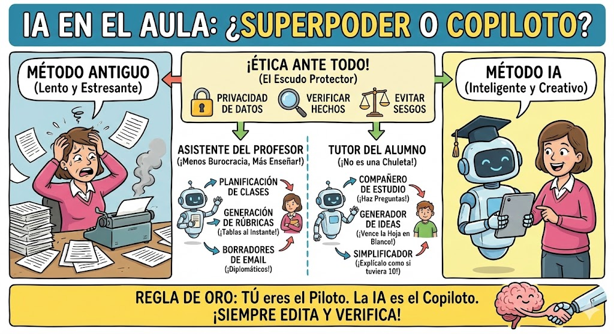
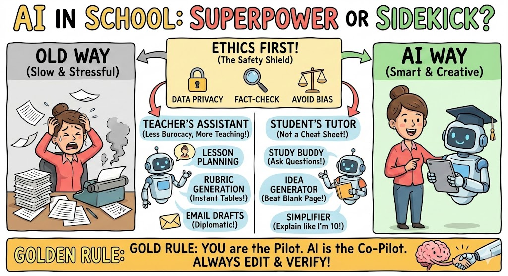

### ¿Qué es la IA Generativa?

La **IA generativa** (o GenAI, por sus siglas en inglés) es un tipo de inteligencia artificial capaz de **crear contenido nuevo y original** a partir de datos con los que ha sido entrenada. En lugar de solo reconocer patrones o clasificar información (como hacía la IA tradicional), la IA generativa produce textos, imágenes, audio, vídeo, código, presentaciones, datos sintéticos, etc., imitando estilos y formatos humanos.

Funciona principalmente con modelos de aprendizaje profundo como los **transformers** y técnicas como la **difusión** (para imágenes y vídeo) o los **grandes modelos de lenguaje** (LLM) para texto.

En educación, la IA generativa no sustituye al docente, pero actúa como un **asistente creativo y personalizador** muy potente que ahorra tiempo y permite adaptar materiales a cada estudiante.

### Tipos de contenidos que se pueden generar hoy (2025)

Actualmente las herramientas de IA generativa permiten crear:

| Tipo de contenido          | Ejemplos concretos en educación                                      | Calidad actual (2025)          |
|----------------------------|-----------------------------------------------------------------------|--------------------------------|
| Texto                      | Resúmenes, ejercicios, exámenes, guías didácticas, cuentos, feedback personalizado, traducciones | Muy alta                       |
| Imágenes e ilustraciones   | Ilustraciones para libros, diagramas, infografías, portadas, dibujos históricos recreados | Alta-muy alta                  |
| Presentaciones             | Diapositivas completas (texto + imágenes + diseño) automáticamente   | Alta                           |
| Audio y voz                | Lectura en voz alta de textos, podcasts educativos, locuciones en varios idiomas y acentos | Muy alta (casi indistinguible) |
| Vídeo                      | Explicaciones animadas cortas, avatares docentes, resúmenes en vídeo | Media-alta (mejorando rápido)  |
| Código y programación      | Generación de ejercicios de programación, corrección automática, ejemplos interactivos | Muy alta                       |
| Datos sintéticos           | Conjuntos de datos anonimizados para prácticas estadísticas o de machine learning | Alta                           |
| Música y efectos de sonido | Fondos musicales para vídeos educativos, canciones didácticas        | Media-alta                     |
| 3D y realidad aumentada    | Modelos 3D de moléculas, monumentos históricos, órganos del cuerpo   | En rápido crecimiento          |

### Herramientas más utilizadas en educación (2025)

| Herramienta                | Tipo principal              | Usos más frecuentes en educación (2025)                                                                                  | Versión educativa / notas importantes                                      |
|----------------------------|-----------------------------|--------------------------------------------------------------------------------------------------------------------------|----------------------------------------------------------------------------|
| ChatGPT (OpenAI)           | Texto + imagen (GPT-4o)     | Redacción de actividades, exámenes, feedback, tutorías personalizadas, resúmenes, traducciones                           | ChatGPT Edu (con controles de privacidad y datos)                         |
| Claude (Anthropic)         | Texto                       | Generación de textos largos y razonamiento paso a paso (muy usado en matemáticas y filosofía)                           | Claude for Education disponible en muchos países                           |
| Gemini (Google)            | Texto + imagen + vídeo      | Integrado en Google Classroom y Workspace: crea presentaciones, resúmenes, cuestionarios y material multimedia          | Gemini for Education (gratuito para centros educativos en muchos países)  |
| Grok (xAI)                 | Texto + imagen              | Explicaciones creativas y sin censura, útil en debates éticos y temas controvertidos                                     | Acceso gratuito con límites; versión Grok 4 para suscriptores              |
| Microsoft Copilot          | Texto + imagen + datos      | Integrado en Teams y Office 365 Educación: crea clases, PowerPoints, análisis de datos de alumnos                        | Copilot for Education con protección de datos FERPA/GDPR                  |
| Perplexity                 | Búsqueda + texto            | Investigación escolar con citas automáticas (alternativa ética a copiar de internet)                                    | Muy usado por alumnos de secundaria y universidad                         |
| Canva Magic Studio         | Diseño + presentaciones     | Creación rápida de materiales visuales, infografías, pósters, presentaciones completas                                  | Gratuito para docentes                                                     |
| Gamma / Tome / Beautiful.ai| Presentaciones automáticas  | Generar diapositivas completas a partir de un esquema o tema                                                            | Muy populares entre profesores para ahorrar horas de diseño               |
| ElevenLabs                 | Voz sintética               | Lectura en voz alta de textos, audiolibros, locuciones en decenas de idiomas y acentos                                    | Usado para alumnos con dislexia o materiales inclusivos                    |
| Suno / Udio                | Música                      | Creación de canciones didácticas (tablas de multiplicar, reglas gramaticales, etc.)                                      | Tendencia creciente en primaria                                            |
| Runway / Pika / Kling      | Vídeo generativo            | Vídeos explicativos cortos, animaciones históricas o científicas                                                        | Cada vez más usado en secundaria y universidad                             |
| NotebookLM (Google)        | Podcasts automáticos        | Convierte cualquier documento o apuntes en un “podcast” de dos locutores que lo explican                                   | Muy viral entre estudiantes (2024-2025)                                    |
| Diffus (Stable Diffusion + extensiones educativas) | Imágenes y diagramas | Generación de ilustraciones científicas, mapas conceptuales, recreaciones históricas | MagicSchool.ai, Brisk Teaching y SchoolAI integran versiones seguras      |

### Plataformas específicamente diseñadas para educación (2025)

- **MagicSchool.ai** (EE.UU. y creciente en Latinoamérica): más de 70 herramientas de IA adaptadas a docentes.
- **SchoolAI** (Reino Unido y expansión global): espacios de chat seguros con monitoreo docente.
- **Brisk Teaching** (extensión de Chrome integrada en Google Docs y Slides).
- **Eduaide.ai** (generador de recursos por asignaturas y niveles).
- **Curipod** (lecciones interactivas con IA para primaria y secundaria).
- **Twee** (especializada en lengua y literatura).

### Conclusión clave para el curso

La IA generativa en 2025 ya no es una herramienta “experimental”: es un **copiloto creativo** que permite al profesorado multiplicar su capacidad de crear materiales personalizados, inclusivos y atractivos en una fracción del tiempo que antes requería. El reto ya no es “si usarla”, sino **cómo usarla de forma responsable, crítica y alineada con los objetivos pedagógicos** de cada centro y docente.
## Comparativa entre Herramientas IA

Le hemos pedido a 2 IAs (Grok y Gemini) que hagan una comparativa entre las principales herramientas.

Dejamos como ejercicio preguntar al resto de ellas su opinión sobre el resto:

### Comparativa entre Herramientas: Costes y Planes Gratuitos según Grok

Para ayudarte a elegir, aquí una tabla comparativa basada en datos de noviembre de 2025. Precios en USD, por usuario/mes (anuales suelen ser 10-20% más baratos). Los planes gratuitos tienen límites (e.g., consultas diarias).

| Herramienta       | Fortalezas Educativas                  | Plan Gratuito                          | Planes Pagos (desde)                  | Coste Total Estimado (Educación) | Limitaciones Gratuitas |
|-------------------|----------------------------------------|----------------------------------------|---------------------------------------|----------------------------------|------------------------|
| **ChatGPT**      | Versátil; integra imágenes/código.    | Acceso básico a GPT-4o mini; límites diarios. | Plus ($20); Pro ($200); Team ($25/user). | Bajo para individuos; alto para grupos. | 50 mensajes/día; sin prioridad. |
| **Google Gemini**| Integración con Google Workspace; búsqueda real-time. | Gemini 1.5 Flash; ilimitado básico.   | Pro ($20); Ultra ($250).             | Medio; gratis con Google One.    | Sin acceso avanzado a Gemini 3. |
| **Claude**       | Razonamiento ético; bajo en alucinaciones. | Claude 3 Haiku; 10-20 consultas/día.  | Pro ($17); Max ($100); API variable. | Bajo para uso ligero.            | Límite estricto en outputs largos. |
| **Grok (xAI)**   | Humor y lógica; integración con X.    | Grok 3 con cuotas limitadas.          | SuperGrok ($30); Heavy ($300).       | Medio-alto; enfocado en premium. | Cuotas diarias; sin Grok 4. |
| **Copilot**      | Integración Microsoft 365; colaborativo. | Versión básica en Edge/365; trial.    | Educación ($18/user, desde dic. 2025); Business ($36). | Medio para escuelas.             | Requiere cuenta Microsoft; límites en trial. |

**Notas:** 
- **Planes gratuitos:** Todos ofrecen acceso básico, ideal para pruebas. Para educación, busca descuentos institucionales (e.g., Copilot Education).
- **Costes:** Varían por uso; API para integraciones avanzadas añade extras (e.g., $3-15/M tokens en Claude). Recomiendo empezar con gratuitos y escalar.
- **Elección:** ChatGPT para versatilidad; Gemini para ecosistemas Google; Copilot para aulas Microsoft.


### Comparativa de las Grandes Herramientas (LLMs) 🛠️ según Gemini

A día de hoy, estas son las principales opciones. No hay una "mejor", depende de la necesidad.

|**Herramienta**|**Desarrollador**|**Puntos Fuertes en Educación**|**Plan Gratuito (Actual)**|**Coste Plan Pro (Aprox.)**|
|---|---|---|---|---|
|**ChatGPT**|OpenAI|**El Estándar.** Muy versátil, excelente razonamiento lógico. Gran capacidad para crear rúbricas y planes.|**Sí.** Modelo GPT-4o (con límites de uso) y GPT-4o-mini ilimitado.|20 USD/mes (Plus)|
|**Claude**|Anthropic|**El "Humano".** Escribe de forma más natural y menos robótica. Mejor para redacción y análisis de textos largos.|**Sí.** Modelo Claude 3.5 Sonnet (límites estrictos de mensajes).|20 USD/mes (Pro)|
|**Gemini**|Google|**El Integrado.** Se conecta con Google Docs, Drive y Gmail. Acceso a información en tiempo real.|**Sí.** Modelo 1.5 Flash. Rápido y capaz.|20 USD/mes (Google One AI)|
|**Perplexity**|Perplexity AI|**El Investigador.** Es un motor de búsqueda. **Cita las fuentes** de donde saca la información. Fundamental para trabajos académicos.|**Sí.** Búsquedas ilimitadas (Modelo básico).|20 USD/mes|
|**Copilot**|Microsoft|**El Creativo.** Usa GPT-4 y DALL-E 3 (imágenes) gratis. Integrado en Edge y Windows.|**Sí.** Muy generoso en funciones gratuitas.|Incluido en licencias MS 365|

### 🎨 Herramientas de Imagen para Material Visual

- **Ideogram / Midjourney:** Para crear ilustraciones específicas para presentaciones.
- **Canva (Magic Studio):** Ideal para profesores. Crea diapositivas enteras con un solo "prompt".

## Ejemplos prácticos para docentes

Le hemos pedido a algunas de las IAs que nos proporcionen ideas, prompt y planteamientos útiles como docentes. Aquí los tienes


### 60 Ejemplos de Prompts Educativos Listos para Copiar y Pegar  
(Clasificados por nivel y uso — actualizados a noviembre 2025)

#### A. PARA ALUMNOS (aprendizaje activo y autónomo)

**1. Explicaciones personalizadas**
- Explica la fotosíntesis como si fueras un alienígena que acaba de llegar a la Tierra y la ve por primera vez.
- Soy estudiante de 2.º de ESO y no entiendo la diferencia entre velocidad y aceleración. Explícamelo con ejemplos de fútbol.
- Hazme un resumen de 200 palabras del libro “El principito” pero desde el punto de vista del zorro.

**2. Resolución paso a paso (matemáticas y ciencias)**
- Resuelve paso a paso esta ecuación y explícame cada paso como si tuviera 12 años: 3(x − 5) + 2 = 5x − 8
- Demuéstrame el teorema de Pitágoras con tres métodos diferentes y dime cuál es el más fácil de recordar.
- Guíame paso a paso para balancear esta ecuación química: C₄H₁₀ + O₂ → CO₂ + H₂O

**3. Práctica de idiomas**
- Corrígeme este párrafo en inglés y explícame cada error: “Yesterday I go to the cinema with my friends and we see a very scared movie.”
- Crea un diálogo de 10 líneas en francés entre dos adolescentes que quedan para hacer los deberes.
- Dame 15 frases útiles en alemán para un viaje de estudios a Berlín (transporte, comida, museo…).

**4. Preparación de exámenes**
- Hazme 10 preguntas tipo test de Historia de España (siglo XX) con 4 opciones y la respuesta correcta al final.
- Genera 5 problemas de selectividad de Matemáticas II (nivel 2025) sobre derivadas con solución detallada.
- Crea una rúbrica de evaluación para un trabajo sobre cambio climático (criterios y puntuación 0-10).

#### B. PARA PROFESORES (diseño de clases y materiales)

**5. Planes de clase completos**
- Crea un plan de clase de 50 minutos para 3.º de ESO sobre “La célula” que incluya objetivos, actividades, recursos y evaluación.
- Diseña una sesión de 90 minutos de Filosofía de 1.º de Bachillerato sobre “¿Qué es la felicidad?” usando el método socrático.

**6. Generación de actividades**
- Propón 8 actividades gamificadas para aprender las tablas de multiplicar en 5.º de primaria.
- Crea un escape room educativo digital sobre la Revolución Francesa (6 pistas y soluciones).
- Diseña 5 estaciones de aprendizaje (learning stations) sobre energía renovable para 4.º de ESO.

**7. Adaptaciones para diversidad funcional**
- Adapta este texto de 400 palabras sobre la Guerra Civil Española para un alumno con TDAH (párrafos cortos, negritas, preguntas intercaladas).
- Convierte este tema de Física (movimiento parabólico) en una explicación para un alumno con dislexia (fuente OpenDyslexic, frases ≤15 palabras).

**8. Evaluación y feedback**
- Escribe 10 comentarios constructivos diferentes para corregir exámenes (desde “insuficiente” hasta “sobresaliente”).
- Genera una rúbrica analítica de 4 niveles para evaluar una presentación oral en inglés.

**9. Contenidos multimedia**
- Escribe el guión de un vídeo de 2 minutos para TikTok/Reels explicando la mitosis a adolescentes.
- Crea 5 prompts perfectos para generar con DALL·E o Midjourney imágenes educativas sobre el sistema solar (incluye el prompt exacto).

#### C. PROMPTS AVANZADOS (pensamiento crítico y creatividad)

**10. Debates y dilemas éticos**
- Actúa como un alumno que defiende el uso ilimitado de IA en los exámenes y dame argumentos sólidos.
- Plantea un dilema ético sobre edición genética (CRISPR) y dame argumentos a favor y en contra para debatir en clase.

**11. Proyectos interdisciplinares**
- Diseña un proyecto ABP (aprendizaje basado en proyectos) de 3 semanas para 1.º de ESO que combine Matemáticas, Plástica y Educación en Valores sobre “Ciudades sostenibles”.
- Crea una unidad didáctica completa sobre inteligencia artificial para 4.º de ESO (8 sesiones) que incluya ética, programación y filosofía.

**12. Prompts “anti-trampa” (para que los alumnos piensen de verdad)**
- He usado IA para escribir este ensayo. Ahora dime 5 preguntas que un profesor me haría para comprobar que realmente entiendo el tema.
- Lee el texto que generó la IA sobre la Revolución Industrial y propón 3 actividades que obliguen al alumno a mejorarlo con pensamiento propio.

#### D. 15 Prompts “mágicos” que funcionan en casi cualquier herramienta (ChatGPT, Claude, Gemini, Grok, Copilot)

1. “Actúa como un tutor experto de [asignatura] y hazme un plan de estudio personalizado de 30 días para sacar notable partiendo de un 4.”
2. “Conviérteme este tema aburrido de [tema] en una historia épica tipo Juego de Tronos con personajes memorables.”
3. “Haz una tabla comparativa de ventajas e inconvenientes de estudiar [asignatura] en papel vs con IA.”
4. “Dame 10 analogías memorables para explicar [concepto difícil].”
5. “Crea un kahoot de 15 preguntas sobre [tema] listo para copiar y pegar.”
6. “Traduce este texto académico al lenguaje de un niño de 10 años sin perder rigor.”
7. “Escribe 5 tuits educativos perfectos (280 caracteres) sobre [tema] que engancharían a adolescentes.”
8. “Genera un crucigrama educativo de 15×15 sobre [tema] con pistas y solución.”
9. “Actúa como corrector implacable y destrózame este ensayo señalando todos los fallos lógicos, gramaticales y de contenido.”
10. “Conviérteme esta lección en un cómic de 6 viñetas listo para imprimir.”
11. “Hazme un resumen visual (describe emojis y estructura) de [tema complejo].”
12. “Propón 5 experimentos caseros baratos para demostrar [concepto de ciencias].”
13. “Crea una canción rap educativa sobre [tema] con estribillo pegadizo.”
14. “Dame un prompt perfecto para que otra IA me genere exactamente lo que necesito sobre [describe tu necesidad].”
15. “Simula una tutoría socrática: solo hazme preguntas hasta que yo mismo descubra la respuesta a [pregunta concreta].”

¡Copia, pega y adapta!  Crea prompts personalizados para tu asignatura y curso exacto, solo di nivel, tema y objetivo y  las tendrás a medida. 


##  Mini-Tutorial Práctico: El Arte del "Prompting" ✍️

Para obtener buenos resultados, usa la estructura **R-C-T-F** (Rol, Contexto, Tarea, Formato).

**Ejemplo de un mal prompt:**

> "Haz un examen de biología."

**Ejemplo de un EXCELENTE prompt (Estructura R-C-T-F):**

- **Rol:** Actúa como un profesor experto de biología en secundaria.
- **Contexto:** Mis alumnos tienen 14 años y acabamos de estudiar la célula eucariota.
- **Tarea:** Crea 5 preguntas de opción múltiple que no solo evalúen la memoria, sino la deducción lógica sobre las funciones de los orgánulos.
- **Formato:** Entrégame el resultado en una tabla, con la respuesta correcta explicada en la última columna.
    


### Ejemplo práctico

Vamos a usar la IA para diseñar una clase sobre cómo usar la IA. Es la mejor manera de demostrar su utilidad.

Dado que tu público son **profesores**, el enfoque debe ser **práctico, desmitificador y centrado en el ahorro de tiempo**. A los docentes no les suele sobrar tiempo para teorías abstractas; quieren ver cómo esto les ayuda el lunes a las 8:00 AM.

Aquí tienes un **"Mega Prompt"** diseñado con la estructura R-C-T-F (Rol, Contexto, Tarea, Formato) listo para copiar y pegar en ChatGPT, Claude o Gemini.


### 📋 El Prompt Maestro para el Formador

Copia y pega esto en tu herramienta de IA preferida:

Markdown

```
Actúa como un experto en Tecnología Educativa y Formación del Profesorado con 20 años de experiencia. Voy a impartir un taller presencial de 90 minutos titulado "IA en el Aula: De la Teoría a la Práctica" para un claustro de profesores de secundaria con niveles de competencia digital mixtos (desde escépticos hasta entusiastas).

Tu tarea es diseñar la escaleta detallada de la sesión y los materiales necesarios.

Por favor, estructura la respuesta en los siguientes bloques:

1. OBJETIVOS DE APRENDIZAJE: 3 objetivos claros (uno sobre conceptos, uno sobre utilidad práctica y uno sobre ética).

2. LA ESCALETA (Minuto a minuto):
   Divide la sesión de 90 minutos en:
   - Introducción rompehielos (10 min): Una actividad para sorprenderlos y mostrar qué es la IA (dame el ejemplo exacto).
   - El "Efecto WOW" (20 min): 3 demostraciones en vivo de cómo la IA ahorra burocracia (redacción de correos a familias, informes, etc.). Incluye los prompts exactos que debo escribir en la pantalla.
   - Taller Práctico (40 min): Diseña una actividad donde los profesores, agrupados por departamentos, tengan que crear una "Situación de Aprendizaje" y su rúbrica usando IA.
   - Debate Ético y Cierre (20 min): 3 preguntas provocadoras para lanzar al grupo sobre copia/plagio vs. uso herramienta.

3. LA "HOJA DE TRUCOS" (Cheat Sheet):
   Genera una lista de 5 "Prompts Mágicos" genéricos que los profesores puedan llevarse impresos y usar al día siguiente (ej: uno para crear exámenes tipo test, otro para adaptar textos a alumnos con dislexia, etc.).

4. CONSEJO PARA EL PONENTE:
   Dame un consejo sobre cómo gestionar a los profesores que puedan tener miedo de que la IA les quite el trabajo.

El tono debe ser profesional pero cercano, alentador y muy práctico.
```


### 💡 Análisis de la estrategia de este Prompt

He diseñado este prompt con varios "ganchos" psicológicos para que la IA te dé el mejor resultado posible:

1. **El Rompehielos:** Es vital empezar fuerte. La IA te sugerirá algo impactante (por ejemplo, pedirle a la IA que escriba un poema sobre el colegio en el estilo de Cervantes en 5 segundos) para captar la atención inmediata.
2. **El enfoque "Burocracia":** Muchos profesores están quemados con el papeleo. Si les enseñas primero cómo la IA redacta correos difíciles a padres o informes de tutoría, te habrás ganado su interés antes de pasar a la parte pedagógica.
3. **Agrupación por departamentos:** Al pedir una actividad por departamentos, la IA te sugerirá ejemplos relevantes para el de Matemáticas y para el de Lengua, evitando que nadie se sienta excluido.
4. **La "Hoja de Trucos":** Es el _take-away_. Los profesores valoran mucho llevarse algo tangible que puedan usar de inmediato.
    

### 🚀 Consejos adicionales para tu presentación

Cuando uses este prompt y obtengas tu plan de clase, te sugiero añadir estos matices humanos que la IA a veces pasa por alto:

- **La regla del 80/20:** Diles que la IA hace el 80% del trabajo (el borrador), pero el 20% restante (la revisión experta del docente) es lo que le da valor y seguridad.
- **El error en directo:** Si estás haciendo una demo en vivo y la IA se equivoca o "alucina", **¡celébralo!** Es el mejor momento pedagógico para enseñarles que no es infalible y que el profesor sigue siendo indispensable para corregirla.
    


### Trucos mágicos

Aquí tienes la **"Hoja de Trucos: 5 Prompts Mágicos"** lista para imprimir y entregar en tu taller.

He seleccionado estos cinco porque cubren las mayores "fugas de tiempo" del profesorado: **inclusión, evaluación, burocracia, creación de exámenes y pedagogía.**

Puedes presentar esto en una diapositiva final o imprimirlo como un PDF entregable.


### 📄 Hoja de Trucos: 5 Prompts para Sobrevivir al Trimestre

_Instrucciones: Copia y pega estos textos en ChatGPT, Gemini, Claude o Copilot. Solo tienes que rellenar la información entre corchetes `[ASÍ]`._

#### 1. El Adaptador Universal (Atención a la Diversidad) 🧩

_Ideal para: Crear materiales multinivel en segundos._

> "Actúa como un experto en pedagogía inclusiva. Toma el texto que pego abajo sobre `[TEMA: EJ. LA REVOLUCIÓN INDUSTRIAL]` y adáptalo para un alumno con `[NECESIDAD: EJ. DISLEXIA / NIVEL DE LECTURA DE 10 AÑOS / DESCONOCIMIENTO DEL IDIOMA]`. Simplifica el vocabulario complejo, usa frases cortas, resalta las ideas clave en negrita y añade una analogía sencilla para explicar el concepto principal.
> 
> [PEGAR TEXTO AQUÍ]"

#### 2. El Constructor de Rúbricas (Evaluación) 📊

_Ideal para: Ahorrar horas formateando tablas de evaluación._

> "Actúa como un docente experto. Crea una rúbrica de evaluación en formato tabla para calificar [ACTIVIDAD: EJ. UNA EXPOSICIÓN ORAL / UN ENSAYO ARGUMENTATIVO].
> 
> La rúbrica debe tener 4 niveles de desempeño (Excelente, Bueno, En Proceso, No Logrado) y evaluar los siguientes criterios: [CRITERIOS: EJ. CLARIDAD, ARGUMENTACIÓN, LENGUAJE NO VERBAL, USO DE FUENTES]. Describe detalladamente qué se espera en cada celda."

#### 3. El Secretario Diplomático (Tutoría y Familias) 📧

_Ideal para: Escribir correos delicados sin perder la calma ni la profesionalidad._

> "Ayúdame a redactar un correo electrónico para los padres de un alumno.
> 
> Contexto: El alumno [NOMBRE] ha tenido un comportamiento [DESCRIBIR: EJ. DISRUPTIVO EN CLASE / HA BAJADO EL RENDIMIENTO].
> 
> Objetivo: Informar a la familia y solicitar una reunión presencial para buscar soluciones juntos.
> 
> Tono: Empático, constructivo, profesional, pero firme. Evita el lenguaje acusatorio; enfócate en la mejora del alumno."

#### 4. El Generador de Exámenes (Creación de Material) 📝

_Ideal para: Crear bancos de preguntas rápidos para repasos o Kahoot._

> "Crea un cuestionario de 10 preguntas de opción múltiple sobre [TEMA O TEXTO].
> 
> Para cada pregunta, ofrece 4 opciones (A, B, C, D).
> 
> Requisito clave: Indica cuál es la respuesta correcta y añade una breve explicación de por qué es la correcta y por qué las otras son distracciones verosímiles pero incorrectas."

#### 5. El Explicador Socrático (Para el Aula) 💡

_Ideal para: Cuando los alumnos no entienden un concepto abstracto._

> "Estoy explicando `[CONCEPTO DIFÍCIL: EJ. LA ENTROPÍA / EL SUBJUNTIVO]` a alumnos de `[EDAD]` años y les cuesta entenderlo.
> 
> 1. Dame 3 analogías de la vida cotidiana que ellos puedan entender (relacionadas con redes sociales, deportes o videojuegos) para explicar este concepto.
>     
> 2. Dame un ejemplo práctico y visual que podamos hacer en clase ahora mismo para demostrarlo."
>     


### 🎓 Consejo para tu presentación:

Cuando muestres esta diapositiva, te sugiero hacer una demo en vivo del Prompt nº 2 (La Rúbrica).

Es el que más suele impresionar visualmente ("Efecto WOW") porque la IA genera la tabla perfectamente formateada, algo que en Word o Excel lleva mucho tiempo hacer a mano.


### Rúbrica de Evaluación: Exposición Oral

|**Criterio**|**Excelente (4)**|**Bueno (3)**|**En Proceso (2)**|**No Logrado (1)**|
|---|---|---|---|---|
|**Contenido y Preparación**|Demuestra un conocimiento profundo del tema. La información es precisa, relevante y está bien organizada. Se nota una excelente preparación.|Demuestra un buen conocimiento del tema. La información es mayormente precisa y organizada, aunque puede haber algún detalle menor incorrecto o desordenado.|Muestra un conocimiento básico del tema. La información es superficial y la organización es confusa en varias partes.|No demuestra conocimiento del tema. La información es incorrecta, irrelevante o no hay una estructura clara.|
|**Claridad y Fluidez**|Se expresa con total claridad, fluidez y un vocabulario preciso y variado. El tono de voz es adecuado y mantiene el interés.|Se expresa con claridad y fluidez la mayor parte del tiempo. El vocabulario es adecuado. El tono de voz es generalmente bueno.|A veces no es claro o fluido. El vocabulario es limitado o repetitivo. El tono de voz puede ser monótono o difícil de escuchar.|Es difícil de entender. Hay muchas pausas, muletillas o errores gramaticales. El tono de voz es inadecuado.|
|**Lenguaje No Verbal**|Mantiene un contacto visual constante con la audiencia. Su postura y gestos son naturales y apoyan el mensaje de forma efectiva.|Mantiene contacto visual la mayor parte del tiempo. Su postura y gestos son generalmente adecuados, aunque a veces pueden parecer forzados o nerviosos.|El contacto visual es limitado. La postura o los gestos pueden ser distractores o poco naturales.|Evita el contacto visual. Su postura es inadecuada (ej. dar la espalda, encorvarse) y no utiliza gestos.|
|**Uso de Recursos de Apoyo**|Los recursos visuales (diapositivas, objetos, etc.) son de alta calidad, relevantes y se integran perfectamente para mejorar la presentación.|Los recursos visuales son adecuados y apoyan la presentación, aunque podrían ser más creativos o estar mejor integrados.|Los recursos visuales son pocos, poco relevantes o no se utilizan de forma eficaz. A veces pueden distraer más que ayudar.|No utiliza recursos de apoyo o los que utiliza son de mala calidad, irrelevantes o contienen errores graves.|
|**Manejo del Tiempo y Preguntas**|Se ajusta perfectamente al tiempo asignado. Responde a las preguntas de forma clara, precisa y segura.|Se ajusta al tiempo con pequeñas desviaciones. Responde a las preguntas de forma adecuada, aunque puede dudar en alguna respuesta.|Tiene dificultades para ajustarse al tiempo (muy corto o muy largo). Sus respuestas a las preguntas son vagas o incompletas.|No respeta el tiempo asignado. No puede responder a las preguntas o sus respuestas son incorrectas.|


### Detección de Plagio con IA: Guía Completa para Educación 

¡Hola! En el contexto de nuestro tutorial sobre herramientas generativas de IA en educación, la detección de plagio impulsada por IA se ha convertido en un pilar esencial para mantener la integridad académica. Con el auge de modelos como GPT-4o, Gemini 2.0 y Claude 3.5, el "plagio AI" —contenido generado por IA sin atribución adecuada— representa un desafío ético y práctico. Según estudios de 2025, el 89% de los estudiantes usa IA para tareas, pero solo el 40% cita su uso correctamente. Esta guía explora cómo detectar plagio tradicional (copia de fuentes existentes) y AI-generado, con énfasis en usos educativos, limitaciones y herramientas actualizadas.

Recuerda: Ninguna herramienta es infalible (precisión media del 70-90% en pruebas independientes), por lo que úsalas como apoyo, no como veredicto final. Integra siempre revisión humana y políticas claras en el aula.

#### 1. ¿Qué es el Plagio con IA y por qué detectarlo?
- **Plagio tradicional:** Copia directa o parafraseo de textos existentes sin citar (e.g., de libros, webs o repositorios académicos).
- **Plagio AI:** Uso no atribuido de contenido generado por IA (e.g., ensayos de ChatGPT). No es "copia" literal, pero viola la originalidad si no se declara. En 2025, Google penaliza sitios con >30% de contenido AI no divulgado en SEO educativo.
- **Importancia en educación:** Fomenta el pensamiento crítico, evita sanciones (e.g., en universidades como la UChicago, falsos positivos llevan a apelaciones). En X, educadores discuten cómo Turnitin separa "similitud" (plagio) de "IA", pero advierten contra su uso como prueba única.

**Usos para profesores:** Escanear entregas para identificar patrones AI (e.g., texto predecible) y guiar feedback ético.
**Usos para alumnos:** Verificar su propio trabajo para asegurar originalidad, aprendiendo a citar IA (e.g., "Generado con ChatGPT, editado por mí").

#### 2. Cómo Funcionan los Detectores de Plagio con IA
Estos tools combinan:
- **Análisis de similitud:** Comparan con bases de datos masivas (e.g., Semantic Scholar con 126M papers).
- **Detección AI:** Examinan patrones lingüísticos (perplejidad, burstiness, predictibilidad). Modelos como RoBERTa (entrenados en GPT-2/3) clasifican texto como "humano" o "AI" con scores %.
- **Avances 2025:** Integración de APIs para LMS (e.g., Moodle), detección multilingüe (30+ idiomas) y hasta imágenes AI (Copyleaks). Algunos usan blockchain para certificar originalidad.

**Paso a paso genérico para usar uno:**
1. Regístrate (muchos gratuitos).
2. Sube texto/PDF o pega en el editor.
3. Obtén reporte: % similitud, % AI, highlights de secciones sospechosas.
4. Revisa manualmente: Cita fuentes o edita para humanizar (e.g., añade anécdotas personales).
5. Exporta PDF como evidencia.

#### 3. Consideraciones Éticas en la Detección de Plagio AI
- **Sesgos:** Detectores fallan más con no nativos (falsos positivos hasta 74%) o textos editados (e.g., parafraseo AI pasa como humano). En X, usuarios reportan inconsistencias: un tool da 0% AI, otro 70%.
- **Privacidad:** No subas datos sensibles; elige tools con borrado automático (e.g., Ref-n-Write).
- **Equidad:** Evita penalizar por IA legítima (e.g., brainstorming). Fomenta políticas: "Cita IA como fuente". Estudios 2025 recomiendan "integridad formativa" sobre "policía digital".
- **Riesgos:** Falsos negativos permiten trampas (IA "humanizada" con errores intencionales); falsos positivos discriminan. Solución: Combina con evaluaciones orales o procesos (e.g., borradores).

En aulas, discute: "¿Es plagio usar IA para editar, pero no para crear?" para construir ética.

#### 4. Principales Herramientas de Detección de Plagio con IA (2025)
Basado en pruebas independientes (e.g., ZDNet, Journal of AI Ethics), aquí las top 7 con >85% precisión media en GPT-4/Claude. Enfocadas en educación.

**Tutorial rápido para cada una:**
- **Turnitin:** Integra en LMS. Sube archivo → Reporte dual (similitud + AI). Preciso en académicos, pero alto costo institucional.
- **Copyleaks:** API para Moodle. Escanea texto/imágenes → Highlights pixel a pixel. Ideal para multilingüe.
- **Originality.ai:** Pega texto → Score por oración + fact-check. Suite completa (plagio + AI).
- **ZeroGPT:** Gratuito, multi-idioma. Upload batch → PDF report. Detecta GPT-4o/Gemini.
- **GPTZero:** Educativo. Analiza perplejidad → Score % + explicaciones. Bueno para ensayos largos.
- **Scribbr:** Freemium. Compara con docs privados (self-plagio) + AI detector. Incluye citador APA.
- **Grammarly:** Editor integrado. Escanea en tiempo real → Sugerencias + detección. Ético para alumnos.

Otras: QuillBot (para parafraseo), Plagium (básico), ContentDetector.ai (rápido).

#### 5. Comparativa de Herramientas: Costes y Planes Gratuitos
Datos de noviembre de 2025. Gratuitos limitados a ~5K palabras/día; pagos por suscripción o uso. Descuentos educativos comunes (20-50%).

| Herramienta        | Precisión Media (2025 Tests) | Fortalezas Educativas                 | Plan Gratuito            | Planes Pagos (desde, USD/mes) | Limitaciones Gratuitas  | Integraciones |
| ------------------ | ---------------------------- | ------------------------------------- | ------------------------ | ----------------------------- | ----------------------- | ------------- |
| **Turnitin**       | 92% (bajo falsos + en AI)    | Dual (plagio + AI); bases académicas. | No; trial institucional. | $10/user (educación).         | Ninguno.                | LMS, Moodle.  |
| **Copyleaks**      | 99% (multilingüe)            | Imágenes AI; reports interactivos.    | 2K palabras/día.         | $9.99 (Pro).                  | Sin batch.              | API, Moodle.  |
| **Originality.ai** | 96% (contra GPT-4o)          | Por oración; fact-check.              | 500 palabras/semana.     | $14.95 (Essential).           | Sin export PDF.         | Web, API.     |
| **ZeroGPT**        | 95% (rápido)                 | Batch upload; PDF proofs.             | Ilimitado básico.        | $10 (Premium).                | Anuncios.               | API, web.     |
| **GPTZero**        | 90% (ensayos)                | Explicaciones pedagógicas.            | 5K palabras/mes.         | $10 (Pro).                    | Límite diario.          | Google Docs.  |
| **Scribbr**        | 88% (self-plagio)            | Citador integrado; privado.           | 5K palabras/mes.         | $19.95 (Premium).             | Sin multilingüe full.   | Web.          |
| **Grammarly**      | 85% (tiempo real)            | Edición + detección; ético.           | Básico (ilimitado).      | $12 (Premium).                | Sin reports detallados. | Docs, Word.   |

**Notas:** 
- **Mejor gratuita:** ZeroGPT para pruebas rápidas.
- **Mejor para aulas:** Turnitin/Copyleaks por integración.
- **Costes:** Varían; APIs extras ~$0.01/página. Verifica descuentos en sitios oficiales.

#### 6. Mejores Prácticas y Limitaciones
- **Para profesores:** Usa como cribado inicial; combina con rúbricas que valoren el proceso (e.g., diarios de trabajo). En X, recomiendan JustDone para detección simple.
- **Para alumnos:** Humaniza outputs AI (añade voz personal); cita siempre (e.g., APA: OpenAI. (2025). ChatGPT...).
- **Limitaciones clave (2025):**
  - Falsos positivos: 20-74% en humanos/no nativos.
  - Falsos negativos: IA "humanizada" (errores intencionales) evade ~30%.
  - Evolución: GPT-5 evade más; actualiza tools regularmente.
- **Consejo:** Enfócate en pedagogía: Asigna tareas "IA-asistidas" con reflexión ética.

#### Conclusión

La detección de plagio con IA no es una "guerra contra las máquinas", sino una herramienta para la equidad y el aprendizaje auténtico. Prueba ZeroGPT gratis hoy con un ensayo de muestra. 

### Resumen visual de lo tratado

Le he pedido a Gemini que cree una imagen resumiendo lo visto hasta ahora:



English version



Me parece muy curioso que use distinto aspecto para la "profe" según el idioma ¿Será un sesgo?