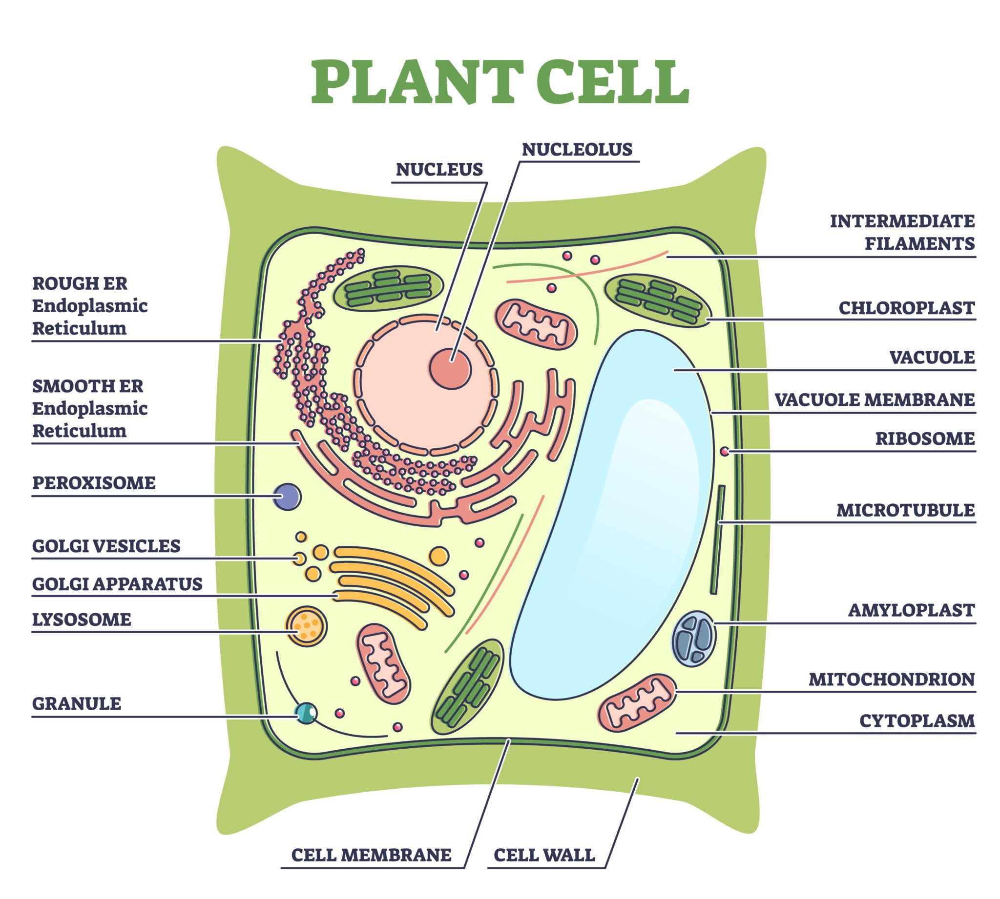
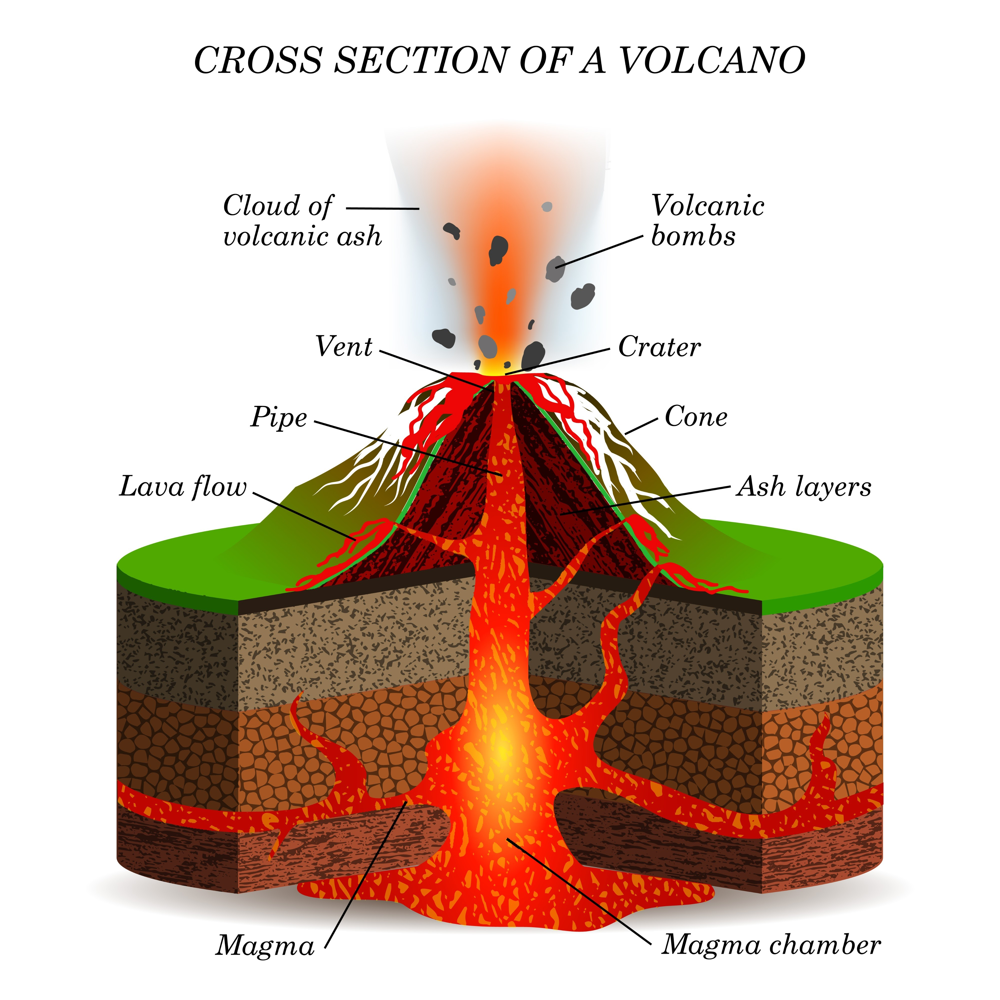
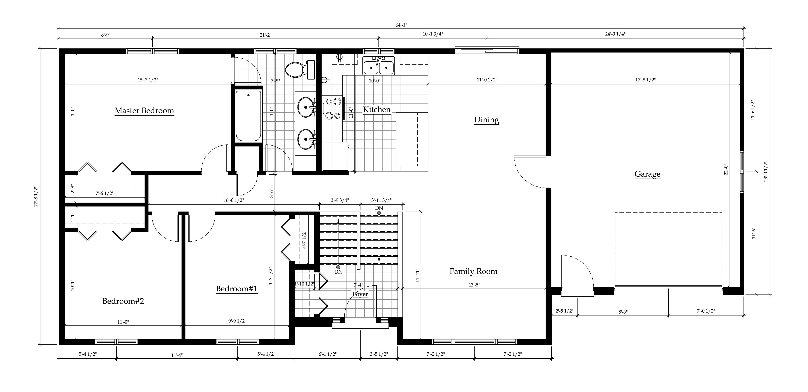
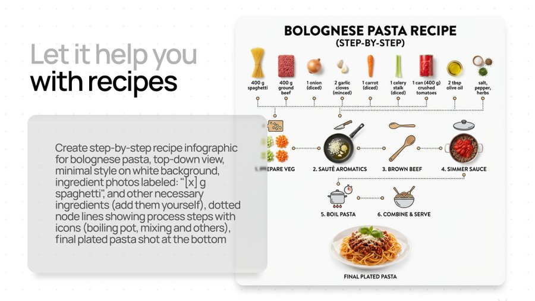

Nano Banana (también conocida como **Gemini 2.5 Flash Image** y su versión más avanzada, **Nano Banana Pro** o **Gemini 3 Pro Image**) es la herramienta de generación de imágenes de Google impulsada por la IA de Gemini.


(Ejemplo de imágenes generadas a las que se le pide que añada automáticamente anotaciones)

Google nos explica cómo funciona con una ilustración generada por la aplicación:


A continuación, te presento un tutorial detallado sobre cómo usarla y ejemplos de _prompts_ de complejidad creciente.

---

## 🛠️ Tutorial de Uso de Nano Banana

Este tutorial está basado en [la documentación oficial de Gemini](https://ai.google.dev/gemini-api/docs/image-generation?hl=es-419#prompt-guide) procesada por el propio Gemini y Grok.

Nano Banana te permite crear imágenes a partir de descripciones de texto (_text-to-image_) y editar imágenes existentes (_image-to-image_).

### 1. Acceso a la Herramienta

La forma más común de acceder a Nano Banana es a través de la aplicación **Gemini** (anteriormente conocida como Google Bard).

- **Paso 1:** Abre la aplicación **Gemini** o ve a su interfaz web.
- **Paso 2:** Inicia una conversación y pide explícitamente que genere una imagen. Por ejemplo, puedes decir: "**Genera una imagen de...**" o "**Crea un retrato de...**"
- **Paso 3 (Opcional - para Edición):** Si quieres editar una imagen que ya tienes, súbela primero a la conversación. Luego, pídele a Gemini que haga un cambio específico.
    

> **Nota:** La versión **Nano Banana Pro** (con capacidad de razonamiento y mayor calidad, impulsada por Gemini 3 Pro) puede estar disponible para usuarios de pago (como suscriptores de Google AI Plus/Pro/Ultra), mientras que la versión base (Gemini 2.5 Flash Image) está disponible para la mayoría de los usuarios gratuitos con un límite.

### 2. Estructura del Prompt

El _prompt_ es la descripción de texto que le das a la IA para indicarle qué debe generar. Para obtener mejores resultados, tu _prompt_ debe incluir la mayor cantidad de detalles posible. Una fórmula sencilla para empezar es:

$$\text{Fórmula Básica}: \langle\text{Sujeto}\rangle + \langle\text{Acción}\rangle + \langle\text{Escena/Fondo}\rangle + \langle\text{Estilo}\rangle$$

|**Elemento**|**Descripción**|**Ejemplo**|
|---|---|---|
|**Sujeto**|Quién o qué es el foco principal. Sé específico.|**Un zorro ártico**, un caballero medieval.|
|**Acción**|Qué está haciendo el sujeto.|**Bebiendo una taza de café**, saltando sobre un charco.|
|**Escena**|Dónde tiene lugar la acción.|**En una cafetería futurista de Tokio**, bajo la lluvia en un bosque.|
|**Estilo**|La estética visual deseada (arte, fotografía, renderizado).|**Fotorrealista**, pintura al óleo, **arte conceptual 3D**.|

---

## 💡 Ejemplos de Prompts (Complejidad Creciente)

A medida que añades más detalles, la IA tiene más información para crear una imagen única y precisa.

### Nivel 1: Básico (Concepto + Estilo)

Estos _prompts_ son cortos y se centran en el sujeto y el estilo general.

- **Ejemplo 1.1:** "**Un gato con un gorro de mago, estilo acuarela.**"
- **Ejemplo 1.2:** "**Una ciudad futurista iluminada por neones, renderizado 3D.**"

### Nivel 2: Intermedio (Composición + Ambiente)

Aquí añades detalles sobre la acción, el entorno y elementos básicos de composición/iluminación.

- **Ejemplo 2.1:** "**Un viejo robot estoico, sirviendo café en una cafetería de Marte, luz suave de neón azul y rojo, plano medio.**"
- **Ejemplo 2.2:** "**Una mujer joven con un vestido rojo de época, corriendo por un campo de trigo durante la hora dorada, estilo fotografía cinematográfica, plano general.**"

### Nivel 3: Avanzado (Detalles Técnicos y Estéticos)

En este nivel, controlas aspectos técnicos de la imagen, como la cámara, el objetivo, el color y la calidad. Esto te da control de "calidad de estudio".

- **Ejemplo 3.1 (Fotorrealismo/Cine):**
    
    > "**Un retrato fotorrealista de un astronauta anciano y reflexivo, mirando por la ventanilla de su cápsula espacial, iluminación de contraluz con una fuerte luz dorada de sol, profundidad de campo baja (bokeh), gran detalle en el traje texturizado, lentes de cámara de 50mm, película Kodak Ektachrome.**"
    
- **Ejemplo 3.2 (Arte Fantástico):**
    
    > "**Una escena de arte conceptual en 3D de una biblioteca de alquimista desordenada y antigua, con libros flotando alrededor de una mesa de trabajo de madera, el ambiente debe ser oscuro y misterioso con un único rayo de luz verde mágico emanando de un frasco, renderizado con el motor Unreal Engine.**"
    
- **Ejemplo 3.3 (Integración de Texto con Nano Banana Pro):**
    
    > "**Genera un cartel vertical 9:16 con un fondo de ciudad oscura y lluvia. En el centro, un detective con gabardina. El título en la parte superior, en fuente sans-serif blanca y audaz, debe decir: 'MISTERIO EN EL BARRIO'.**"
    

---

## 🎨 Consejos Adicionales para Mejores Resultados

- **Sé Detallado:** Cuantos más adjetivos uses (ej. en lugar de "perro", usa "perro pastor alemán peludo y enérgico"), mejor.
- **Especifica el Estilo:** Incluir términos como "fotorrealista", "pintura digital", "anime", "arte conceptual", "óleo sobre lienzo", etc., guía a la IA.
- **Define la Composición:** Usa términos de fotografía y cine como "plano picado", "plano detalle", "profundidad de campo baja", "gran angular", o "relación de aspecto 16:9".
- **Controla la Iluminación:** Describe cómo quieres la luz ("luz de neón", "hora dorada", "luz de estudio", "sombras dramáticas", "contraluz").
    

### Ejemplos educativos

Un generador de imágenes como Nano Banana (Gemini) en un entorno educativo permite a los estudiantes visualizar conceptos abstractos, históricos o científicos.

Aquí tienes una serie de ejemplos de _prompts_ con complejidad creciente, diseñados para diferentes materias y niveles educativos:

---

## 🔬 Nivel 1: Básico (Visualización de Conceptos Simples)

Estos _prompts_ son directos y se centran en la representación de un concepto fundamental o un objeto concreto. Ideales para niveles primarios e introducción a temas.

| **Materia**        | **Prompt**                                                                                                                           | **Objetivo Educativo**                                          |
| ------------------ | ------------------------------------------------------------------------------------------------------------------------------------ | --------------------------------------------------------------- |
| Ciencias Naturales | "Genera una imagen fotorrealista de una célula vegetal con sus principales orgánulos claramente visibles y etiquetados."             | Identificar las partes de una célula.                           |
| Historia           | "Crea una ilustración con el estilo de un mapa antiguo de un galeón español navegando por un mar tormentoso."                        | Visualizar el medio de transporte de la Era de la Exploración.  |
| Matemáticas        | "Diseña un diagrama 3D animado de un cilindro perfecto y muestra cómo se calcularía su volumen con las variables r y h etiquetadas." | Entender las variables de la fórmula de volumen de un cilindro. |



---

## 🌍 Nivel 2: Intermedio (Combinación de Conceptos y Contexto)

Estos _prompts_ requieren que la IA combine múltiples ideas, integre un contexto específico y a menudo incorpore un estilo artístico para transmitir un ambiente. Ideales para estudiantes de secundaria y para análisis.

| **Materia**        | **Prompt**                                                                                                                                                                                         | **Objetivo Educativo**                                                                     |
| ------------------ | -------------------------------------------------------------------------------------------------------------------------------------------------------------------------------------------------- | ------------------------------------------------------------------------------------------ |
| Geografía/Geología | "Genera un corte transversal fotorrealista de un volcán en erupción (tipo estromboliano), con la cámara magmática y las capas de la corteza terrestre etiquetadas. Estilo de diagrama científico." | Comprender la estructura interna y la acción de un volcán.                                 |
| Literatura         | "Crea un entorno de fantasía oscura y gótico: un castillo en ruinas en la cima de un acantilado bajo una luna llena. La imagen debe evocar una atmósfera de romanticismo tardío."                  | Visualizar el ambiente y la estética de un movimiento literario (ej. Romanticismo oscuro). |
| Física             | "Genera una infografía minimalista que muestre un rayo de luz blanca descomponiéndose en el espectro de colores (arcoíris) al atravesar un prisma de cristal. Estilo de diseño plano y limpio."    | Explicar la dispersión de la luz y el espectro visible.                                    |


---

## 🏛️ Nivel 3: Avanzado (Integración de Razonamiento y Detalles Técnicos)

Estos _prompts_ utilizan la capacidad de **razonamiento** de Nano Banana Pro (si está disponible) para generar imágenes que cumplen con múltiples restricciones fácticas, históricas o técnicas, y son útiles para proyectos complejos y niveles universitarios.

| **Materia**                 | **Prompt**                                                                                                                                                                                                                                                                    | **Objetivo Educativo**                                                                 |
| --------------------------- | ----------------------------------------------------------------------------------------------------------------------------------------------------------------------------------------------------------------------------------------------------------------------------- | -------------------------------------------------------------------------------------- |
| Historia del Arte       | "Crea un retrato de estilo 'pintura al óleo' de la artista Frida Kahlo, pero con la paleta de colores vibrantes y el uso de la luz típicos del Impresionismo francés. Asegúrate de que la textura de las pinceladas sea muy visible."                                     | Analizar y aplicar la fusión de estilos artísticos de diferentes épocas/movimientos.   |
| Ingeniería/Arquitectura | "Diseña un plano de planta (vista superior) de una casa modular de $\text{100 m}^2$. Debe incluir una distribución de 'concepto abierto' para la sala de estar/cocina, e incorporar un esquema de techos verdes para la eficiencia energética. Etiqueta las áreas clave." | Aplicar principios de diseño sostenible y distribución arquitectónica.                 |
| Economía                    | "Genera un gráfico de velas (candlestick chart) que ilustre una tendencia bajista (bear market) en el mercado de valores, con colores de contraste dramáticos (rojo y verde). El ambiente debe ser tenso y fotorrealista, como una sala de operaciones oscura."               | Visualizar representaciones de datos financieras complejas y sus atmósferas asociadas. |



---

### **Consejo Clave para Uso Educativo:**

Para maximizar el valor educativo, siempre pide a la IA que **etiquete** los componentes clave de la imagen. Por ejemplo: "_Crea un diagrama del ciclo del agua y etiqueta: Evaporación, Condensación, Precipitación y Colección_". Esto convierte la imagen de una mera ilustración a una **herramienta de aprendizaje activa**.

### Algunos ejemplos reales

Internet a explotado con la nueva versión de Gemini y de Nano Banana. Aquí algunos ejemplos con sus prompts 



```prompt
Create step-by-step recipe infographic for [bolognese pasta], top-down view, minimal style on white background, ingredient photos labeled: "[x] g spaghetti", and other necessary ingredients (add them yourself), dotted node lines showing process steps with icons (boiling pot, mixing and others), final plated pasta shot at the bottom
```

Si le pedimos que haga un vista "exploded" (¿Expandida?) de una cámara Polaroid. Muy útil para crear diagramas


Si le pedimos que convierta una imagen en un dibujo hecho a mano con perspectiva isométrica


También es capaz de generar imágenes de estilo PixelArt para nuestros videojuegos.

```prompt
create pixel art, a cute western inspired village on mars  
with sci fi architecture like glass cupolas,  
isometric camera, style of old gameboy advance game,  
no ui, close up shot with 4 structures and 2 astronauts  
walking about, pixel perfect, no interpolation, low...
```


Incluso los fotogramas (sprites) de las animaciones de los personajes del videjouego


```prompt
Create a 32 bit character sheet for video game animations. The character is a lizard/human hybrid alien that crash landed on earth....
```


Si le pedimos que resuelva la operación escrita a mano... incluso imita nuestra letra

