## 📚 Google NotebookLM: Tu Asistente de Investigación Personal con IA

**Google NotebookLM** es un asistente de investigación, aprendizaje y escritura,  potenciado por IA que te ayuda a sintetizar información, generar ideas y crear borradores a partir de tus propios documentos. No es un chatbot general, sino una herramienta de "compañero de pensamiento" que basa todas sus respuestas estrictamente en las fuentes que tú le proporcionas, o que él descubre para ti. 

Ha sido desarrollada por **Google Labs** que utiliza el modelo de lenguaje avanzado **Google Gemini**.

Puedes usarlo desde [su web](https://notebooklm.google.com/) o desde las Apps para iOS y Android. La funcionalidad de las herramientas es algo más reducida. 

Su principal característica y utilidad es que se convierte en un **experto personalizado** en **tus propios documentos y fuentes**. A diferencia de otros asistentes de IA que responden basándose en información general de internet, NotebookLM limita sus respuestas al contenido que tú le proporcionas, lo que garantiza la **fidelidad contextual** de la información.

### Conceptos Clave y Utilidad 💡

| **Concepto**                            | **Descripción**                                                                                                                                                                   |
| --------------------------------------- | --------------------------------------------------------------------------------------------------------------------------------------------------------------------------------- |
| **Cuadernos (Notebooks)**               | Son los espacios de trabajo donde organizas tus fuentes de información para un proyecto, tema o estudio específico. Cada cuaderno es independiente.                               |
| **Fuentes (Sources)**                   | Son los documentos o archivos que subes para que la IA los analice. La IA de NotebookLM solo responderá basándose en el contenido de estas fuentes.                               |
| **Fidelidad Contextual**                | Es la garantía de que las respuestas generadas por la IA citan y referencian el fragmento exacto dentro de tus fuentes. Esto permite una fácil **verificación** y profundización. |
| **Chat con la IA**                      | Una ventana de chat interactiva donde puedes hacer preguntas, solicitar resúmenes, comparaciones, o generar ideas basadas únicamente en tus fuentes cargadas.                     |
| **Artefactos**                          | Existen unos tipos de resultados ya configurados que puedes generar con sólo pulsar                                                                                               |
| **Resúmenes en Audio (Audio Overview)** | Función que transforma tus documentos cargados en resúmenes narrados tipo _podcast_, permitiendo el aprendizaje y repaso sobre la marcha.                                         |

#### Utilidad Principal:

NotebookLM optimiza el flujo de trabajo de investigación, estudio y planificación de proyectos al centralizar, analizar y sintetizar rápidamente grandes volúmenes de información específica. Aumenta la productividad al reducir el tiempo dedicado a la lectura y búsqueda manual de datos.

---

## 🛠️ Tutorial: Primeros Pasos con NotebookLM

El proceso es sencillo y se divide en la creación de un cuaderno y la carga de fuentes.

### 1. Acceso y Creación de un Cuaderno

1. **Acceso:** Ve al sitio web oficial de NotebookLM (busca "NotebookLM Google" en tu navegador). Inicia sesión con tu cuenta de Google.
2. **Crear Cuaderno:** Pulsa el botón para crear un **Nuevo Cuaderno**. Asígnale un nombre relevante a tu proyecto (ej: "Tesis de IA" o "Reuniones de Proyecto X").

### 2. Carga de Fuentes

Una vez dentro del cuaderno, el siguiente paso es añadir las fuentes que la IA debe analizar. Puedes cargar hasta 50 archivos por cuaderno, con un límite de 500.000 palabras por archivo.

Pulsa **"Añadir Fuentes"** o **"Add Sources"**. Tienes diversas opciones:

- **Archivos Locales:** Sube documentos en formatos como PDF, `.txt`, o Markdown desde tu ordenador.
- **Google Drive:** Enlaza documentos de Google Docs o presentaciones de Google Slides.
- **Enlaces Web:** Pega la URL de un artículo, _paper_ científico, o cualquier página web.
- **Vídeos de YouTube:** Pega el enlace de un vídeo de YouTube; NotebookLM transcribirá el contenido para analizarlo.
- **Texto Plano:** Copia y pega texto directamente en la herramienta.
- **Descubrir Fuentes (Web):** (Una herramienta clave) Puedes describir un tema de interés, y NotebookLM buscará hasta 10 fuentes web relevantes, las resumirá y te permitirá añadirlas con un solo clic.

**💡 Consejo:** Cuanto más específica y de alta calidad sea tu fuente, mejor será la respuesta de la IA.

### 3. Interacción con la IA (El Core de la Herramienta)

Una vez que las fuentes están cargadas y procesadas (suele tardar unos segundos a minutos dependiendo del tamaño) la interfaz de NotebookLM se divide en un panel de fuentes, un área de chat interactiva y un panel para "Artefactos" (Artifacts).

#### A. El Chat Interactivo (Tu Asistente de Investigación)

Este es el área principal para hacer preguntas y obtener resúmenes.

- **Uso:** Formula cualquier pregunta o solicita una tarea de escritura. La IA escaneará **solo tus fuentes** para dar una respuesta.
- **Citas:** La característica más importante. Cada respuesta de la IA viene con citas numéricas. Al hacer clic en ellas, se resaltará exactamente la sección del documento original de donde proviene la información. **Esto genera confianza y garantiza la precisión.**
    
- **Ejemplos de Preguntas/Prompts:**
    
    - _"Explícame el concepto de 'reversión termodinámica' del Documento 3 con un lenguaje sencillo y un ejemplo práctico."_
    - _"Compara las metodologías de investigación propuestas en el Documento 1 y el Documento 2."_
    - _"Genera 5 preguntas de examen de opción múltiple basadas en los temas clave de todas las fuentes."_
    - _"Haz un resumen de los tres documentos y lista los puntos clave de la 'Solución A' en el Documento 2."_
    
#### B. Artefactos (Artifacts)

Además de usar los prompts, también existen determinado "formatos" de salida, denominados "Artefactos" como el podcast, el informe, las tarjetas de estudio... disponible con tan solo pulsar sobre ellas. Son documentos generados automáticamente por la IA que sintetizan la información de tus fuentes en formatos estructurados.

En la versión web encontramos más artefactos que en las Apps.

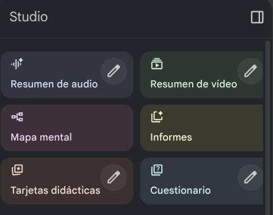

Algunas de ellas te permiten "ajustar" el resultado que vas a obtener modificando el prompt con el que se genera el resultado

|**Artefacto**|**Descripción**|**Casos de Uso**|
|---|---|---|
|**Resumen de Audio**|Convierte tus fuentes en una narración de audio, como un podcast o audiolibro, permitiéndote "escuchar" tus documentos.|Aprender o repasar contenido mientras te desplazas, o para personas con estilos de aprendizaje auditivo.|
|**Documento Informativo (Briefing Doc)**|Un resumen ejecutivo estructurado con puntos clave, conclusiones e ideas principales de tus fuentes.|Preparar una reunión, obtener una visión general rápida de material extenso, crear un borrador de informe.|
|**Preguntas Frecuentes (FAQ)**|Genera una lista de preguntas comunes y sus respuestas basadas en el contenido de los documentos.|Crear guías de estudio, preparar material de formación para clientes o empleados, o resumir políticas.|
|**Guía de Estudio (Study Guide)**|Un documento estructurado para el aprendizaje, a menudo incluyendo preguntas, términos clave y explicaciones detalladas.|Estudiantes o cualquier persona que quiera dominar un nuevo tema.|

- **Generación:** Simplemente haz clic en el botón para generar el Artefacto deseado y este aparecerá en el panel de la derecha, listo para ser editado, copiado o exportado.

Veamos algunos de ellos y su configuración
#### Resumen de vídeo

Podemos generar un vídeo con un resumen de las fuentes, en el que podremos seleccionar estilo visual la duración y el idioma.

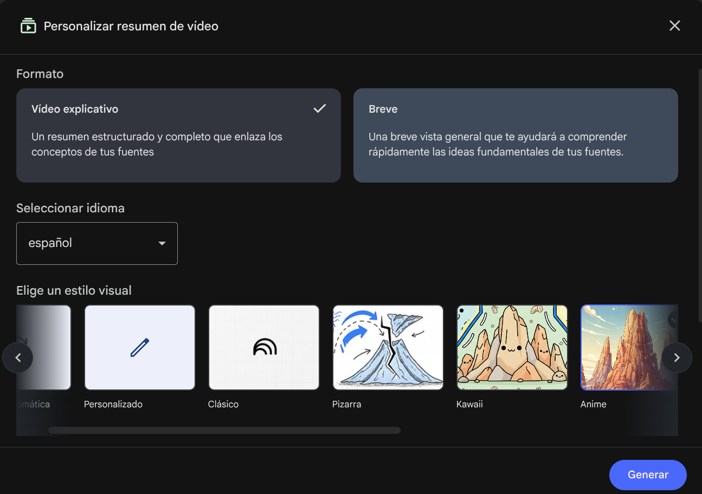

### Crear Informe

También podemos pedir que se cree un informe a partir de los contenido. Existen varios formatos ya preparados, cada uno con un prompt determinado que  podemos ajustar según  nuestro propio gusto.

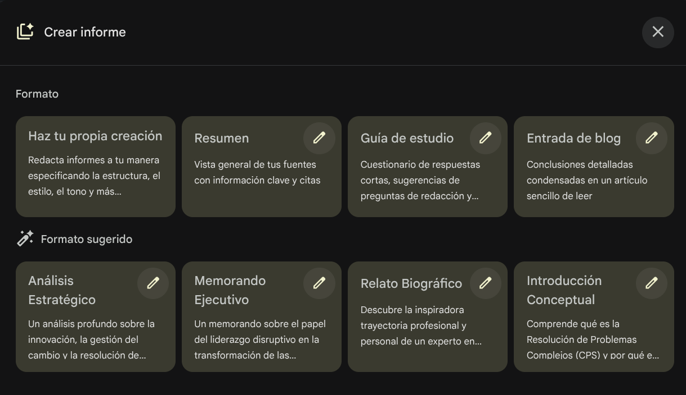

Vemos cómo se puede modificar el prompt para que el resultado se ajuste más a nuestras necesidades.

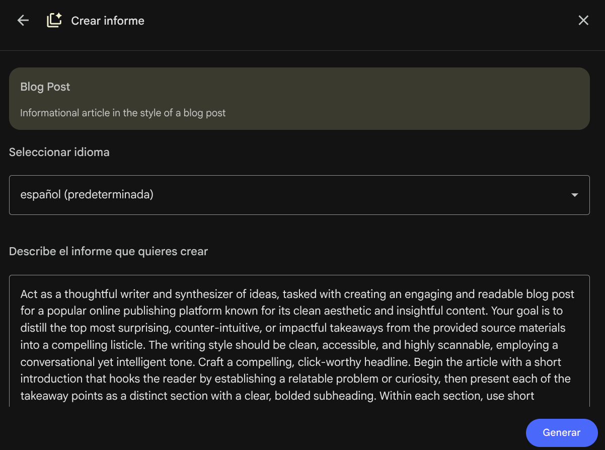

### Herramientas futuras

Por lo que vamos viendo en las redes, Google está apostando por herramientas del tipo de NotebookLM. 

Hoy mismo (20 de noviembre de 2025) se han presentado herramientas para generar infografías y presentaciones a partir de contenido (usando internamente la herramienta [Nano Banana](https://gemini.google/es/overview/image-generation/?hl=es)). Actualmente sólo están disponibles en el plan Pro de NotebookLM.

Por ejemplo, podemos generar un imagen de este estilo a partir de nuestro CV
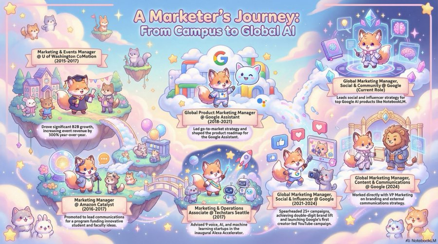

O transformar una clase de matemáticas básicas en estas preciosas imágenes

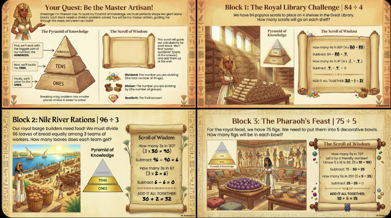

Podemos usar la versión web o bien instalarnos una App en nuestro dispositivo móvil (existen versiones para Android y para iOS). En esta herramientas disponemos de menos herramientas (artefactos).

En este vídeo vemos cómo utilizar el interface web.

[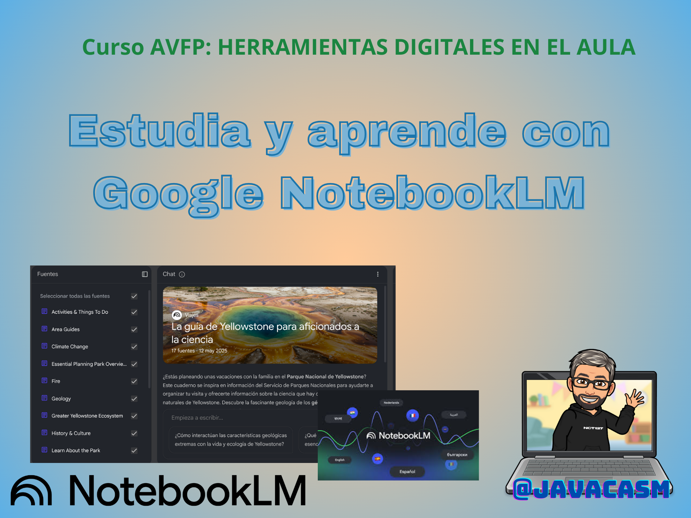](https://drive.google.com/file/d/1YHRBdLCxoypvQWP9HAlB8rCqqM9BuyVx/view?usp=sharing)
[Vídeo sobre el uso de Google NotebookLM](https://drive.google.com/file/d/1YHRBdLCxoypvQWP9HAlB8rCqqM9BuyVx/view?usp=sharing)

En este otro vemos cómo utilizar la herramienta en un iPad.

[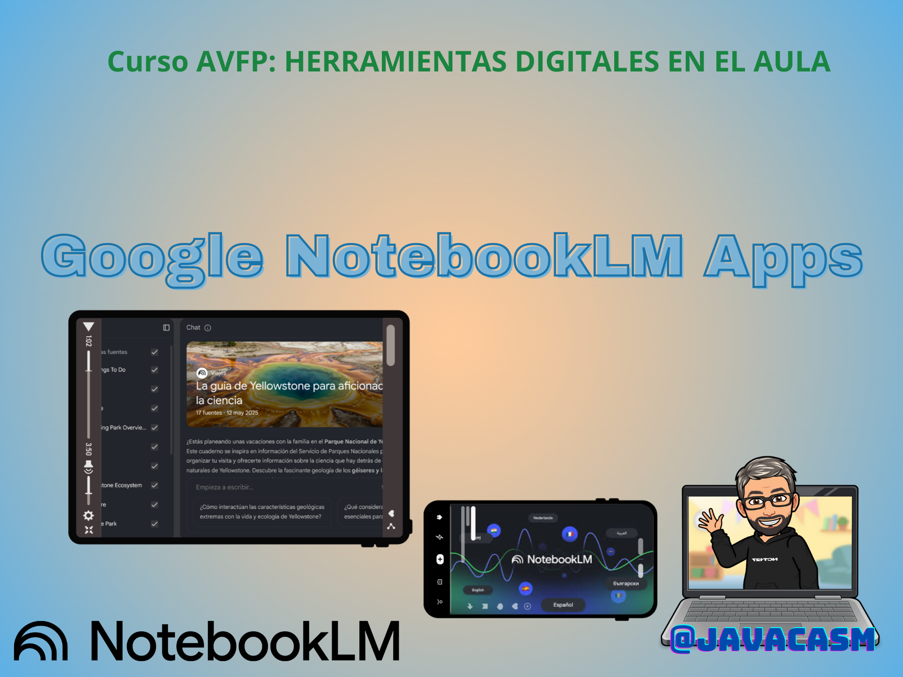](https://drive.google.com/file/d/1oQEmYcjN2d6U6215xotXCBq31kJ-UlUl/view?usp=sharing)

[Vídeo: Uso de la app NotebookLM en iPad](https://drive.google.com/file/d/1oQEmYcjN2d6U6215xotXCBq31kJ-UlUl/view?usp=sharing)

### Cuadernos compartidos

Puedes compartir tus cuadernos igual que compartes documentos en Google Drive, con permisos de edición o haciéndolos públicos para cualquiera que tenga el enlace:

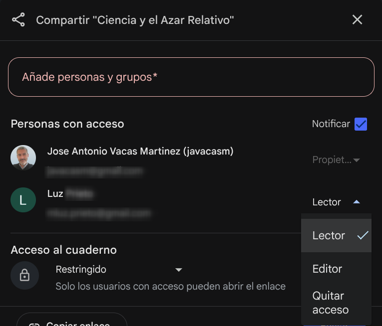

También existen cuadernos públicos sobre temas muy interesante, que nos van a permitir ver las posibilidades de la herramienta. Son cuadernos creados por otros usuarios (investigadores, autores, educadores) que han elegido compartir su trabajo. Estos suelen contener fuentes de alta calidad y artefactos pregenerados (como resúmenes de audio, preguntas frecuentes o guías de estudio) sobre un tema específico.

Actualmente, no hay una biblioteca de búsqueda interna centralizada en NotebookLM (excepto la pestaña "Featured notebooks", que muestra una selección curada). La forma principal de localizarlos es a través de enlaces directos o mediante una búsqueda avanzada.

- **Pestaña "Featured Notebooks" (Cuadernos Destacados):**
    
    - Si está habilitada para tu cuenta (principalmente cuentas personales), esta pestaña en la página de inicio es la forma más directa de encontrar cuadernos curados por Google o colaboradores sobre temas populares (ciencia, guías de viaje, etc.).
        
- **Búsqueda en Google (Avanzada):**
    
    - Debido a que los cuadernos públicos tienen URLs únicas, la mejor manera de encontrar temas específicos es usar el operador `site:` en la Búsqueda de Google.
    - **Fórmula de Búsqueda:** `[Tema de interés] site:notebooklm.google.com`
    - **Ejemplo de Búsqueda:** `Historia de la IA site:notebooklm.google.com`
        
- **Interacción:** Cuando abres un cuaderno público, puedes leer las fuentes originales y, a menudo, interactuar con el chat haciendo tus propias preguntas sobre ese material. **No puedes** modificar las fuentes o generar tus propios artefactos en el cuaderno de otra persona.

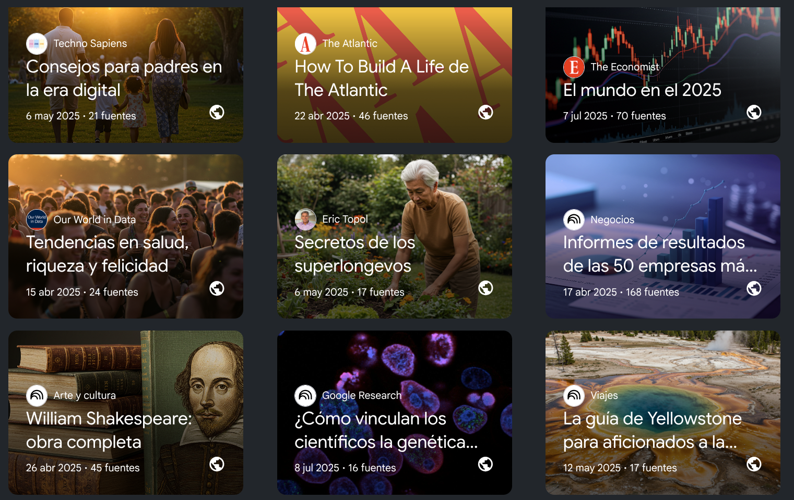

#### William Shakespeare: obra completa

Este cuaderno usa como fuentes algunas de las obras de Shakespeare

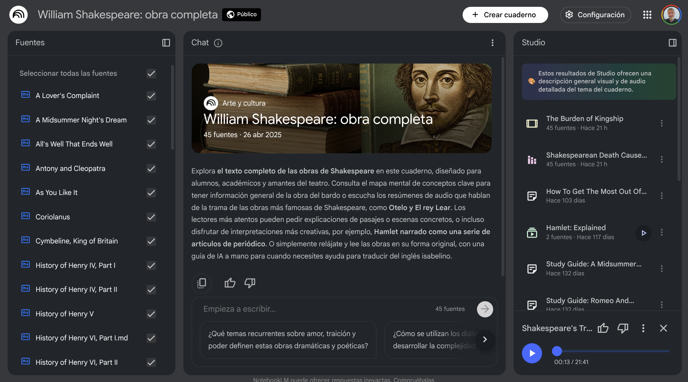

### Yellowstone

Este cuaderno nos adentra en el parque de Yellowstone sobre una perspectiva científica.

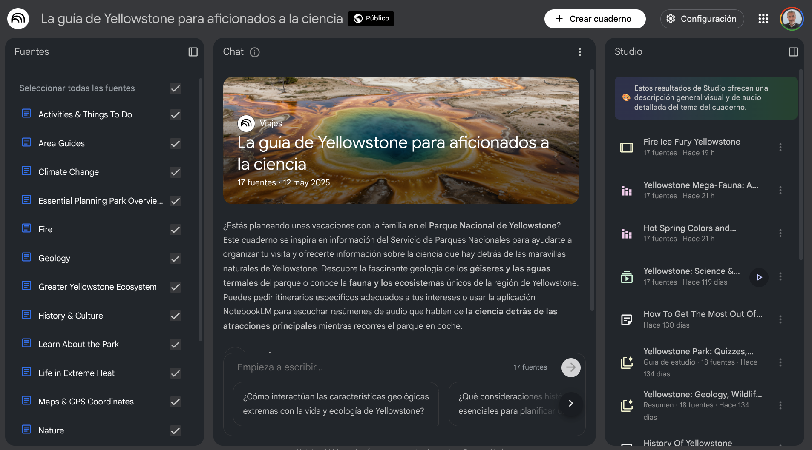

### Informe de las empresas más importantes

Este cuaderno contiene los informes económicos de las 50 empresas más importantes

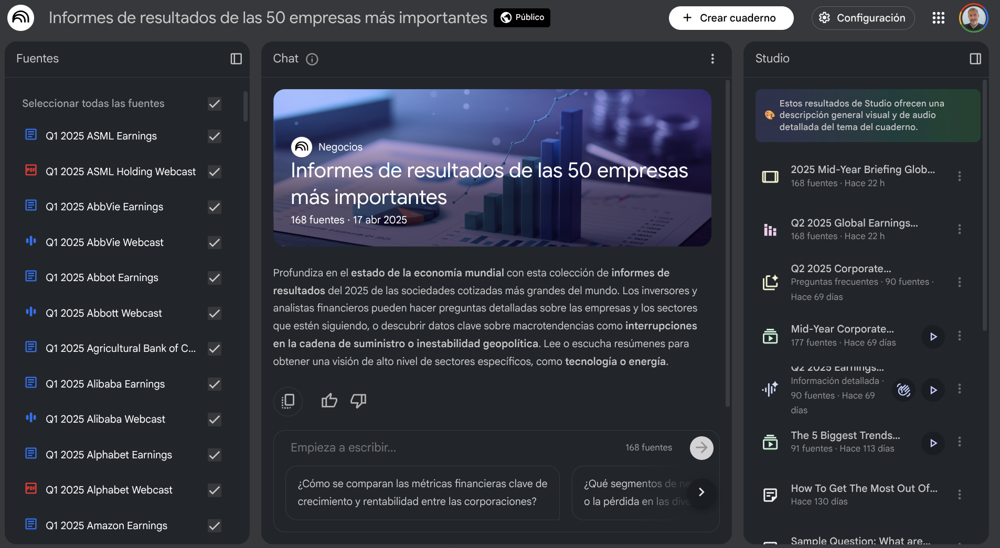

---

## 🎯 Ejemplos Prácticos de Uso

NotebookLM es increíblemente versátil para diversos escenarios:

| **Escenario**                               | **Objetivo**                                                                                       | **Ejemplo de Prompt**                                                                                                                                                                        | **Resultado Clave**                                                                          |
| ------------------------------------------- | -------------------------------------------------------------------------------------------------- | -------------------------------------------------------------------------------------------------------------------------------------------------------------------------------------------- | -------------------------------------------------------------------------------------------- |
| **Investigación Académica**                 | Sintetizar 10 _papers_ para una tesis.                                                             | "Compara las metodologías utilizadas en el _Paper A_ y el _Paper C_. Identifica las referencias cruzadas sobre la 'teoría del aprendizaje adaptativo'."                                      | Un análisis comparativo detallado con citas exactas a cada _paper_.                          |
| **Reuniones y _Onboarding_**                | Crear un resumen de los puntos clave de 5 grabaciones de reunión (subidas como MP3 o transcritas). | "Identifica las decisiones tomadas en la reunión de la semana pasada y genera una lista de tareas pendientes para el equipo de desarrollo, mencionando quién es el responsable de cada una." | Una lista de tareas organizada y referenciada a la transcripción de la reunión.              |
| **Marketing y Contenido**                   | Analizar vídeos de la competencia para identificar vacíos de contenido.                            | "Revisa los 15 vídeos de YouTube cargados e indica tres temas de interés del sector que no hayan sido cubiertos por la competencia."                                                         | Ideas frescas para la creación de contenido con información contrastada.                     |
| **Estudio Personal**                        | Preparar un examen a partir de un libro de texto (PDF).                                            | "Genera 20 tarjetas didácticas (_flashcards_) con la pregunta al frente y la respuesta en el dorso, sobre los capítulos 3 y 4."                                                              | Material de estudio estructurado en un formato interactivo.                                  |
| **Revisión de Documentos Legales/Técnicos** | Entender rápidamente una nueva normativa.                                                          | "Explícame, en un lenguaje sencillo para un no especialista, cuáles son los tres cambios más relevantes de esta normativa para el Departamento de Finanzas."                                 | Explicación clara con referencias que permiten al equipo legal revisar el contexto original. |

Vamos a desarrollar, algunos de estos ejemplos de cómo puedes usar NotebookLM en diferentes escenarios:

### Ejemplo 1: Investigación Académica y Tesis

|**Rol**|**Estudiante de Doctorado**|
|---|---|
|**Fuentes**|10 artículos de investigación (PDF) sobre un nuevo medicamento experimental, notas de reuniones con el supervisor.|
|**Uso de Herramientas**|**Chat:** Pide a la IA que _"Compare los hallazgos del Documento 4 con los resultados del Documento 7, identificando cualquier contradicción en la metodología de muestreo."_|
|**Artefacto**|Generar una **Guía de Estudio** para repasar rápidamente los principales conceptos y terminología compleja antes de una defensa oral.|
|**Resultado**|Síntesis rápida de la literatura, identificando brechas o conflictos en la investigación para enfocar la dirección de la tesis.|

### Ejemplo 2: Creación de Contenido y Guiones

|**Rol**|**Creador de Contenido (YouTube o Blog)**|
|---|---|
|**Fuentes**|Transcripciones de entrevistas (TXT), estudios de mercado (PDF) y datos de la competencia (Google Docs).|
|**Uso de Herramientas**|**Descubrir Fuentes:** Pide _"Encuentra las 10 últimas tendencias sobre el mercado de la energía solar en 2025."_|
|**Artefacto**|Generar un **Documento Informativo** para crear un esquema del guion de un vídeo, con puntos clave y datos concretos respaldados por las fuentes.|
|**Resultado**|Un guion bien estructurado, con información precisa y citada, lo que reduce el tiempo de investigación y aumenta la credibilidad del contenido.|

### Ejemplo 3: Onboarding y Formación de Empleados

|**Rol**|**Gerente de Recursos Humanos**|
|---|---|
|**Fuentes**|Manual del Empleado (PDF), Política de Vacaciones (Google Doc), Documento de Estructura de Salarios (Google Doc).|
|**Uso de Herramientas**|**Chat:** Pregunta _"¿Cuál es la política de la empresa sobre el trabajo remoto después de los 6 meses de empleo, según los documentos?"_|
|**Artefacto**|Generar un **FAQ** (Preguntas Frecuentes) completo que responda a todas las dudas comunes de los nuevos empleados sobre beneficios, permisos y código de conducta.|
|**Resultado**|Un documento de formación instantáneo y preciso, ahorrando tiempo en responder repetidamente las mismas preguntas y asegurando que la información de los empleados es coherente con los documentos oficiales.|

---

## ⚖️ Comparativa con Herramientas Similares

NotebookLM se ubica en el nicho de **Gestión de Conocimiento y Q&A basado en Fuentes**. Aunque comparte funcionalidades con otras herramientas, su enfoque es único.

|**Herramienta**|**Tipo**|**Diferencia Clave con NotebookLM**|
|---|---|---|
|**ChatGPT/Gemini**|Modelos de Lenguaje General (LLMs)|Responden basándose en datos masivos de entrenamiento. **NotebookLM es más seguro** porque limita las respuestas **solo a tus fuentes**, evitando "alucinaciones" (información inventada) sobre tu contenido específico y ofreciendo **citas verificables**.|
|**Notion AI/ClickUp AI**|Herramientas de Productividad/Notas con IA|Ofrecen IA integrada para resumir o generar texto dentro de su entorno de notas y gestión de proyectos. NotebookLM está más centrado en la **investigación profunda** y el análisis de **múltiples tipos de fuentes** (incluidos vídeos/audio).|
|**Obsidian/Roam Research**|Gestores de Notas basados en Gráficos|Excelentes para la toma de notas enlazadas y la estructura de conocimiento personal (Zettelkasten). NotebookLM es superior en la **síntesis automatizada** y el **Q&A inmediato** de documentos complejos con IA.|
|**Zotero**|Gestor de Referencias Académicas|Especializado en organizar bibliografía y citar. NotebookLM es complementario; se enfoca en **entender y sintetizar el contenido** de esas referencias, más que en su gestión bibliográfica.|

NotebookLM destaca por su **integración con el ecosistema de Google**, su capacidad para citar fuentes con precisión, y el uso de **Gemini** como un motor de IA contextual potente para la investigación.

### Limitaciones de Google NotebookLM

A día de hoy (11 de noviembre de 2025), y basándose en la información más reciente sobre el uso gratuito, estas son las principales limitaciones para una cuenta estándar (no Plus):

### 1. Límites de Contenido y Estructura

- **Número de Cuadernos (Notebooks):**
    - Puedes crear **hasta 100 cuadernos** por usuario.
- **Fuentes por Cuaderno:**
    - Puedes subir **hasta 50 fuentes/documentos** por cada cuaderno.
- **Tamaño de las Fuentes (Documentos):**
    - Cada documento (PDF, texto, etc.) puede tener **hasta 500.000 palabras** o un tamaño de **200 MB** si es una carga local.
        

### 2. Límites de Uso Diario (Consultas y Audio)

Estos son los límites más importantes que gestionan el uso intensivo de la IA:

- **Consultas de Chat (Chat Prompts):**
    - Tienes un límite de **50 consultas de chat al día**. Esto incluye cualquier pregunta, solicitud de resumen, comparación o generación de texto que le hagas a la IA dentro de un cuaderno.
- **Generaciones de Resúmenes en Audio (Audio Overview):**
    - Tienes un límite de **3 generaciones de audio al día**. Esto se refiere a la función que convierte tus documentos en resúmenes narrados tipo _podcast_.
        

### Resumen de la Oferta Gratuita

|**Concepto**|**Límite (Cuenta Gratuita Estándar)**|
|---|---|
|**Cuadernos Totales**|Hasta 100|
|**Fuentes por Cuaderno**|Hasta 50|
|**Tamaño Máximo por Fuente**|500.000 palabras / 200 MB|
|**Consultas de Chat (Diario)**|50 consultas|
|**Generaciones de Audio (Diario)**|3 resúmenes de audio|

**Nota importante:** Inicialmente, NotebookLM estuvo disponible para muchos usuarios sin costo y con límites que parecían ilimitados. Sin embargo, con la introducción de la versión **NotebookLM Plus** (una suscripción de pago) y la necesidad de gestionar la carga de los servidores de Gemini, Google ha implementado estos límites diarios para el uso gratuito.

Te dejo un video de Joaquín Barberá, donde se explican 9 casos de uso épicos de NotebookLM que puedes probar hoy mismo: [9 Casos de Uso Épicos de NOTEBOOK LM que TIENES que PROBAR](https://www.youtube.com/watch?v=eGOwdas3afE).

